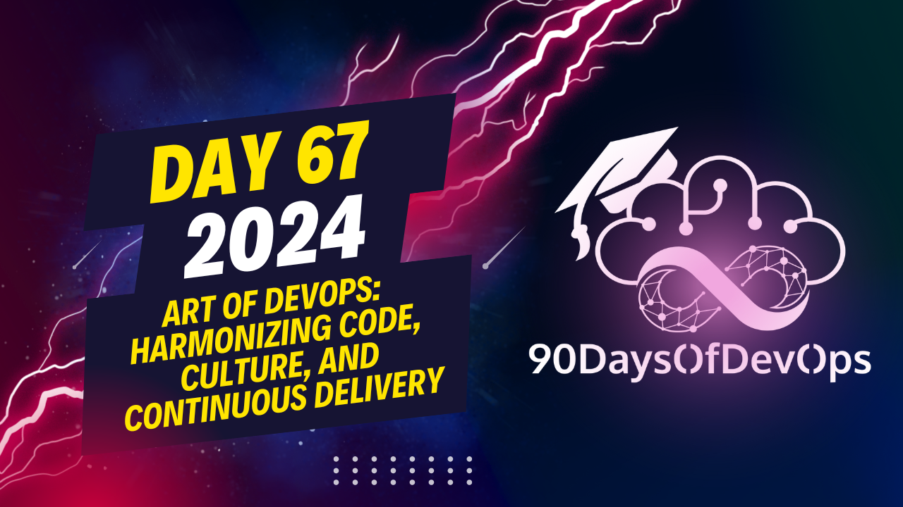

# Day 67 - Art of DevOps: Harmonizing Code, Culture, and Continuous Delivery

 A discussion of various trends and technologies in DevOps, MLOps, GitOps, and data engineering. Here is a summary of some of the points you mentioned:

1. Data Engineering: Research on data related to Kubernetes and CUber can be found at Ke Side and various conferences focusing on these topics.

2. GitOps, AI Ops, MLOps: GitOps automates and controls infrastructure using Kubernetes. Argo is a popular project for this. AI Ops and MLOps aim to simplify the process of data preparation, model training, and deployment for machine learning engineers and data scientists. QFlow is one such project.

3. Simplified Infrastructure: Companies and startups should look towards infrastructure solutions that are scalable and cost-efficient. AWS Lambda and similar services are gaining traction in this area.

4. Microservices Architecture: Service Mesh and Cloud Infrastructure are becoming increasingly popular due to their ability to offer various services to companies. AWS, Google Cloud, and other companies are focusing on Lambda and similar services to compete.

5. Platform Engineering: This is an emerging field that focuses on simplifying the cycle between DevOps and SRE. It involves creating platforms for companies to work effectively, taking into account the latest tools and trends in the industry. The Platform Engineering Day at Cucon is a good resource to learn more about this trend.

6. Resources for Learning DevOps: You mentioned several resources for learning DevOps from scratch, including Cloud talks podcast, the 90 days of devops repo, devops roadmap by Sam, devops commune (which has around 10K members), and videos by Nana, Victor Devops Toolkit, Kunal, and Rock Cod.

The speaker discussed various trends in DevOps, including:

1. **Identity and Purpose**: Cybersecurity is crucial, with AI-powered tools being used extensively.
2. **Terraform and Pulumi**: Infrastructure as Code (IaC) helps maintain infrastructure through code.
3. **CI/CD implementation**: Automates the software development life cycle for enhanced management.
4. **Data on Kubernetes**: Researches are ongoing to improve data management on Kubernetes.
5. **GitOps, AI Ops, and MLOps**: Automation of pipelines using GitOps, AI-powered tools, and Machine Learning Operations (MLOps).
6. **Service Computing and Microservices**: Focus on scalable and cost-efficient infrastructure for service-based architecture.
7. **Platform Engineering**: Emerging field simplifying the cycle between DevOps and SRE teams.
8. **Data Obility and Platform Engineering**: Key trends in the next year, with platform engineering being a key area of focus.

The speaker also mentioned various resources for learning DevOps, including:

* Podcasts: Cloud Talks, 90 Days of DevOps
* Videos: Victor Devops Toolkit, Kunal's videos on networking and Rock Code
* Communities: DevOps Commune (10K members), Reddit

Overall, the speaker emphasized the importance of cybersecurity, automation, and infrastructure management in DevOps.
