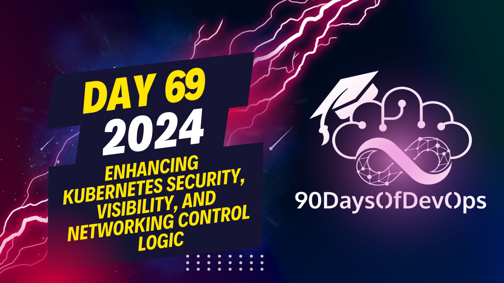

# Day 69 - Enhancing Kubernetes security, visibility, and networking control logic at the Linux kernel

Summary of a presentation about using the Istio service mesh and Tetragon, a kernel-level security tool, in a Kubernetes environment. The main focus is on investigating an incident where the Death Star, a hypothetical system, has been compromised due to a vulnerability in its exhaust port.

1. The user checks the Hubble dashboard to see the incoming request and finds that it was TIE fighter (not a rebel ship) that caused the damage.

2. To find out more details about the incident, they investigate using forensics and root cause analysis techniques. They identify which node caused the problem (worker node in this case).

3. To dig deeper, they inspect the Tetragon logs related to any connection to the specific HTTP path, where they find the kill command executed with its arguments and the TCP traffic being passed. This helps them understand what happened during the incident.

4. The user also shows how to view this data using JSON, which provides more detailed information about the incident, including the start time, kubernetes pod labels, workload names, and capabilities that the container was running with.

5. Finally, the user demonstrates capturing the flag for this challenge by providing the binary and arguments in an editor.

Throughout the tutorial, the user emphasizes the importance of network observability, network policies, transparent encryption, mutual or runtime visibility, and enforcement using Tetron. They also mention that more details can be found on Ice Vent's website (https://icevent.com) and encourage viewers to join their weekly AMA and request a demo for the enterprise version of their platform.
The main points from this content are:

1. The importance of understanding the Identity and Purpose of a platform or system, using Star Wars as an analogy to demonstrate how attackers can exploit vulnerabilities.
2. The use of Tetragon to investigate and analyze network traffic and logs to identify potential security threats.
3. The importance of using network observability, network policies, transparent encryption, and runtime visibility and enforcement to secure the environment.
4. The value of conducting forensics and root cause analysis to identify the source of a security breach.
5. The use of JSON to view data and export it for further analysis.

Overall, this content emphasizes the importance of understanding the Identity and Purpose of a system, as well as using various tools and techniques to analyze and secure network traffic and logs.
