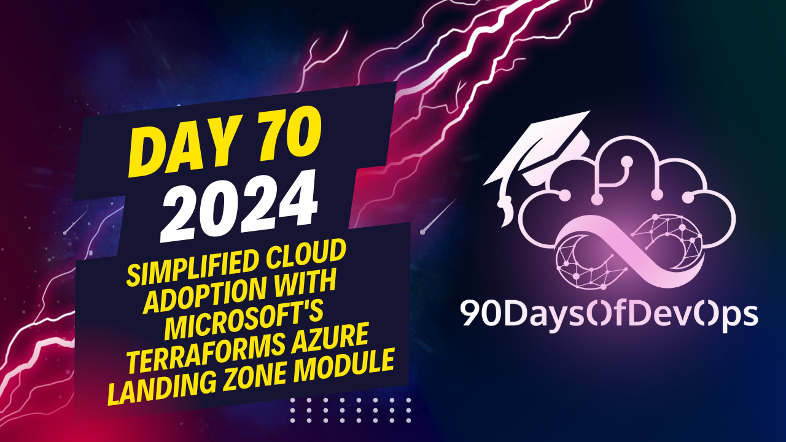

# Day 70 Simplified Cloud Adoption with Microsoft's Terraforms Azure Landing Zone Module

 The speaker is providing guidance on implementing a landing zone in Azure using the Cloud Adoption Framework (CAF) Landing Zone with Terraform. Here are the key points:

1. Use Azure policy to enable tag inheritance, which helps to tag more resources automatically and improves cost management.
2. Review the CAF review checklist for best practices in building and customizing landing zones.
3. Stay up-to-date on updates by checking the "What's new" page on the CAF website, following blog posts, and attending community calls.
4. Utilize resources like the Terraform team's roadmap to know what features are being worked on and when.
5. Contribute feedback or issues to the relevant repositories (such as the Enterprise scale Azure Learning Zone repo) to collaborate with the development teams.
6. The speaker recommends watching recorded community calls, especially those held in Australian time zones, at 2x speed and pausing where necessary for maximum efficiency.
7. The speaker also shares their LinkedIn profile and Blue Sky (new Twitter) handle for further communication or feedback.
