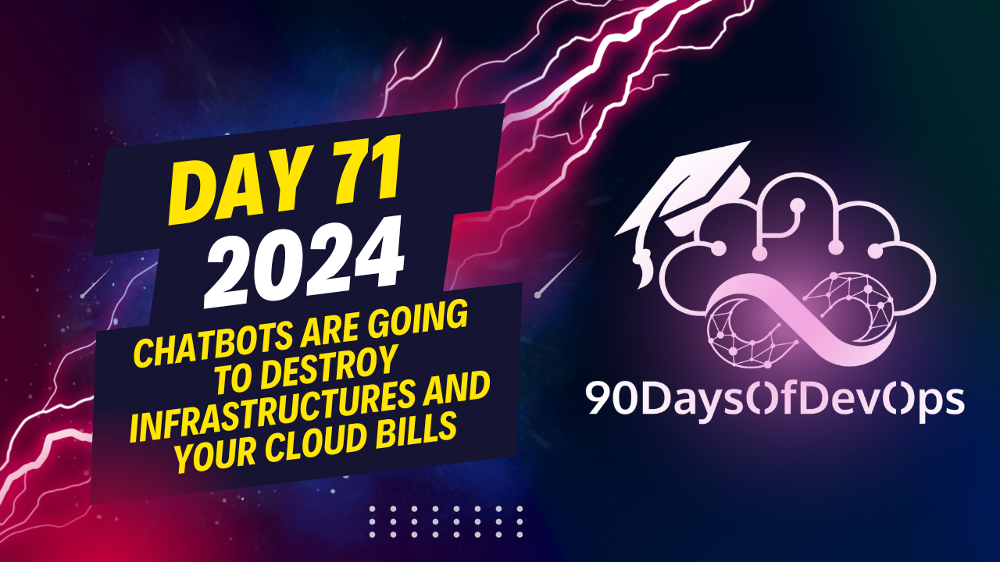

# Day 71 - Chatbots are going to destroy infrastructures and your cloud bills

 The user is explaining that their chatbot application takes a long time to respond because it has many dependencies, and the current infrastructure uses ECS container service in the Parisian region. They suggest separating the chat functionality from the API, as the chat is CPU-bound while the API calls are more CPU-bound. They also recommend monitoring costs closely to avoid unnecessary expenses, especially with regards to large language models (LLMs). They advise putting the chat in its own container or using Lambda functions for better scalability and cost control. They mention that separating components into microservices can help manage dependencies and optimize performance. Lastly, they suggest using tools like Sentry to identify slow queries and optimize accordingly. The user concludes by stating that these changes would improve the application's stability and efficiency and could potentially save costs over time.
Here are some key takeaways regarding identity and purpose:

**Identity:**

1. Separate the chat (LLM) from the API, as they are CPU-bound and require different resources.
2. Use a container service like ECS or LSC to run the chat in its own instance, reducing overhead and improving scalability.
3. Consider using Lambdas for chat responses to reduce costs and improve performance.

**Purpose:**

1. Keep the chatbot's code separate from your main application to prevent performance issues and high costs.
2. Use microservices architecture to break down complex applications into smaller, more manageable components.
3. Monitor your costs regularly to ensure you're not overspending on infrastructure or services.

**Lessons learned from Qua:**

1. Put the chat in its own container and instance to reduce costs and improve scalability.
2. Separate dependencies and components using microservices architecture.
3. Monitor your cloud bills and optimize your resources accordingly.

By following these guidelines, you can create a more efficient, scalable, and cost-effective infrastructure for your chatbot or application.
