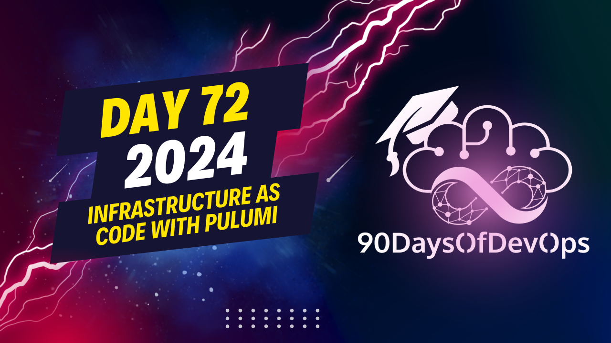

# Day 72 - Infrastructure as Code with Pulumi

Welcome to day 72 of the 2024 edition of 90 Days of DevOps!

Today's session is titled "Infrastructure as Code with Pulumi", and it is led by Scott Lowe.

## Video

## Additional Notes

Code for this session, as well as a PDF version of the slides, is available from [the companion repository](https://github.com/scottslowe/2024-90dod-iac-pulumi).

To use the example code, you will need the following:

* The AWS CLI installed and configured for an AWS account (Pulumi doesn't rely on the AWS CLI, but it uses the configuration for connecting to AWS)
* An SSH key pair defined in your AWS account and in your desired region
* The `pulumi` CLI tool installed and logged into a backend (see the slides for more information on Pulumi backends; using [Pulumi Cloud](https://app.pulumi.com) is the easiest and fastest way to get started)
* NodeJS installed
* The `git` CLI tool installed
* _(Optional)_ SSH installed on your system, if you want to be able to connect to the instance provisioned by the Pulumi program

Follow these instructions to run this Pulumi program:

1. Use `git clone` to clone [the companion repository](https://github.com/scottslowe/2024-90dod-iac-pulumi) to your local system.
1. Change into the directory where the repository was cloned.
1. Use `pulumi stack init <name>` to create a new Pulumi stack named `<name>`.
1. Run `npm install` to install the dependencies for the Pulumi program.
1. Run `pulumi config set aws:region <region>` to specify the AWS region where the resources should be created.
1. Run `pulumi config set keypair <keypair-name>` to specify the name of an existing AWS key pair that can be used for SSH access to an EC2 instance.
1. _(Optional)_ Set the desired VPC CIDR block with `pulumi config set vpcNetworkCidr <cidr>`.
1. _(Optional)_ Set the instance type with `pulumi config set <instance-type>`.
1. Run `pulumi up` to instantiate the infrastructure.
1. After the stack has finished provisioning, run `pulumi stack output` to get the IP address of the Flatcar Container Linux instance that was created. You can SSH into this instance to run Docker commands and verify that Pulumi launched a Docker container on this instance.
1. When you're finished, run `pulumi destroy` to tear down all the AWS resources.

Enjoy!
