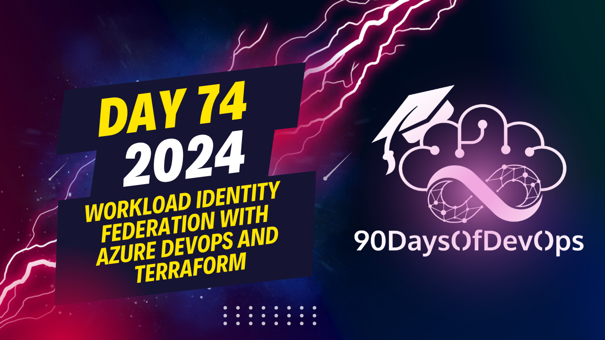

# Day 74 - Workload Identity Federation with Azure DevOps and Terraform

demonstrated the use of Workload Identity Federation (WhFF) in Azure DevOps to orchestrate Terraform deployments using service connections. Here's a summary of the steps you provided:

1. Configure an Azure AD Application (Service Principal) with the required permissions for your Terraform resources.
2. Assign the Service Principal to a Kubernetes Managed Identity.
3. Create a Workload Identity Federation in Azure DevOps and link it to the configured Service Principal.
4. Update your Terraform backend to use Azure AD OAuth2 for authentication.
5. Configure a pipeline task using the updated Terraform task version 0.14 or higher with the necessary environment variables and service connections.
6. Run the pipeline to deploy your resources, utilizing the WhFF service connection to authenticate and authorize access to Azure resources.

Thank you for sharing this valuable information! It's great to see the collaborative spirit in the DevOps community. If anyone encounters any issues while running these codes, they can always reach out to you or contribute solutions back to the repository. Keep up the fantastic work and good luck with future presentations in 90 days of DevOps!
The video is about setting up Workload Identity Federation (WIF) for Azure services using Terraform. The speaker explains that WIF allows you to manage identity and access control for Azure resources in a more centralized way.

The speaker walks the audience through their setup, showing how they created an app registration with Federated credentials, set up a workload identity Federation service connection, and configured RBAC (Role-Based Access Control) for the storage account where Terraform state files are stored.

The key points emphasized by the speaker are:

1. The importance of creating an app registration with Federated credentials.
2. Configuring the workload identity Federation service connection.
3. Granting the necessary RBAC permissions to the storage account where Terraform state files are stored.
4. Updating the Terraform task to version 4, which is required for WIF to work.
5. Setting an environmental variable `Azure RM use Azure ad true` to tell the backend to use Azure AD instead of creating a key.

The speaker also mentions that they have provided links and code snippets in their repository, and invites viewers to explore and run the code themselves. They emphasize the importance of collaboration and welcome feedback and contributions to improve their work.

Overall, the video provides a detailed explanation of how to set up WIF for Azure services using Terraform, with a focus on identity and access control management.
