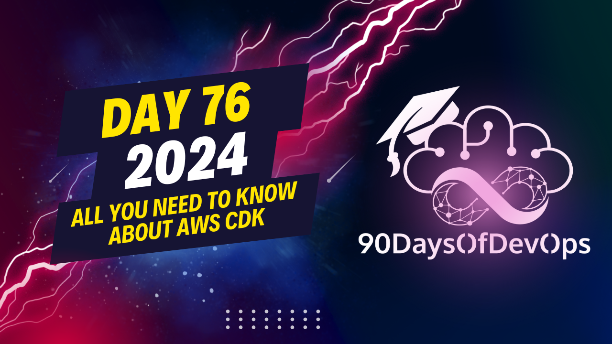

# Day 76 - All you need to know about AWS CDK

 In summary, AWS Cloud Development Kit (CDK) is a tool that allows developers to define their cloud infrastructure using programming languages of their choice (such as Python, JavaScript, Java, Go, TypeScript, etc.), instead of the traditional JSON or YAML templates used in Amazon Web Services (AWS) CloudFormation.

The main advantage of using CDK is that it simplifies the process of defining complex infrastructure and reduces the chances of errors by allowing developers to code their infrastructure. Additionally, CDK offers a modular architecture where stacks (templates) contain resources defined within constructs, which establish relationships between those resources. This makes it easier to manage and update large-scale infrastructure deployments.

It's worth noting that the AWS CDK is open-source, and its code is available on GitHub. There is also an active community on Slack where you can find help and learn more about using the tool. If you are interested in learning more about AWS CDK, there are numerous resources available online, including a blog post that I have linked in the description below.

Thank you for joining me today, and I hope you found this information helpful. Please feel free to reach out to me on social media using my handle @amokacana. Keep building awesome stuff!
**IDENTITY AND PURPOSE**

As an expert content summarizer, I will help you identify the main points and purpose of this talk about AWS Cloud Development Kit (CDK).

**Main Points:**

1. The speaker emphasizes the importance of using CDK to avoid errors and time-consuming manual infrastructure deployment on AWS.
2. CDK provides a way to code complex infrastructure in just a few lines, unlike manual console-based deployment which can lead to errors.
3. The speaker highlights that CDK allows you to use any programming language of your choice (e.g., Python, JavaScript, Java) whereas CloudFormation only supports JSON or YAML files.
4. The talk explains the CDK architecture:
	* CDK app is a container for stacks
	* Stacks are templates that hold resources
	* Resources are grouped into constructs

**Purpose:**

The purpose of this talk is to introduce and showcase the benefits of using AWS Cloud Development Kit (CDK) for infrastructure deployment on AWS. The speaker aims to demonstrate how CDK can simplify complex infrastructure deployment, reduce errors, and increase productivity.

**Additional Points:**

* CDK is open-sourced and available on GitHub
* There is an AWS CDK community on Slack
* Resources are available online to learn more about CDK and its usage
