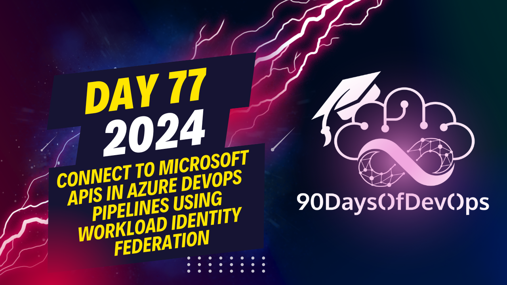

# Day 77 - Connect to Microsoft APIs in Azure DevOps Pipelines using Workload Identity Federation

This note accompanies my contribution for 2024 edition of 90DaysOfDevOps, which consists of:

- A video: [90DaysOfDevOps YouTube Channel](https://youtu.be/-KCgEC58PHQ)
- A presentation deck for reference: [day77-Connect-to-Microsoft-APIs-in-Azure-DevOps-Pipelines-using-Workload-Identity-Federation.pdf](./Presentations/day77-Connect-to-Microsoft-APIs-in-Azure-DevOps-Pipelines-using-Workload-Identity-Federation.pdf)
- This markdown file and a summary below, and a blog post where I have more details.

## What is Workload Identity Federation?

Workload Identity Federation allows you to access Microsoft Entra protected resources without needing to manage secrets. It is based on Open ID Connect, and supports specific scenarios like federation with GitHub and Azure DevOps, as well as a range of other documented scenarios.

The way that this works, is that you use workload identity federation to configure a user-assigned managed identity or app registration in Microsoft Entra ID to trust tokens from an external identity provider (IdP).

[Read more about Workload Identity Federation at Microsoft Learn](https://learn.microsoft.com/en-us/entra/workload-id/workload-identity-federation?WT.mc_id=linkedin&sharingId=EM-MVP-5001872)

## What are Service Connections?

Service Connections in Azure DevOps can be used to connect to resources in pipelines, and by using an Azure Resource Manager connection with Workload Identity Federation, we can basically connect to any Entra ID protected API and resource.

[Read more about Service Connections using Azure Resource Manager with Workload Identity Federation](https://learn.microsoft.com/nb-no/azure/devops/pipelines/library/connect-to-azure?view=azure-devops&WT.mc_id=linkedin&sharingId=EM-MVP-5001872)

## About Microsoft APIs protected by Entra ID

Microsoft have several well-known APIs that support OIDC (OpenID Connect) and OAuth2 for Authentication and Authorization, like Azure Resource Manager Rest API, Microsoft Graph API, KeyVault API to name a few.

In addition you can create, expose and protect your own APIs via App Registrations, so there are a lot of usage scenarios.

All this Microsoft APIs can be accessed securely and without secrets using Workload Identity Federation and Service Connections in Azure DevOps.

## Blog post

Here is a previous blog post I published that show the details on how to set this up:

https://gotoguy.blog/2023/09/15/connect-to-microsoft-graph-in-azure-devops-pipelines-using-workload-identity-federation/

## About me

I'm Jan Vidar Elven, and work as a Senior Architect in Evidi AS in Norway, I'm a Microsoft Security MVP, and specialize in Microsoft Entra, IAM (Identity Access Management), IGA (Identity Governance & Administration), Security, Cloud Platform solutions using Microsoft Azure, and DevOps.

Connect with me at:

- [LinkedIn](https://linkedin.com/in/janvidarelven)
- [X](https://x.com/JanVidarElven)
- [GitHub](https://github.com/janvidarelven)
