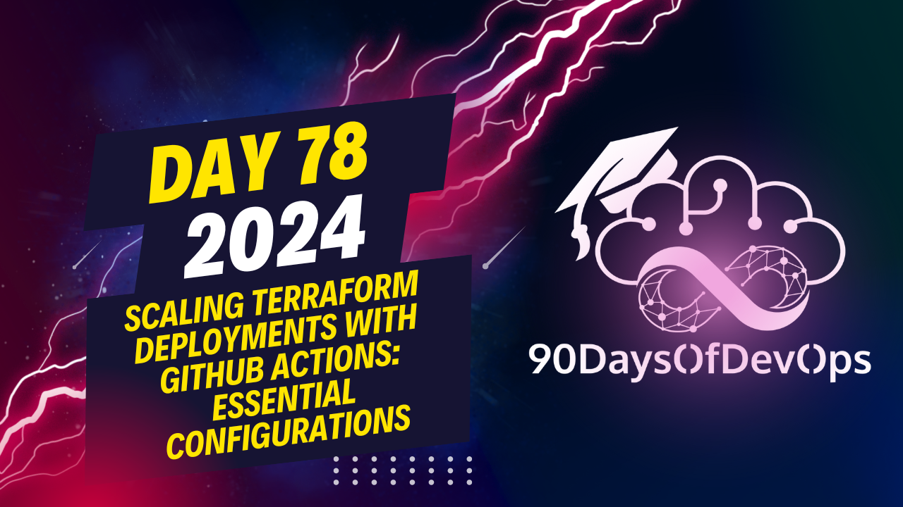

# Day 78 - Scaling Terraform Deployments with GitHub Actions: Essential Configurations

 In this explanation, the speaker is discussing their GitHub repository setup, branch policies, repository secrets, and actions associated with pull requests (PRs). Here's a breakdown of the main points:

1. **Branch Policy**: The main branch has a branch policy requiring pull requests before merging, approval(s), and status checks (Terraform job) to run successfully before merging. This helps ensure collaboration and prevents any failed merges due to failing jobs or unapproved PRs.

2. **Repository Secrets**: The repository contains multiple secrets for different environments like production and staging. These secrets can be used to store sensitive information like API keys, database credentials, etc. This is a crucial part of maintaining security within the project.

3. **Actions in PRs**: When creating a PR, instead of reviewing the code directly, the speaker suggests allowing the CI/CD pipeline to run and then creating a pull request as part of the review process. In this case, the PR will provide feedback on the changes made, including any formatting issues or required approvals.

4. **Terraform Format**: To address formatting issues, the Terraform format check is part of the CI/CD pipeline. This ensures that the code adheres to a consistent style and structure.

5. **Matrix Strategy**: The repository deploys multiple components in different environments using the Matrix strategy, ensuring no code duplication while providing fast and extensible output.

6. **Renovate Setup**: The speaker recommends setting up Renovate to manage package versions, as it keeps workflows and versions up-to-date and creates a base configuration for your organization's preferences.

7. **Terraform Apply**: A Terraform apply is run after merging the PR into the main branch, updating the infrastructure in the chosen environment. The speaker filters by development tags to check the progress of the Terraform apply.

In summary, this explanation provides an overview of how the speaker manages their GitHub repository and CI/CD pipeline, emphasizing the importance of branch policies, security through repository secrets, and a streamlined PR review process using actions and Terraform checks. The Matrix strategy and Renovate setup are also discussed as tools to simplify deploying multiple components across different environments while maintaining consistency and scalability.
It looks like we have a lot of information packed into this text! Let's break it down into smaller chunks to get a better understanding.

**Terraform C**

The first job uses a template called `terC` which sets up Terraform for the development environment. This template will run whenever it's not the main branch, ensuring that the CI check runs before merging into the main branch.

**Terraform**

The second job also uses a template called `terraForm` which deploys infrastructure components in both development and production environments. The template takes inputs from Secrets stored in the repository, allowing for easy swapping of secrets between environments.

**Repository Secrets**

The speaker demonstrates how to manage secrets in the repository using two environments (development and production) with multiple secrets. This is important for security purposes, as it allows for easy switching between secret sets.

**Actions and PR Feedback**

The speaker shows how the PR feedback works during the pipeline run, providing output that can be reviewed by team members. In this case, the tag change has been updated correctly in each environment and component.

**Terraform Format**

The Terraform format check is shown to be working correctly, with automatic commits made to update the repository after formatting changes are made.

**Workflow Matrix**

The speaker demonstrates how the workflow matrix can be used to deploy multiple components (six in this case) across different environments without code duplication. This makes the workflow more efficient and extensible.

**Renit Setup**

The speaker recommends setting up Renit, which keeps workflows and versions up-to-date, making it easier to track changes and dependencies.

That's a lot of information!
