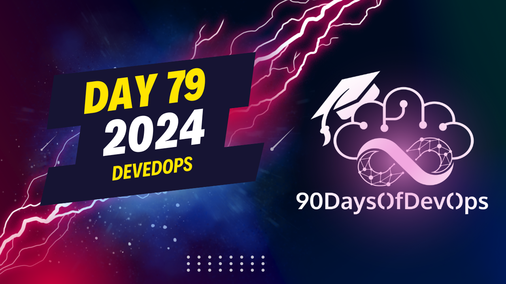

# Day 79 - DevEdOps

## DevEdOps

**Adam Leskis - SRE at Mention Me**

- [Twitter](https://twitter.com/baronvonleskis)
- [GitHub](https://github.com/lpmi-13)
- [Email](leskis@gmail.com)
- [Blog](https://micromaterialsblog.wordpress.com)
- [Personal Site](https://adamleskis.com)

## Presentation Overview

This session will explore the ways that we can apply a DevOps methodology to learning about DevOps. While there are numerous free resources publicly available on the internet, the majority of these are input-based (eg, blogs), or they provide a complete solution (eg, tutorials with links to complete source code). While these resources are indeed very useful, they’re insufficient if we also want to provide learners with experience applying knowledge to actually solve problems.

One potential reaction to this is an approach involving applying the Three Ways of Devops to our own learning journeys. This can result in some interesting ways to think about augmenting learning with faster flow, faster feedback, and creating a culture of sharing and expanding those materials and knowledge...and obviously as much automation as we can muster!

Faster flow means things like smaller more focused learning materials that can be done without large commitments of time. Faster feedback means creating automation around feedback to the learner while they’re in the process of completing the learning objective. Continuous learning can expand on the first two, fostering a system with materials/environments that are aimed at satisfying the first two ways and making them publicly available, either as open source code repositories, or running web-based services for everyone to explore and learn from.

By the end of the session, attendees will have been exposed to ideas blending cognitive psychology and devops practices, as well as seen examples of free and open-source educational materials exemplifying the Three Ways as applied to DevOps learning, and hopefully be excited to create some of their own.

## Notes

“I'm not a great programmer; I'm just a good programmer with great habits.” ~Kent Beck

[The Programmer's Brain](https://www.amazon.co.uk/Programmers-Brain-every-programmer-cognition/dp/1617298670)

[The Phoenix Project](https://www.amazon.co.uk/Phoenix-Project-Devops-Helping-Business/dp/1942788290/ref=sr_1_1?crid=3V9HEJTJXFZR5&keywords=the+phoenix+project&qid=1705009649&s=books&sprefix=the+phoenix+project%2Cstripbooks%2C181&sr=1-1)

[Chess chunking research](https://snitkof.com/cg156/chesschunkingtheory.php)

[Webapp I built to help me recognize public IP addresses](https://ipinder.netlify.app)
(source code at https://github.com/lpmi-13/ipinder)

[Webapp I built to help me learn jq better](https://jayq.party)
(source code at https://github.com/lpmi-13/jq-pilot)

[Learning dojo I built to help myself get more comfortable with operating MongoDB replicasets](https://github.com/lpmi-13/mongo-dojo)

## Other places already doing DevEdOps

- [Mess with DNS](https://messwithdns.net/)

- [Sad Servers](https://sadservers.com/)

- [Game of Active Directory](https://github.com/Orange-Cyberdefense/GOAD)

- [Iximiuz Labs](https://labs.iximiuz.com/challenges)
