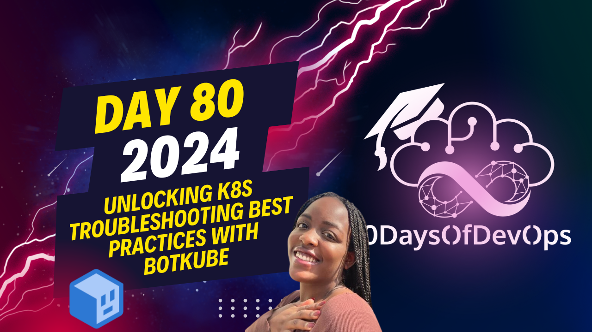

# Day 80 - Unlocking K8s Troubleshooting Best Practices with Botkube

 Discussing a solution called BotCube, which is designed to streamline incident response and troubleshooting processes within Kubernetes clusters. Here's a summary of the benefits:

1. **ID Channels**: Different teams receive alerts tailored to their roles. This reduces unnecessary noise for developers, platform engineers, and other team members.

2. **Incident Response**: Resolve issues directly from communication platforms like Slack or Teams, saving time and preventing context switching.

3. **Information Gathering**: Access detailed information about incidents, including resource descriptions and audit logs, which helps in analyzing application behavior and improving team performance.

4. **Automation**: Utilize various CNCF tools within the communication platform to speed up command execution and reduce reliance on Kubernetes experts. Automations can also help reduce manual steps during troubleshooting.

5. **Action versus Reaction**: With historical incident data, teams can become more proactive, identifying telltale signs of upcoming incidents and taking action before they escalate into larger outages.

6. **Improvements**: BotKube helps reduce mean time to recovery (MTTR), increase operational efficiency, reduce team burnout, and minimize the number of outages by promoting a proactive approach to incident management.

7. **Security and Reliability**: BotKube integrates with Kubernetes RBAC (Role-Based Access Control) and Slack, creating an access control system for your team, ensuring reliability and security when managing Kubernetes clusters.
Based on the content, I've identified the main points and summarized them as follows:

**Identity**: The speaker emphasizes the importance of understanding the context and history of kubernetes troubleshooting, highlighting the need to be proactive rather than reactive. They introduce BotKube as a tool that can help streamline the process.

**Purpose**: The purpose of this presentation is to showcase how BotKube can improve the kubernetes troubleshooting experience by providing a centralized platform for collaboration, automating manual steps, and reducing team burnout.

**Key Points**:

1. **Audit Logs**: BotKube provides audit logs that allow teams to monitor who did what inside the cluster, enabling root cause analysis and continuous improvement.
2. **Proactive Approach**: By having access to historical data and real-time insights, teams can anticipate and prevent issues from occurring.
3. **Automation**: BotKube automates manual steps in the troubleshooting process, reducing the need for human intervention and speeding up command execution.
4. **Collaboration**: The platform enables seamless collaboration among team members, allowing them to work together more efficiently.

**Benefits**:

1. **Reduced MTTR (Mean Time To Recovery)**: BotKube helps reduce downtime by streamlining the troubleshooting process and automating manual steps.
2. **Increased Operational Efficiency**: The tool reduces the need for human intervention, freeing up team members to focus on higher-level tasks.
3. **Improved Team Productivity**: By reducing context switching and pressure on devops teams, BotKube helps prevent burnout and improves overall team productivity.

**Real-World Example**: A shipping company uses BotKube to manage their kubernetes clusters, automating parts of their troubleshooting process and improving collaboration among team members.

**Conclusion**: The speaker emphasizes the importance of having a strategic approach to kubernetes troubleshooting and highlights how BotKube can help teams become more resilient and reliable by centralizing and automating the troubleshooting process.
