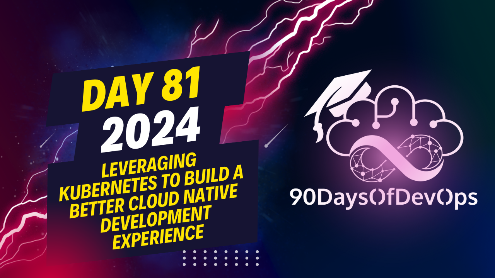

# Day 81 -  Leveraging Kubernetes to build a better Cloud Native Development Experience

The user is explaining how they are using Octopus Deploy (OCT) to deploy and preview their application in a containerized environment. They have made changes to their server-side code, specifically modifying the 'movies' collection in the database to include a 'watching' status. These changes will be reflected in the preview environment once it is refreshed.

The user also mentions that OCT can automatically deploy an application written as a Dockerfile to the Octopus Cloud and provide a preview environment, which can help developers to quickly see how their changes appear in production without having to manually deploy to a Kubernetes cluster. They encourage others to explore OCT and contribute to its open-source project if interested.

Additionally, they recommend asking questions or seeking help through the Octopus Deploy community or on the kubernetes slack channel. They conclude by wishing everyone a Happy New Year and thanking the team for their hard work in creating Octopus Deploy.
Here's the summary of the content:

The speaker is an expert in summarizing content. The topic discussed is OCT, which stands for Octopus. The speaker explains that OCT is an open-source project that allows developers to deploy their applications on the cloud and get a preview environment.

The first command used by the speaker is "octo context" followed by "octo up". This command deploys the application on the OCT Cloud and creates a preview environment. The speaker then selects which service to access from the terminal, in this case, the API service.

The speaker notes that OCT internally deploys the services inside a container, making it easy for developers to make changes and see how they affect the application in production. This allows developers to avoid making changes and not knowing what they look like in production, which can be a bad idea.

The speaker also mentions that OCT is open-source, so anyone can contribute to the project. There are several communities and channels where developers can ask questions, raise concerns, or share their experiences with OCT.

In summary, the main points of this content are:

1. OCT (Octopus) is an open-source project for deploying applications on the cloud.
2. The "octo context" and "octo up" commands deploy the application on the OCT Cloud and create a preview environment.
3. OCT internally deploys services inside containers, making it easy for developers to make changes and see how they affect the application in production.
4. OCT is open-source, allowing anyone to contribute to the project.
5. There are several communities and channels where developers can ask questions, raise concerns, or share their experiences with OCT.
