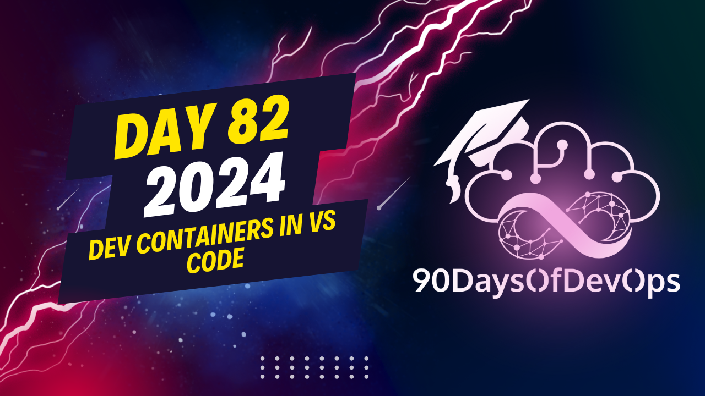

# Day 82 - Dev Containers in VS Code

Discussing the features and benefits of using Visual Studio Code (VSCode) with Dev Containers. Here's a summary of the key points from your text:

1. VSCode with Dev Containers allows developers to work in isolated environments, ensuring consistency across different machines.
2. Developers can create, manage, and share Dev Containers for their projects, making it easy to collaborate with others or switch between machines.
3. The extension supports various languages such as Rust, Go, Python, etc., providing a streamlined development experience without worrying about setting up the environment.
4. Developers can set breakpoints, debug, and examine code within the container, just like working on their local machine.
5. Port mapping is available, allowing developers to access web applications or services running inside the Dev Container from their local machine.
6. Home Assistant, an open-source home automation platform, uses a Dev Container for consistency and ease of development with various tools.
7. There are extensive resources and documentation available on Visual Studio Code's website and GitHub regarding creating, attaching, and using Dev Containers in advanced scenarios like multiple users or Kubernetes.

Overall, it seems that VSCode with Dev Containers provides a powerful and flexible development environment for various programming languages and use cases.
**IDENTITY and PURPOSE**

Here's a summary of the main points:

1. **Dev Containers**: With VS Code, you can create a remote development environment using Dev Containers. This allows for consistent tooling across projects, reduces conflicts with system dependencies, and enables collaboration.
2. **GitHub Codespaces**: GitHub Codespaces is a cloud-based service that provides a remote development environment. You can access your codespace from anywhere, and it integrates seamlessly with VS Code.
3. **Customizations**: In the Dev container settings, you can customize the extensions, add features, and configure the environment to suit your needs.
4. **Extensions**: You can enable extensions like Co-Pilot, Pull Request Analyzer, and GitHub CLI to enhance your development experience.
5. **Net 8 installation**: With Net 8 installed in your codespace, you can work with .NET projects without worrying about compatibility issues.
6. **Code Spaces**: In the Code Spaces extension, you can configure settings like opening code spaces directly in VS Code, setting up remote connections, and managing data sovereignty.

**Cool features:**

1. **Try a sample**: With Dev Containers, you can quickly try out samples of different programming languages, such as Rust or Go.
2. **Debugging**: You can debug web applications running in a codespace using your local browser.
3. **Port mapping**: The Dev Container extension allows for port mapping, enabling you to access the application from your local machine.

**Additional resources:**

1. **Visual Studio Code documentation**: Check out the official VS Code documentation on Dev Containers for more information and advanced scenarios.
2. **GitHub Codespaces documentation**: Visit GitHub's Codespaces documentation for details on setting up and using code spaces.
3. **Home Assistant**: Explore the Home Assistant project, which uses Dev Containers to ensure consistency across different tools.

