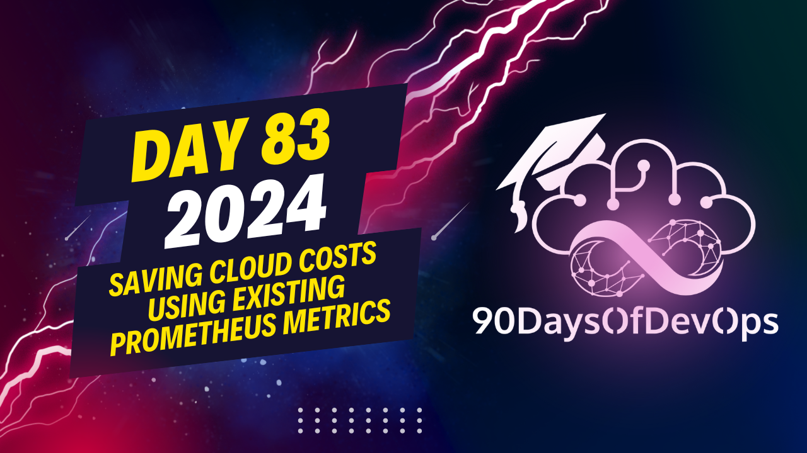

# Day 83 - Saving Cloud Costs Using Existing Prometheus Metrics

Explaining how to use KR, a tool for providing resource optimization recommendations in a Kubernetes cluster. Here's a summary of the steps and key points:

1. To install and use KR, the following prerequisites are needed:
   - Prometheus and Cube State metrics (if you have these, KR should work fine)
   - If using Linux or Mac with Brew, you can directly install KR. For Windows users, WSL is recommended.
   - Clone the KR repository and install dependencies using a Python virtual environment.

2. Run KR on the cluster to analyze the past 14-day history of applications and provide recommendations based on a simple algorithm. The output will include:
   - Namespaces and types of Kubernetes objects (e.g., pods)
   - Container names, with separate recommendations for each container within a pod
   - CPU requests, CPU limits, memory requests, memory limits, and the difference in suggested values

3. If you only want to see the recommendations without the process setup details, use the '--quiet' flag.

4. Recommendations may suggest to unset CPU limits or not have them at all, as KR has a detailed explanation about why this is recommended (you can find more information in blog posts and talks by the co-founder/CEO).

5. Compared to vPA (Kubernetes Vertical Pod Autoscaler), KR runs instantly, provides recommendations based on existing history, and allows you to add new strategies and algorithms for better results tailored to your specific applications.

6. With the Robusta OpSource, you can configure KR to run occasional K scans and send reports to Slack or other integrations like 15+ available options.

7. For a detailed explanation of recommendations, previous usage history, and why KRR is suggesting certain values, use the Robusta dashboard. Additionally, a K9s plugin is available for direct in-cluster recommendations.

Key takeaways:
- Using existing Prometheus data can help predict resource optimization without requiring new data or provisioning additional resources.
- Automate the process of receiving results with KR by setting up the Robusta OpSource to send reports.
# OUTPUT SECTIONS

ONE SENTENCE SUMMARY:
The presentation discusses how Kubernetes over-allocation is burning cash for companies and introduces KR, an open-source CLI tool that uses existing Prometheus metrics to provide data-driven recommendations for CPU and memory request and limits.

MAIN POINTS:

1. Kubernetes over-allocation can lead to significant cloud costs.
2. KR (Kubernetes Requestor) is a simple, data-driven solution to optimize resource allocation.
3. KR connects to Prometheus and analyzes history to provide recommendations.
4. The tool does not require an agent or continuous running on the cluster.
5. Recommendations are based on actual application usage and can be extended or modified for specific needs.
6. CPU limits in Kubernetes work differently than memory limits, which is why KR often suggests removing or unsetting them.
7. VPA (Kubernetes Vertical Pod Autoscaler) runs in the cluster and requires time to provide results, whereas KR runs instantly.
8. KR provides recommendations but does not implement changes; users can choose to apply or reject suggestions.

KEY TAKEAWAYS:

1. Requests and limits can save companies a significant amount of cloud cost.
2. Existing Prometheus data can be used to predict and optimize resource allocation.
3. Automation is possible by integrating K with other tools, such as Slack.
4. KR provides detailed explanations for recommendations and allows users to change the configuration.

# PURPOSE

The purpose of this presentation is to introduce KR as a solution to the problem of Kubernetes over-allocation and to showcase its capabilities in optimizing resource allocation using existing Prometheus metrics.
