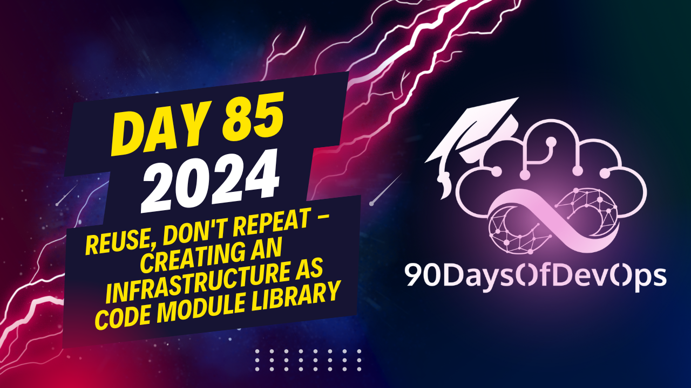

# Day 85 - Reuse, Don't Repeat - Creating an Infrastructure as Code Module Library

 To start practicing with creating modules, here is a simple roadmap that includes good documentation, evangelizing, and distribution:

1. **Create your module:** Choose a suitable language such as ARM Templates (Azure), BICEP, CloudFormation, or Terraform based on your infrastructure needs. Write clear and concise code for the module.

2. **Documentation:** Provide detailed documentation explaining what the module does, its dependencies, required inputs/parameters, acceptable values, and outputs. Make sure to include examples and use cases that demonstrate how to use the module effectively.

3. **Evangelize and engage:** Share your modules with others within your organization or open-source communities. Create awareness about the benefits of using these modules, such as reduced complexity, increased consistency, and improved collaboration across teams.

4. **Distribute your modules:** Use registry systems like Azure's Template Specs, Bicep Module Repository, AWS CloudFormation Registry, or third-party tools like Spacelift to centralize storage of your modules. This makes it easy for others to find and consume your modules as needed.

5. **Real-world examples:** Consider creating modules for common infrastructure components such as virtual machines (VMs), Kubernetes clusters, networks, and configuration settings that can help standardize processes across your organization.

By following these steps, you'll be able to create reusable and easily consumable modules, streamline infrastructure deployment, and improve collaboration among teams within your organization or open-source communities. Good luck with your DevOps journey!
The topic is IDENTITY and PURPOSE, specifically discussing how to create modules for infrastructure-as-code (IaC) management. The speaker emphasizes the importance of having a single source of truth for IaC modules, making it easier for teams to consume and maintain them.

The speaker suggests several ways to create modules:

1. Template specs in Azure Resource Manager (ARM) and Bicep
2. CloudFormation registry
3. Terraform Registry or Git repository
4. Third-party tools like Spacelift

These allow for centralized storage of IaC modules, version control, and easy consumption by teams.

The speaker provides several real-world examples of where creating modules can bring benefits:

1. Virtual Machine (VM) configuration modules to simplify VM deployment
2. Kubernetes cluster modules to ease the process of setting up a new cluster
3. Network configuration modules to define standard networking settings
4. Configuration modules to set default configuration settings for resources

The speaker also mentions that there are tools available that can help with some of these tasks, such as High from Puppet or ESC from Palumi.

Overall, the session aims to encourage teams to create IaC modules and reuse existing infrastructure code to simplify their work and improve collaboration.
