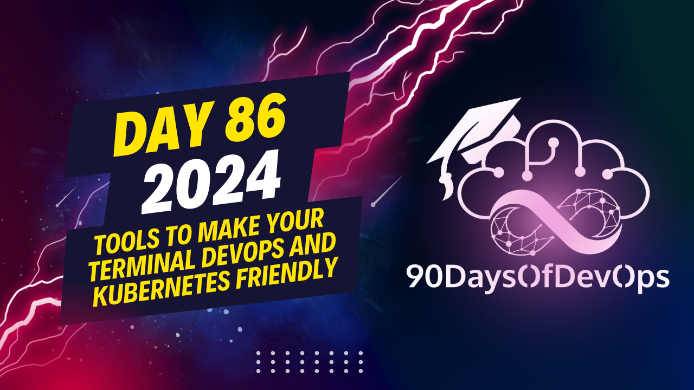

# Day 86 - Tools To Make Your Terminal DevOps and Kubernetes Friendly

 various tools that can help developers manage Kubernetes effectively. Here is a summary of the tools mentioned:

1. Alias for kubectl (e.g., 'K'): Shortens kubectl commands, making it quicker and easier to use.
2. PS1: Prevents errors by showing which cluster and namespace you are currently working on in your terminal.
3. CBE color: Enhances the output of kubernetes commands with colors for improved visibility.
4. Cube CTX and Cube NS: Allows users to switch between different contexts and namespaces in a Kubernetes system.
5. K9: A user-friendly command-line tool that provides a visual dashboard for managing Kubernetes clusters.
6. Kubernetes Lens: A desktop application with a graphical interface for managing and monitoring Kubernetes clusters.
7. Popy: Analyzes a Kubernetes cluster to identify potential issues, best practices violations, resource inefficiencies, and security concerns.
8. Cube capacity: Provides insights into resource usage and capacity of your cluster, including CPU and memory requests and limits.
9. Cube shell: Integrated shell for kubernetes CLI that suggests possible commands and provides visualization.

These tools can help developers improve productivity, reduce errors, and streamline Kubernetes management tasks. If you have any questions or would like to know more about these tools, feel free to reach out on LinkedIn or find the speaker's technical articles on Medium.
**IDENTITY and PURPOSE**

As an expert content summarizer, I've taken on the task of condensing this session into a concise summary. Here's what I've found:

The session focuses on various tools for DevOps professionals, particularly those working with Terraform (TF), Kubernetes, and Git.

**Terraform Tools**

1. **TFC (Terraform Security Scanning)**: A security scanning tool designed specifically for Terraform code, identifying potential vulnerabilities and suggesting improvements.
2. **Cube CTX**: Allows users to switch between different contexts in their system.
3. **Cube NS**: Enables switching between different name spaces.

**Kubernetes Tools**

1. **K9**: A user-friendly command-line tool providing a visual dashboard for managing Kubernetes clusters.
2. **Kubernetes Lens**: A desktop application offering a graphical interface for monitoring and managing clusters.
3. **popy**: Analyzes Kubernetes cluster resource usage, identifying potential issues, misconfigurations, or security concerns.

**Git Tools**

1. **q PS1**: A helpful tool that visually displays the current Kubernetes context and namespace, preventing errors.

The session concludes by emphasizing the importance of using these tools to boost productivity and make life easier for DevOps professionals.

That's it! If you have any questions or would like to learn more about these tools, feel free to reach out to me on LinkedIn or Medium.
