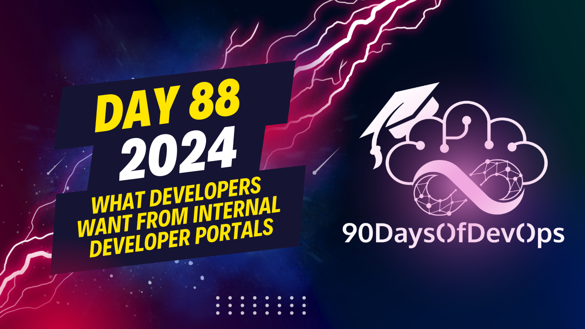

# Day 88 - What Developers Want from Internal Developer Portals

A session on Cortex, an IDP (Identity and Developer Portal) solution that offers a unique plugin system for customization, along with its adoption strategies. Here's a summary:

1. Cortex provides pre-built Integrations and a self-service platform out of the box. However, it also encourages users to build their own plugins to accommodate their organization's specific needs using React TypeScript. These plugins can be embedded across various pages, allowing for custom features like building your release management UI or a single portal for C Kubernetes control plane.

2. To successfully adopt IDPs like Cortex, organizations should focus on collecting information about existing services, infrastructure, accountability, and interaction points. This will help optimize and build better experiences.

3. Set a North Star to define where the organization is today and where it aims to be across various pillars such as production readiness standards, service maturity, reliability, security, and productivity standards. Assess the baseline to measure impact and prioritize action for developers accordingly.

4. Enable and optimize experiences based on the data collected. For instance, if you find friction in specific areas like setting up SLOs or spinning up infrastructure, you can provide self-serve experiences tailored to those problems. Continuously measure, assess, and make changes to create a feedback loop that drives adoption, value, and productivity.

5. Ganesh, the co-founder & CTO of Cortex, is available for questions via email on his LinkedIn profile. His email address is [Ganesh@cortex](mailto:Ganesh@cortex).

Hope this summary helps! Let me know if you need further clarification.
The current state of your business, organization, and engine - that's what's most important when it comes to scoring drives action for developers and giving them clear visibility into what they should be working on. 

A developer portal must provide an out-of-the-box reporting capability to give leadership visibility into the organization, services, and infrastructure. This will enable data-driven decisions without which you're not solving for a key persona (leadership) that cares about the catalog but in a different way.

Self-service is another crucial aspect of a developer portal. You can spin up new services from scratch using a scaffolder or template, giving developers golden paths to create consistent and standardized code. This also enables a feedback loop within your developer portal that says "here's what good is; here's how you can go and do that really easily".

Actions are the ability to trigger events outside of the system, allowing developers to build payloads and give them simple form UIs to trigger external systems.

Lastly, plugins - a unique feature in cortex - allows you to build your own capabilities on top of the platform. You can create your own react typescript plugins and embed them inside cortex, giving you flexibility and the ability to build custom experiences for developers.

So, how do successful organizations adopt IDPs? They start by collecting information about what services are out there, who owns what, and how they all interact with each other. Once you have that information, you set a North star - where are we today, where are we trying to get to, and prioritize action for your developers.

The outcome of this is enabling and optimizing experiences that drive impact. By creating personalized experiences, automating things away, and building custom dashboards, you can optimize the experience for developers and create a feedback loop that drives adoption and value.

That's how organizations adopt IDPs successfully!
