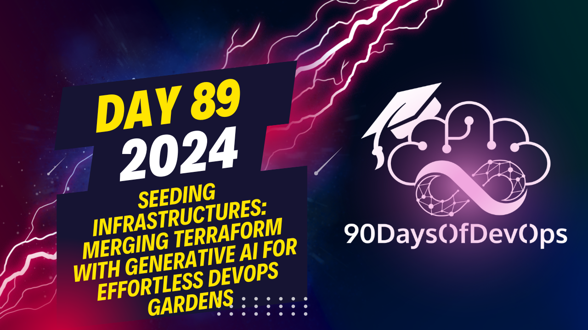

# Day 89 - Seeding Infrastructures: Merging Terraform with Generative AI for Effortless DevOps Gardens

 Thank you for sharing your insights and case study! It seems that you have successfully implemented a generative AI-powered seating engine in a project aimed at building a rapidly growing website with scalable digital infrastructure. The benefits you mentioned, such as reduced downtime, cost savings, time savings, and enhanced user experience, are indeed valuable outcomes of automation using AI.

To summarize your key learnings:
1. Automation's impact should not be underestimated, offering potential for significant cost and time savings.
2. Security is crucial, requiring human oversight to validate recommendations and ensure best practices are followed.
3. Predictive analytics will play a more significant role as AI generates valuable analysis and insights.
4. Collaborative AI, where humans work with AI to monitor its output, will be increasingly important in the future.
5. Resource optimization will become a prominent aspect of devops, with generative AI providing suggestions for improvements.
6. Understanding generative AI is essential when creating your own seating engine.
7. Human supervision and monitoring are still vital to ensure the output of AI aligns with human requirements and follows normal guidelines, particularly for security purposes.
8. Don't cut corners; ensure that the entire process, including security measures, is in place and followed accordingly.

Overall, it was a fascinating session, and I appreciate your sharing valuable insights about the role of generative AI in devops. Your points about the importance of human oversight in an autonomous workload are especially important to remember, as AI should complement our work, not replace it. Thank you once again for this enlightening discussion, and feel free to connect with me on my socials if you have any questions or further insights!
Here is a summarized version of the content:

**Identity and Purpose**

The speaker emphasized the importance of understanding generative AI in creating one's own seating engine. They highlighted that automation cannot be understated, as it can lead to significant cost savings and time savings.

**Case Study: Scalable Digital Infrastructure**

The speaker shared a case study on building a rapidly growing website needing scalable digital infrastructure. They used a seating engine to automate workflows, including adaptive scaling for traffic and form submission data. The result was a significant reduction in downtime maintenance costs and enhanced user experience.

**Key Learnings**

* Automation can lead to cost savings and time savings.
* DevOps is evolving towards generative AI-driven practices.
* Security is key and requires human oversight.
* Autonomous devops will continue to gain popularity.
* Predictive analytics, enhanced security, and resource optimization will be crucial aspects of future devops.

**Future of DevOps**

The speaker predicted that the future of devops will involve more autonomous workflows, predictive analytics, and collaborative AI. They emphasized the importance of humans working with AI to ensure that final outputs meet requirements.
