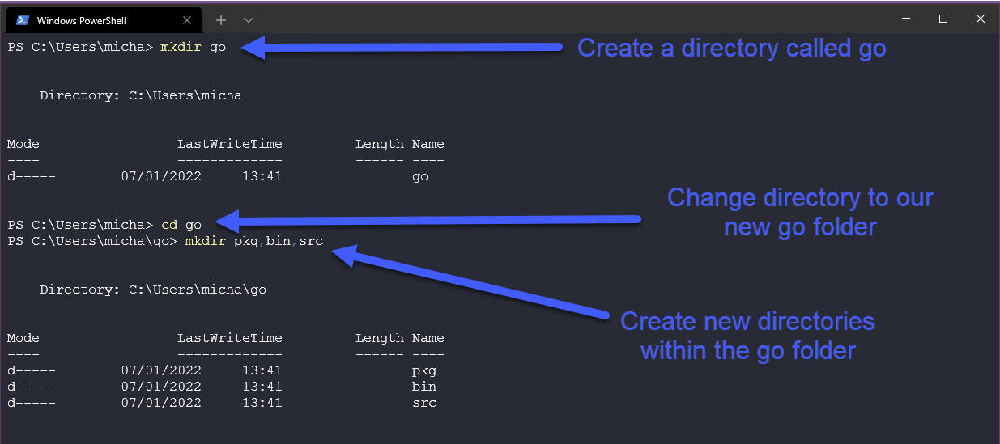
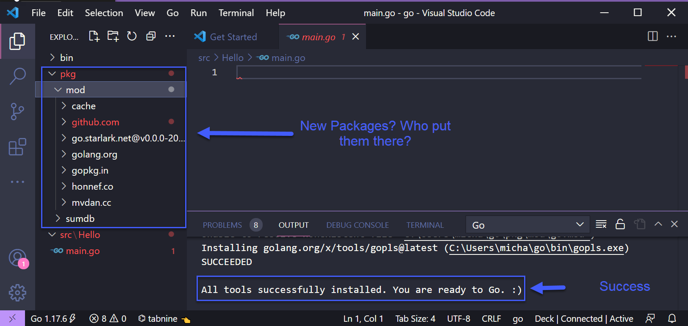

## Setting up your DevOps environment for Go & Hello World

Before we get into some of the fundamentals of Go we should get Go installed on our workstation and do what every "learning programming 101" module teaches us which is to create the Hello World app. As this one is going to be walking through the steps to get Go installed on your workstation we are going to attempt to document the process in pictures so people can easily follow along. 

First of all, let's head on over to [go.dev/dl](https://go.dev/dl/) and you will be greeted with some available options for downloads. 


If we made it this far you probably know which workstation operating system you are running so select the appropriate download and then we can get installing. I am using Windows for this walkthrough, basically, from this next screen, we can leave all the defaults in place for now. ***(I will note that at the time of writing this was the latest version so screenshots might be out of date)*** 


Also note if you do have an older version of Go installed you will have to remove this before installing, Windows has this built into the installer and will remove and install as one. 

Once finished you should now open a command prompt/terminal and we want to check that we have Go installed. If you do not get the output that we see below then Go is not installed and you will need to retrace your steps. 

`go version`


Next up we want to check our environment for Go. This is always good to check to make sure your working directories are configured correctly, as you can see below we need to make sure you have the following directory on your system. 


Did you check? Are you following along? You will probably get something like the below if you try and navigate there. 


Ok, let's create that directory for ease I am going to use the mkdir command in my powershell terminal. We also need to create 3 folders within the Go folder as you will see also below. 



Now we have Go installed and we have our Go working directory ready for action. We now need an  integrated development environment (IDE) Now there are many out there available that you can use but the most common and the one I use is Visual Studio Code or Code. You can learn more about IDEs [here](https://www.youtube.com/watch?v=vUn5akOlFXQ). 

If you have not downloaded and installed VSCode already on your workstation then you can do so by heading [here](https://code.visualstudio.com/download). As you can see below you have your different OS options. 


Much the same as with the Go installation we are going to download and install and keep the defaults. Once complete you can open VSCode and you can select Open File and navigate to our Go directory that we created above. 


You may get a popup about trust, read it if you want and then hit Yes, trust the authors. (I am not responsible later on though if you start opening things you don't trust!)

Now you should see the three folders we also created earlier as well and what we want to do now is right click the src folder and create a new folder called `Hello`


Pretty easy stuff I would say up till this point? Now we are going to create our first Go Program with no understanding about anything we put in this next phase. 

Next create a file called `main.go` in your `Hello` folder. As soon as you hit enter on the main.go you will be asked if you want to install the Go extension and also packages you can also check that empty pkg file that we made a few steps back and notice that we should have some new packages in there now? 



Now let's get this Hello World app going, copy for the following code into your new main.go file and save that. 

```
package main

import "fmt"

func main() {
    fmt.Println("Hello #90DaysOfDevOps")
}
```
Now I appreciate that the above might make no sense at all, but we will cover more about functions, packages and more in later days. For now let's run our app. Back in the terminal and in our Hello folder we can now check that all is working. Using the command below we can check to see if our generic learning program is working. 

```
go run main.go
```


It doesn't end there though, what if we now want to take our program and run it on other Windows machines? We can do that by building our binary using the following command 

```
go build main.go
``` 


If we run that


## Resources

- [StackOverflow 2021 Developer Survey](https://insights.stackoverflow.com/survey/2021)
- [Why we are choosing Golang to learn](https://www.youtube.com/watch?v=7pLqIIAqZD4&t=9s)
- [Jake Wright - Learn Go in 12 minutes](https://www.youtube.com/watch?v=C8LgvuEBraI&t=312s) 
- [Techworld with Nana - Golang full course - 3 hours 24 mins](https://www.youtube.com/watch?v=yyUHQIec83I) 
- [**NOT FREE** Nigel Poulton Pluralsight - Go Fundamentals - 3 hours 26 mins](https://www.pluralsight.com/courses/go-fundamentals) 
- [FreeCodeCamp -  Learn Go Programming - Golang Tutorial for Beginners](https://www.youtube.com/watch?v=YS4e4q9oBaU&t=1025s) 
- [Hitesh Choudhary - Complete playlist](https://www.youtube.com/playlist?list=PLRAV69dS1uWSR89FRQGZ6q9BR2b44Tr9N) 


See you on [Day 9](day09.md).


