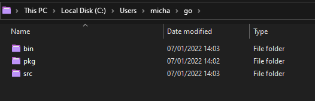
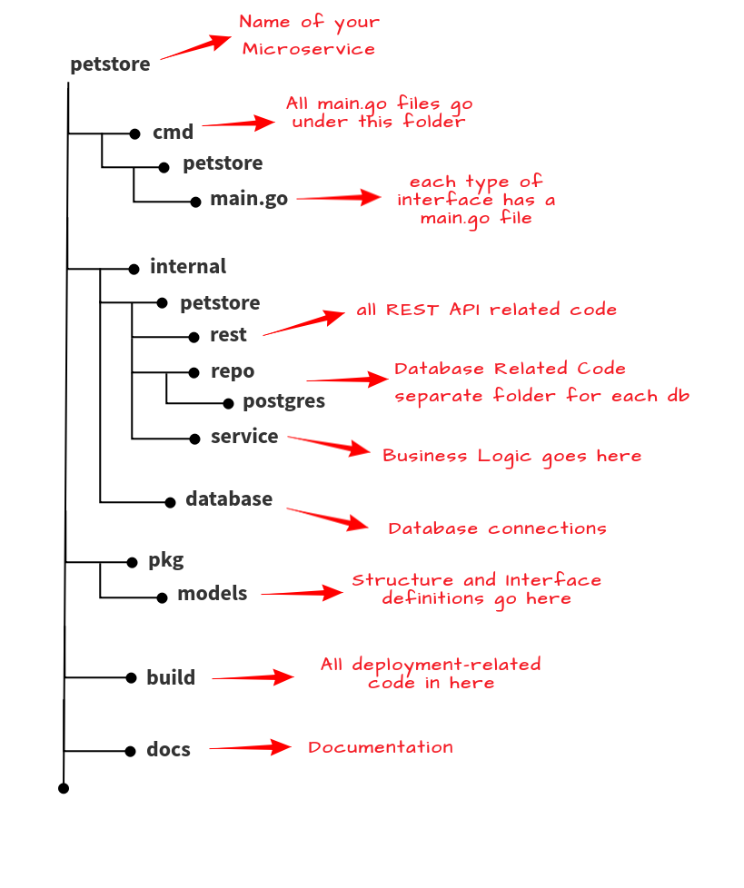

### The Go Workspace

On [Day 8](day08.md) we briefly covered the Go workspace to get Go up and running to get to the demo of `Hello #90DaysOfDevOps` But we should explain a little more about the Go workspace.

Remember we chose the defaults and we then went through and created our Go folder in the GOPATH that was already defined but in reality, this GOPATH can be changed to be wherever you want it to be.

If you run

```
echo $GOPATH
```

The output should be similar to mine (with a different username may be) which is:

```
/home/michael/projects/go
```

Then here, we created 3 directories. **src**, **pkg** and **bin**



**src** is where all of your Go programs and projects are stored. This handles namespacing package management for all your Go repositories. This is where you will see on our workstation we have our Hello folder for the Hello #90DaysOfDevOps project.


**pkg** is where your archived files of packages that are or were installed in programs. This helps to speed up the compiling process based on if the packages being used have been modified.


**bin** is where all of your compiled binaries are stored.


Our Hello #90DaysOfDevOps is not a complex program so here is an example of a more complex Go Program taken from another great resource worth looking at [GoChronicles](https://gochronicles.com/)



This page also goes into some great detail about why and how the layout is like this it also goes a little deeper on other folders we have not mentioned [GoChronicles](https://gochronicles.com/project-structure/)

### Compiling & running code

On [Day 9](day09.md) we also covered a brief introduction to compiling code, but we can go a little deeper here.

To run our code we first must **compile** it. There are three ways to do this within Go.

- go build
- go install
- go run

Before we get to the above compile stage we need to take a look at what we get with the Go Installation.

When we installed Go on Day 8 we installed something known as Go tools which consist of several programs that let us build and process our Go source files. One of the tools is `Go`

It is worth noting that you can install additional tools that are not in the standard Go installation.

If you open your command prompt and type `go` you should see something like the image below and then you will see "Additional Help Topics" below that for now we don't need to worry about those.


You might also remember that we have already used at least two of these tools so far on Day 8.


The ones we want to learn more about are the build, install and run.


- `go run` - This command compiles and runs the main package comprised of the .go files specified on the command line. The command is compiled to a temporary folder.
- `go build` - To compile packages and dependencies, compile the package in the current directory. If the `main` package, will place the executable in the current directory if not then it will place the executable in the `pkg` folder. `go build` also enables you to build an executable file for any Go Supported OS platform.
- `go install` - The same as go build but will place the executable in the `bin` folder

We have run through go build and go run but feel free to run through them again here if you wish, `go install` as stated above puts the executable in our bin folder.


Hopefully, if you are following along you are watching one of the playlists or videos below, I am taking bits of all of these and translating these into my notes so that I can understand the foundational knowledge of the Golang language. The resources below are likely going to give you a much better understanding of a lot of the areas you need overall but I am trying to document the 7 days or 7 hours worth of the journey with interesting things that I have found.

## Resources

- [StackOverflow 2021 Developer Survey](https://insights.stackoverflow.com/survey/2021)
- [Why we are choosing Golang to learn](https://www.youtube.com/watch?v=7pLqIIAqZD4&t=9s)
- [Jake Wright - Learn Go in 12 minutes](https://www.youtube.com/watch?v=C8LgvuEBraI&t=312s)
- [Techworld with Nana - Golang full course - 3 hours 24 mins](https://www.youtube.com/watch?v=yyUHQIec83I)
- [**NOT FREE** Nigel Poulton Pluralsight - Go Fundamentals - 3 hours 26 mins](https://www.pluralsight.com/courses/go-fundamentals)
- [FreeCodeCamp - Learn Go Programming - Golang Tutorial for Beginners](https://www.youtube.com/watch?v=YS4e4q9oBaU&t=1025s)
- [Hitesh Choudhary - Complete playlist](https://www.youtube.com/playlist?list=PLRAV69dS1uWSR89FRQGZ6q9BR2b44Tr9N)

See you on [Day 11](day11.md).
