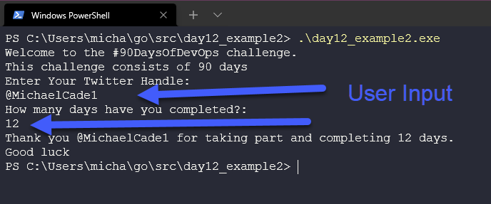
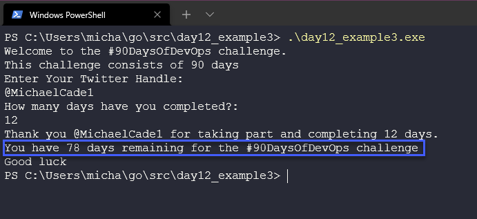
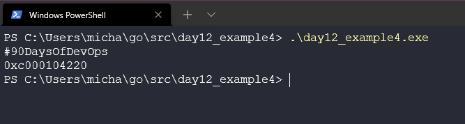

## Getting user input with Pointers and a finished program

Yesterday ([Day 11](day11.md)), we created our first Go program that was self-contained and the parts we wanted to get user input for were created as variables within our code and given values, we now want to ask the user for their input to give the variable the value for the end message.

## Getting user input

Before we do that let's take a look at our application again and walk through the variables we want as a test before getting that user input.

Yesterday we finished up with our code looking like this [day11_example4.go](Go/day11_example4.go) we have manually in code defined our `challenge, daystotal, dayscomplete` variables and constants.

Let's now add a new variable called `TwitterName` you can find this new code at [day12_example1.go](Go/day12_example1.go) and if we run this code this is our output.


We are on day 12 and we would need to change that `dayscomplete` every day and compile our code each day if this was hardcoded which doesn't sound so great.

Getting user input, we want to get the value of maybe a name and the number of days completed. For us to do this we can use another function from within the `fmt` package.

Recap on the `fmt` package, different functions for formatted input and output (I/O)

- Print Messages
- Collect User Input
- Write into a file

This is instead of assigning the value of a variable we want to ask the user for their input.

```
fmt.Scan(&TwitterName)
```

Notice that we also use `&` before the variable. This is known as a pointer which we will cover in the next section.

In our code [day12_example2.go](Go/day12_example2.go) you can see that we are asking the user to input two variables, `TwitterName` and `DaysCompleted`

Let's now run our program and you see we have input for both of the above.



Ok, that's great we got some user input and we printed a message but what about getting our program to tell us how many days we have left in our challenge.

For us to do that we have created a variable called `remainingDays` and we have hard valued this in our code as `90` we then need to change the value of this value to print out the remaining days when we get our user input of `DaysCompleted` we can do this with this simple variable change.

```
remainingDays = remainingDays - DaysCompleted
```

You can see how our finished program looks here [day12_example2.go](Go/day12_example3.go).

If we now run this program you can see that simple calculation is made based on the user input and the value of the `remainingDays`



## What is a pointer? (Special Variables)

A pointer is a (special) variable that points to the memory address of another variable.

A great explanation of this can be found here at [geeksforgeeks](https://www.geeksforgeeks.org/pointers-in-golang/)

Let's simplify our code now and show with and without the `&` in front of one of our print commands, this gives us the memory address of the pointer. I have added this code example here. [day12_example4.go](Go/day12_example4.go)

Below is running this code.



## Resources

- [StackOverflow 2021 Developer Survey](https://insights.stackoverflow.com/survey/2021)
- [Why we are choosing Golang to learn](https://www.youtube.com/watch?v=7pLqIIAqZD4&t=9s)
- [Jake Wright - Learn Go in 12 minutes](https://www.youtube.com/watch?v=C8LgvuEBraI&t=312s)
- [Techworld with Nana - Golang full course - 3 hours 24 mins](https://www.youtube.com/watch?v=yyUHQIec83I)
- [**NOT FREE** Nigel Poulton Pluralsight - Go Fundamentals - 3 hours 26 mins](https://www.pluralsight.com/courses/go-fundamentals)
- [FreeCodeCamp - Learn Go Programming - Golang Tutorial for Beginners](https://www.youtube.com/watch?v=YS4e4q9oBaU&t=1025s)
- [Hitesh Choudhary - Complete playlist](https://www.youtube.com/playlist?list=PLRAV69dS1uWSR89FRQGZ6q9BR2b44Tr9N)

See you on [Day 13](day13.md).
