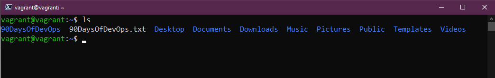
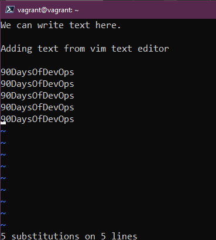

## Text Editors - nano vs vim

The majority of your Linux systems are going to be servers and these are not going to have a GUI. I also mentioned in the last session that Linux is mostly made up of configuration files, to make changes you are going to need to be able to edit those configuration files to change anything on the system.

There are lots of options out there but I think we should cover probably the two most common terminal text editors. I have used both of these editors and for me, I find `nano` the easy button when it comes to quick changes but `vim` has such a broad set of capabilities.

### nano

- Not available on every system.
- Great for getting started.

If you run `nano 90DaysOfDevOps.txt` we will create a new file with nothing in, from here we can add our text and we have our instructions below for what we want to do with that file.

We can now use `control x + enter` and then run `ls` you can now see our new text file.

We can now run `cat` against that file to read our file. We can then use that same `nano 90DaysOfDevOps.txt` to add additional text or modify your file.

For me, nano is super easy when it comes to getting small changes done on configuration files.

### vim

Possibly the most common text editor around? A sibling of the UNIX text editor vi from 1976 we get a lot of functionality with vim.

- Pretty much supported on every single Linux distribution.
- Incredibly powerful! You can likely find a full 7-hour course just covering vim.

We can jump into vim with the `vim` command or if we want to edit our new txt file we could run `vim 90DaysOfDevOps.txt` but you are going to first see the lack of help menus at the bottom.

The first question might be "How do I exit vim?" that is going to be `escape` and if we have not made any changes then it will be `:q`

You start in `normal` mode, there are other modes `command, normal, visual, insert`, if we want to add the text we will need to switch from `normal` to `insert` we need to press `i` if you have added some text and would like to save these changes then you would hit escape and then `:wq`

You can confirm this with the `cat` command to check you have saved those changes.

There is some cool fast functionality with vim that allows you to do menial tasks very quickly if you know the shortcuts which is a lecture in itself. Let's say we have added a list of repeated words and we now need to change that, maybe it's a configuration file and we repeat a network name and now this has changed and we quickly want to change this. I am using the word day for this example.

Now we want to replace that word with 90DaysOfDevOps, we can do this by hitting `ESC` and typing `:%s/Day/90DaysOfDevOps`

The outcome when you hit enter is that the word day is then replaced with 90DaysOfDevOps.

Copy and Paste was a big eye-opener for me. Copy is not copied it is yanked. we can copy using `yy` on our keyboard in normal mode. `p` paste on the same line, `P` paste on a new line.

You can also delete these lines by choosing the number of lines you wish to delete followed by `dd`

There is also likely a time you will need to search a file, now we can use `grep` as mentioned in a previous session but we can also use vim. we can use `/word` and this will find the first match, to navigate through to the next you will use the `n` key and so on.

For vim this is not even touching the surface, the biggest advice I can give is to get hands-on and use vim wherever possible.

A common interview question is what is your favourite text editor in Linux and I would make sure you have at least this knowledge of both so you can answer, it is fine to say nano because it's simple. At least you show competence in understanding what a text editor is. But get hands-on with them to be more proficient.

Another pointer to navigate around in vim we can use `H,J,K,L` as well as our arrow keys.

## Resources

- [Vim in 100 Seconds](https://www.youtube.com/watch?v=-txKSRn0qeA)
- [Vim tutorial](https://www.youtube.com/watch?v=IiwGbcd8S7I)
- [Learn the Linux Fundamentals - Part 1](https://www.youtube.com/watch?v=kPylihJRG70)
- [Linux for hackers (don't worry you don't need to be a hacker!)](https://www.youtube.com/watch?v=VbEx7B_PTOE)

See you on [Day18](day18.md)
