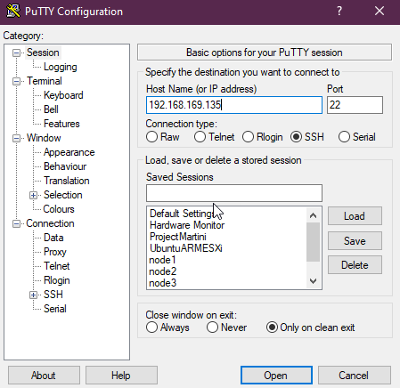
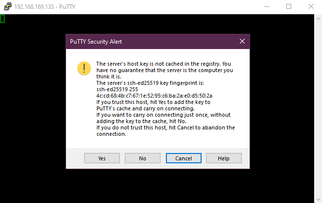
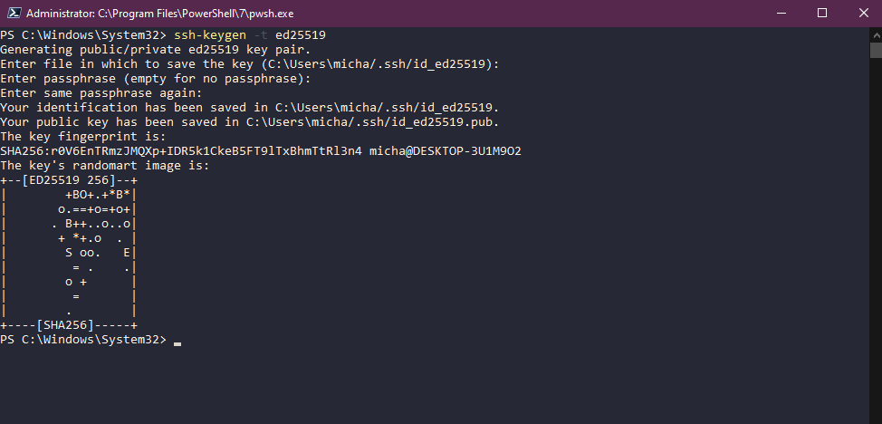
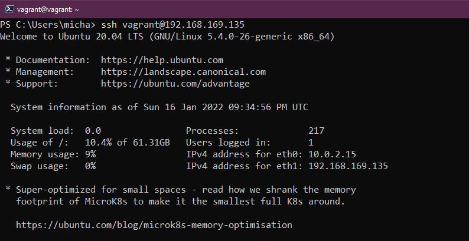
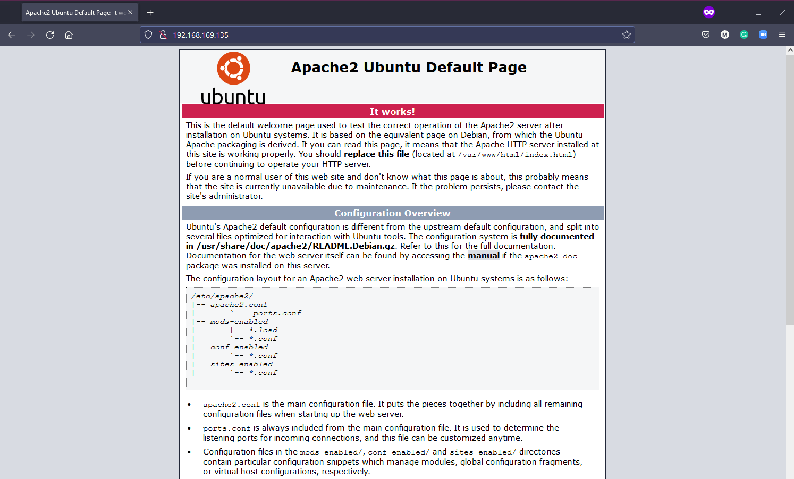

## SSH & Web Server

As we have mentioned throughout you are going to most likely be managing lots of remote Linux servers, because of this, you will need to make sure that your connectivity to these remote servers is secure. In this section, we want to cover some of the basics of SSH that everyone should know that will help you with that secure tunnel to your remote systems.

- Setting up a connection with SSH
- Transferring files
- Create your private key

### SSH introduction

- Secure shell
- Networking Protocol
- Allows secure communications
- Can secure any network service
- Typically used for remote command-line access

In our environment, if you have been following along we have been using SSH already but this was all configured and automated through our vagrant configuration so we only had to run `vagrant ssh` and we gained access to our remote virtual machine.

If our remote machine was not on the same system as our workstation and was in a remote location, maybe a cloud-based system or running in a data centre that we could only access over the internet we would need a secure way of being able to access the system to manage it.

SSH provides a secure tunnel between client and server so that nothing can be intercepted by bad actors.


The server has a server-side SSH service always running and listening on a specific TCP port (22).

If we use our client to connect with the correct credentials or SSH key then we gain access to that server.

### Adding a bridged network adapter to our system

For us to use this with our current virtual box VM, we need to add a bridged network adapter to our machine.

Power down your virtual machine, right-click on your machine within Virtual Box and select settings. In the new window then select networking.


Now power your machine back on and you will now have an IP address on your local machine. You can confirm this with the `IP addr` command.

### Confirming SSH server is running

We know SSH is already configured on our machine as we have been using it with vagrant but we can confirm by running

`sudo systemctl status ssh`


If your system does not have the SSH server then you can install it by issuing this command `sudo apt install OpenSSH-server`

You then want to make sure that our SSH is allowed if the firewall is running. We can do this with `sudo ufw allow ssh` this is not required on our configuration as we automated this with our vagrant provisioning.

### Remote Access - SSH Password

Now that we have our SSH Server listening out on port 22 for any incoming connection requests and we have added the bridged networking we could use putty or an SSH client on our local machine to connect to our system using SSH.



Then hit open, if this is the first time you have connected to this system via this IP address you will get this warning. We know that this is our system so you can choose yes.



We are then prompted for our username (vagrant) and password (default password - vagrant) Below you will see we are now using our SSH client (Putty) to connect to our machine using username and password.


At this stage, we are connected to our VM from our remote client and we can issue our commands on our system.

### Remote Access - SSH Key

The above is an easy way to gain access to your systems however it still relies on username and password, if some malicious actor was to gain access to this information plus the public address or IP of your system then it could be easily compromised. This is where SSH keys are preferred.

SSH Keys means that we provide a key pair so that both the client and server know that this is a trusted device.

Creating a key is easy. On our local machine (Windows) We can issue the following command in fact if you have an ssh-client installed on any system I believe this same command will work?

`ssh-keygen -t ed25519`

I am not going to get into what `ed25519` is and means here but you can have a search if you want to learn more about [cryptography](https://en.wikipedia.org/wiki/EdDSA#Ed25519)



At this point, we have our created SSH key stored in `C:\Users\micha/.ssh/`

But to link this with our Linux VM we need to copy the key. We can do this by using the `ssh-copy-id vagrant@192.168.169.135`

I used Powershell to create my keys on my Windows client but there is no `ssh-copy-id` available here. There are ways in which you can do this on Windows and a small search online will find you an alternative, but I will just use git bash on my Windows machine to make the copy.


We can now go back to Powershell to test that our connection now works with our SSH Keys and no password is required.

`ssh vagrant@192.168.169.135`



We could secure this further if needed by using a passphrase. We could also go one step further saying that no passwords at all meaning only key pairs over SSH would be allowed. You can make this happen in the following configuration file.

`sudo nano /etc/ssh/sshd_config`

there is a line in here with `PasswordAuthentication yes` this will be `#` commented out, you should uncomment and change the yes to no. You will then need to reload the SSH service with `sudo systemctl reload sshd`

## Setting up a Web Server

Not specifically related to what we have just done with SSH above but I wanted to include this as this is again another task that you might find a little daunting but it really should not be.

We have our Linux playground VM and at this stage, we want to add an apache webserver to our VM so that we can host a simple website from it that serves my home network. Note that this web page will not be accessible from the internet, this can be done but it will not be covered here.

You might also see this referred to as a LAMP stack.

- **L**inux Operating System
- **A**pache Web Server
- **m**ySQL database
- **P**HP

### Apache2

Apache2 is an open-source HTTP server. We can install apache2 with the following command.

`sudo apt-get install apache2`

To confirm that apache2 is installed correctly we can run `sudo service apache2 restart`

Then using the bridged network address from the SSH walkthrough open a browser and go to that address. Mine was `http://192.168.169.135/`



### mySQL

MySQL is a database in which we will be storing our data for our simple website. To get MySQL installed we should use the following command `sudo apt-get install mysql-server`

### PHP

PHP is a server-side scripting language, we will use this to interact with a MySQL database. The final installation is to get PHP and dependencies installed using `sudo apt-get install php libapache2-mod-php php-mysql`

The first configuration change we want to make out of the box apache is using index.html and we want it to use index.php instead.

We are going to use `sudo nano /etc/apache2/mods-enabled/dir.conf` and we are going to move index.php to the first item in the list.


Restart the apache2 service `sudo systemctl restart apache2`

Now let's confirm that our system is configured correctly for PHP. Create the following file using this command, this will open a blank file in nano.

`sudo nano /var/www/html/90Days.php`

then copy the following and use control + x to exit and save your file.

```
<?php
phpinfo();
?>
```

Now navigate to your Linux VM IP again with the additional 90Days.php on the end of the URL. `http://192.168.169.135/90Days.php` you should see something similar to the below if PHP is configured correctly.


### WordPress Installation

I then walked through this tutorial to get WordPress up on our LAMP stack, some commands are shown below if not shown correctly in the walkthrough [How to install WordPress on Ubuntu with LAMP](https://blog.ssdnodes.com/blog/how-to-install-wordpress-on-ubuntu-18-04-with-lamp-tutorial/)

`sudo mysql -u root -p`

`CREATE DATABASE wordpressdb;`

`CREATE USER 'admin-user'@'localhost' IDENTIFIED BY 'password';`

`GRANT ALL PRIVILEGES ON wordpressdb.* TO 'admin-user'@'localhost';`

`FLUSH PRIVILEGES;`

`EXIT;`

`sudo apt install php-curl php-gd php-mbstring php-xml php-xmlrpc php-soap php-intl php-zip`

`sudo systemctl restart apache2`

`cd /var/www`

`sudo curl -O https://wordpress.org/latest.tar.gz`

`sudo tar -xvf latest.tar.gz`

`sudo rm latest.tar.gz`

At this point you are in Step 4 in the linked article, you will need to follow the steps to make sure all correct permissions are in place for the WordPress directory.

Because this is internal only you do not need to "generate security keys" in this step. Move to Step 5 which is changing the Apache configuration to WordPress.

Then providing everything is configured correctly you will be able to access via your internal network address and run through the WordPress installation.

## Resources

- [Client SSH GUI - Remmina](https://remmina.org/)
- [The Beginner's guide to SSH](https://www.youtube.com/watch?v=2QXkrLVsRmk)
- [Vim in 100 Seconds](https://www.youtube.com/watch?v=-txKSRn0qeA)
- [Vim tutorial](https://www.youtube.com/watch?v=IiwGbcd8S7I)
- [Learn the Linux Fundamentals - Part 1](https://www.youtube.com/watch?v=kPylihJRG70)
- [Linux for hackers (don't worry you don't need to be a hacker!)](https://www.youtube.com/watch?v=VbEx7B_PTOE)

See you on [Day19](day19.md)
