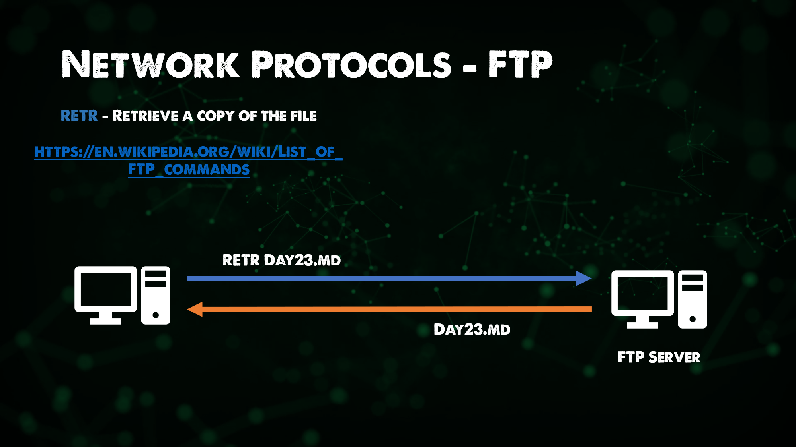
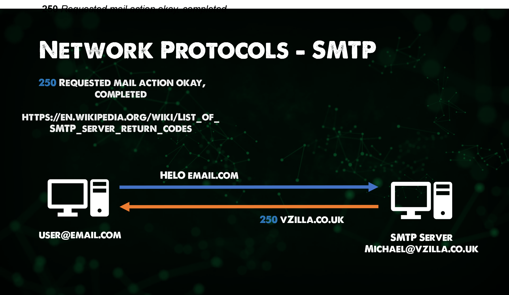
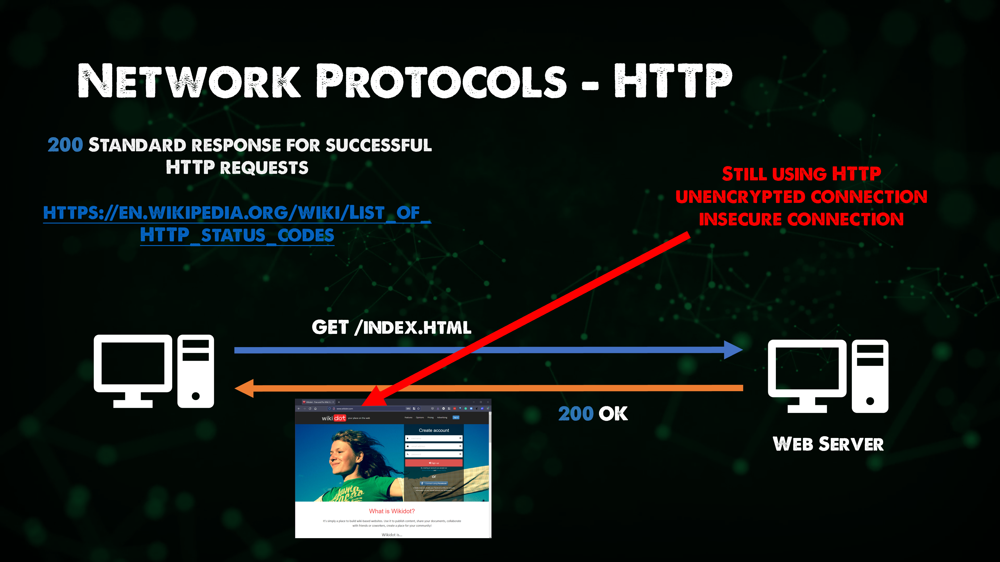
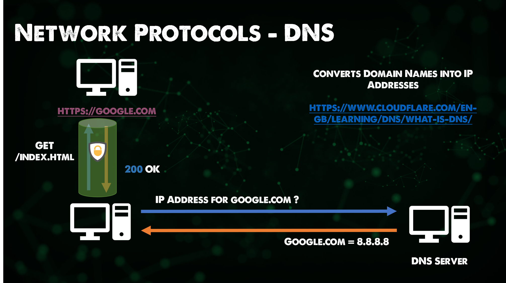
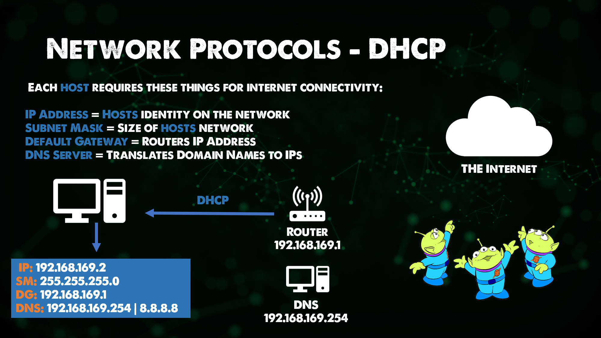
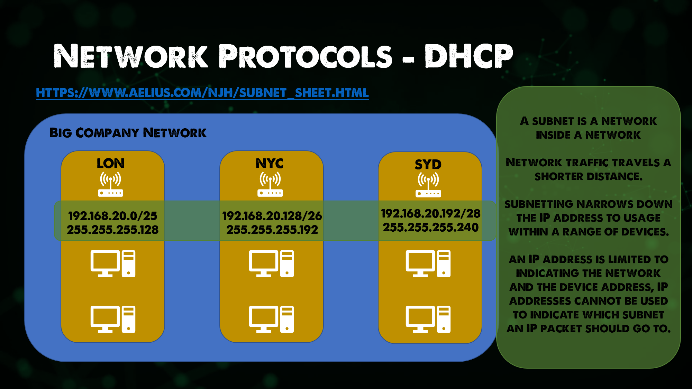

## Network Protocols

A set of rules and messages that form a standard. An Internet Standard.

- ARP - Address Resolution Protocol

If you want to get really into the weeds on ARP you can read the Internet Standard here. [RFC 826](https://datatracker.ietf.org/doc/html/rfc826)

Connects IP addresses to fixed physical machine addresses, also known as MAC addresses across a layer 2 network.

- FTP - File Transfer Protocol

Allows for the transfer of files from source to destination. Generally, this process is authenticated but there is the ability if configured to use anonymous access. You will more frequently now see FTPS which provides SSL/TLS connectivity to FTP servers from the client for better security. This protocol would be found in the Application layer of the OSI Model.

- SMTP - Simple Mail Transfer Protocol

Used for email transmission, mail servers use SMTP to send and receive mail messages. You will still find even with Microsoft 365 that the SMTP protocol is used for the same purpose.

- HTTP - Hyper Text Transfer Protocol

HTTP is the foundation of the internet and browsing content. Giving us the ability to easily access our favourite websites. HTTP is still heavily used but HTTPS is more so used or should be used on most of your favourite sites.

- SSL - Secure Sockets Layer | TLS - Transport Layer Security

TLS has taken over from SSL, TLS is a **Cryptographic Protocol** that provides secure communications over a network. It can and will be found in the mail, Instant Messaging and other applications but most commonly it is used to secure HTTPS.

- HTTPS - HTTP secured with SSL/TLS

An extension of HTTP, used for secure communications over a network, HTTPS is encrypted with TLS as mentioned above. The focus here was to bring authentication, privacy and integrity whilst data is exchanged between hosts.

- DNS - Domain Name System

The DNS is used to map human-friendly domain names for example we all know [google.com](https://google.com) but if you were to open a browser and put in [8.8.8.8](https://8.8.8.8) you would get Google as we pretty much know it. However good luck trying to remember all of the IP addresses for all of your websites where some of them we even use google to find information.

This is where DNS comes in, it ensures that hosts, services and other resources are reachable.

On all hosts, if they require internet connectivity then they must have DNS to be able to resolve those domain names. DNS is an area you could spend Days and Years on learning. I would also say from experience that DNS is mostly the common cause of all errors when it comes to Networking. Not sure if a Network engineer would agree there though.

- DHCP - Dynamic Host Configuration Protocol

We have discussed a lot about protocols that are required to make our hosts work, be it accessing the internet or transferring files between each other.

There are 4 things that we need on every host for it to be able to achieve both of those tasks.

- IP Address
- Subnet Mask
- Default Gateway
- DNS

We have covered IP address being a unique address for your host on the network it resides, we can think of this as our house number.

Subnet mask we will cover shortly, but you can think of this as postcode or zip code.

A default gateway is the IP of our router generally on our network providing us with that Layer 3 connectivity. You could think of this as the single road that allows us out of our street.

Then we have DNS as we just covered to help us convert complicated public IP addresses to more suitable and rememberable domain names. Maybe we can think of this as the giant sorting office to make sure we get the right post.

As I said each host requires these 4 things, if you have 1000 or 10,000 hosts then that is going to take you a very long time to determine each one of these individually. This is where DHCP comes in and allows you to determine a scope for your network and then this protocol will distribute to all available hosts in your network.

Another example is you head into a coffee shop, grab a coffee and sit down with your laptop or your phone let's call that your host. You connect your host to the coffee shop WiFi and you gain access to the internet, messages and mail start pinging through and you can navigate web pages and social media. When you connected to the coffee shop WiFi your machine would have picked up a DHCP address either from a dedicated DHCP server or most likely from the router also handling DHCP.

### Subnetting

A subnet is a logical subdivision of an IP network.

Subnets break large networks into smaller, more manageable networks that run more efficiently.

Each subnet is a logical subdivision of the bigger network. Connected devices with enough subnet share common IP address identifiers, enabling them to communicate with each other.

Routers manage communication between subnets.

The size of a subnet depends on the connectivity requirements and the network technology used.

An organisation is responsible for determining the number and size of the subnets within the limits of address space
available, and the details remain local to that organisation. Subnets can also be segmented into even smaller subnets for things like Point to Point links, or subnetworks supporting a few devices.

Among other advantages, segmenting large
networks into subnets enable IP address
reallocation and relieves network congestion, streamlining, network communication and efficiency.

Subnets can also improve network security.
If a section of a network is compromised, it can be quarantined, making it difficult for bad actors to move around the larger network.

## Resources

- [Computer Networking full course](https://www.youtube.com/watch?v=IPvYjXCsTg8)
- [Practical Networking](http://www.practicalnetworking.net/)

See you on [Day 24](day24.md)
