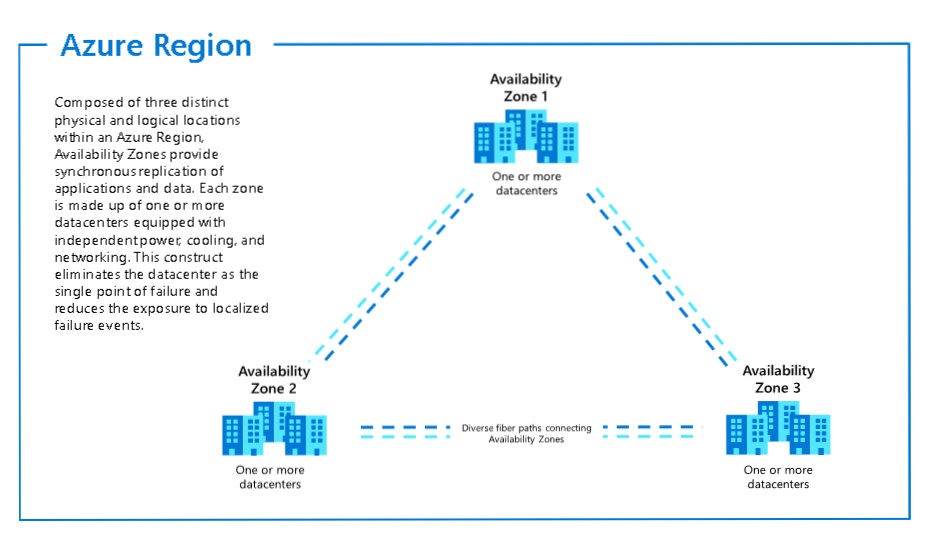
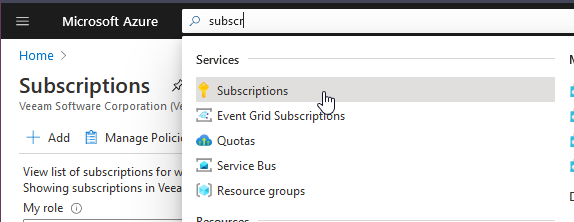
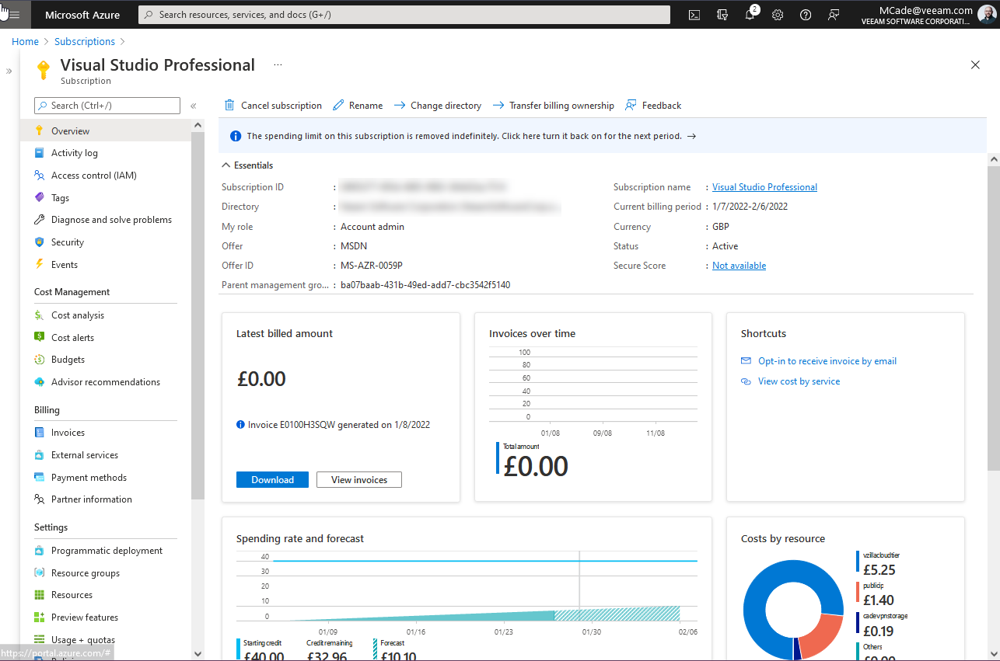
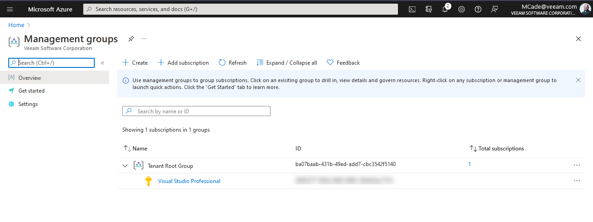
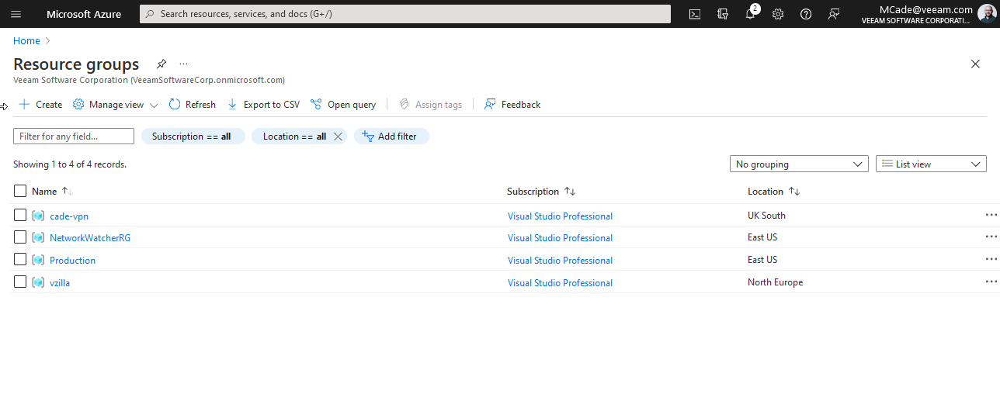
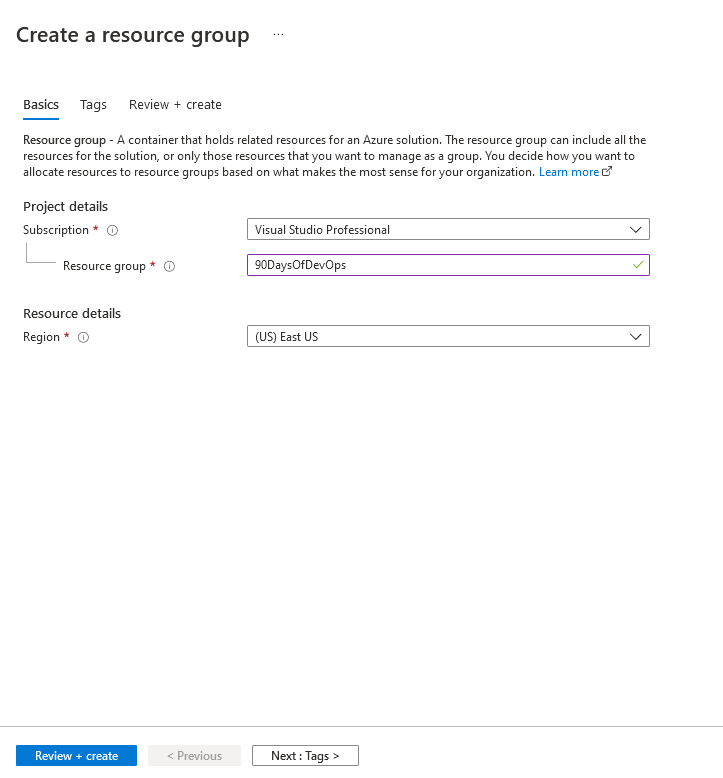
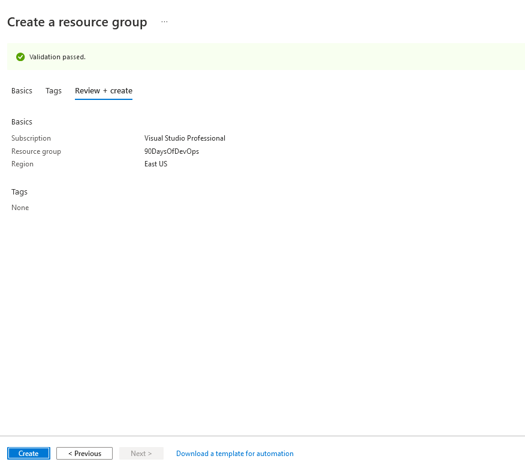

## Microsoft Azure Fundamentals

Before we get going, the winner of the Twitter poll was Microsoft Azure, hence the title of the page. It was close and also quite interesting to see the results come in over the 24 hours.

I would say in terms of covering this topic is going to give me a better understanding and update around the services available on Microsoft Azure, I lean towards Amazon AWS when it comes to my day today. I have however left resources I had lined up for all three of the major cloud providers.

I do appreciate that there are more and the poll only included these 3 and in particular, there were some comments about Oracle Cloud. I would love to hear more about other cloud providers being used out in the wild.

### The Basics

- Provides public cloud services
- Geographically distributed (60+ Regions worldwide)
- Accessed via the internet and/or private connections
- Multi-tenant model
- Consumption-based billing - (Pay as you go | Pay as you grow)
- A large number of service types and offerings for different requirements.

- [Microsoft Azure Global Infrastructure](https://infrastructuremap.microsoft.com/explore)

As much as we spoke about SaaS and Hybrid Cloud we are not planning on covering those topics here.

The best way to get started and follow along is by clicking the link, which will enable you to spin up a [Microsoft Azure Free Account](https://azure.microsoft.com/en-gb/free/)

### Regions

I linked the interactive map above, but we can see the image below the breadth of regions being offered in the Microsoft Azure platform worldwide.

_image taken from [Microsoft Docs - 01/05/2021](https://docs.microsoft.com/en-us/azure/networking/microsoft-global-network)_

You will also see several "sovereign" clouds meaning they are not linked or able to speak to the other regions, for example, these would be associated with governments such as the `AzureUSGovernment` also `AzureChinaCloud` and others.

When we are deploying our services within Microsoft Azure we will choose a region for almost everything. However, it is important to note that not every service is available in every region. You can see [Products available by region](https://azure.microsoft.com/en-us/global-infrastructure/services/?products=all) at the time of my writing this that in West Central US we cannot use Azure Databricks.

I also mentioned "almost everything" above, there are certain services that are linked to the region such as Azure Bot Services, Bing Speech, Azure Virtual Desktop, Static Web Apps, and some more.

Behind the scenes, a region may be made up of more than one data centre. These will be referred to as Availability Zones.

In the below image you will see and again this is taken from the Microsoft official documentation it describes what a region is and how it is made up of Availability Zones. However not all regions have multiple Availability Zones.

The Microsoft Documentation is very good, and you can read up more on [Regions and Availability Zones](https://docs.microsoft.com/en-us/azure/availability-zones/az-overview) here.

### Subscriptions

Remember we mentioned that Microsoft Azure is a consumption model cloud you will find that all major cloud providers follow this model.

If you are an Enterprise then you might want or have an Enterprise Agreement set up with Microsoft to enable your company to consume these Azure Services.

If you are like me and you are using Microsoft Azure for education then we have a few other options.

We have the [Microsoft Azure Free Account](https://azure.microsoft.com/en-gb/free/) which generally gives you several free cloud credits to spend in Azure over some time.

There is also the ability to use a Visual Studio subscription which gives you maybe some free credits each month alongside your annual subscription to Visual Studio, this was commonly known as the MSDN years ago. [Visual Studio](https://azure.microsoft.com/en-us/pricing/member-offers/credit-for-visual-studio-subscribers/)

Then finally there is the hand over a credit card and have a pay as you go, model. [Pay-as-you-go](https://azure.microsoft.com/en-us/pricing/purchase-options/pay-as-you-go/)

A subscription can be seen as a boundary between different subscriptions potentially cost centres but completely different environments. A subscription is where the resources are created.

### Management Groups

Management groups give us the ability to segregate control across our Azure Active Directory (AD) or our tenant environment. Management groups allow us to control policies, Role Based Access Control (RBAC), and budgets.

Subscriptions belong to these management groups so you could have many subscriptions in your Azure AD Tenant, these subscriptions then can also control policies, RBAC, and budgets.

### Resource Manager and Resource Groups

#### Azure Resource Manager

- JSON based API that is built on resource providers.
- Resources belong to a resource group and share a common life cycle.
- Parallelism
- JSON-Based deployments are declarative, idempotent and understand dependencies between resources to govern creation and order.

#### Resource Groups

- Every Azure Resource Manager resource exists in one and only one resource group!
- Resource groups are created in a region that can contain resources from outside the region.
- Resources can be moved between resource groups
- Resource groups are not walled off from other resource groups, there can be communication between resource groups.
- Resource Groups can also control policies, RBAC, and budgets.

### Hands-On

Let's go and get connected and make sure we have a **Subscription** available to us. We can check our simple out of the box **Management Group**, We can then go and create a new dedicated **Resource Group** in our preferred **Region**.

When we first login to our [Azure portal](https://portal.azure.com/#home) you will see at the top the ability to search for resources, services and docs.

We are going to first look at our subscription, you will see here that I am using a Visual Studio Professional subscription which gives me some free credit each month.

If we go into that you will get a wider view and a look into what is happening or what can be done with the subscription, we can see billing information with control functions on the left where you can define IAM Access Control and further down there are more resources available.

There might be a scenario where you have multiple subscriptions and you want to manage them all under one, this is where management groups can be used to segregate responsibility groups. In mine below, you can see there is just my tenant root group with my subscription.

You will also see in the previous image that the parent management group is the same id used on the tenant root group.

Next up we have Resource groups, this is where we combine our resources and we can easily manage them in one place. I have a few created for various other projects.

With what we are going to be doing over the next few days, we want to create our resource group. This is easily done in this console by hitting the create option on the previous image.

A validation step takes place and then you have the chance to review your creation and then create. You will also see down the bottom "Download a template for automation" this allows us to grab the JSON format so that we can perform this simple in an automated fashion later on if we wanted, we will cover this later on as well.

Hit create, then in our list of resource groups, we now have our "90DaysOfDevOps" group ready for what we do in the next session.

## Resources

- [Hybrid Cloud and MultiCloud](https://www.youtube.com/watch?v=qkj5W98Xdvw)
- [Microsoft Azure Fundamentals](https://www.youtube.com/watch?v=NKEFWyqJ5XA&list=WL&index=130&t=12s)
- [Google Cloud Digital Leader Certification Course](https://www.youtube.com/watch?v=UGRDM86MBIQ&list=WL&index=131&t=10s)
- [AWS Basics for Beginners - Full Course](https://www.youtube.com/watch?v=ulprqHHWlng&t=5352s)

See you on [Day 30](day30.md)
