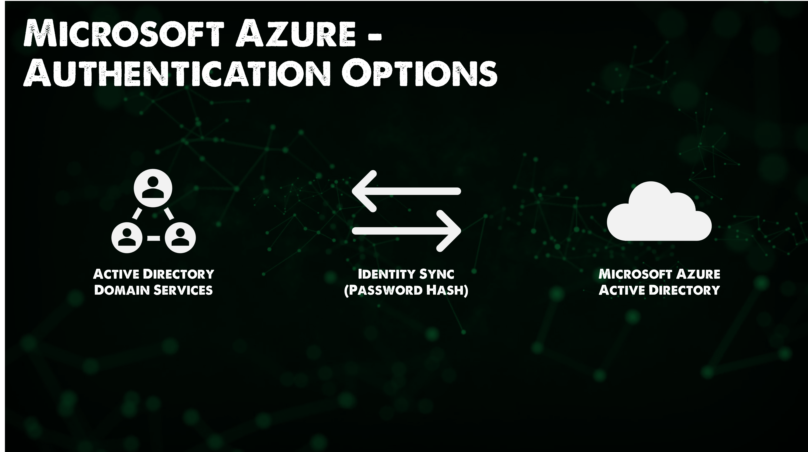
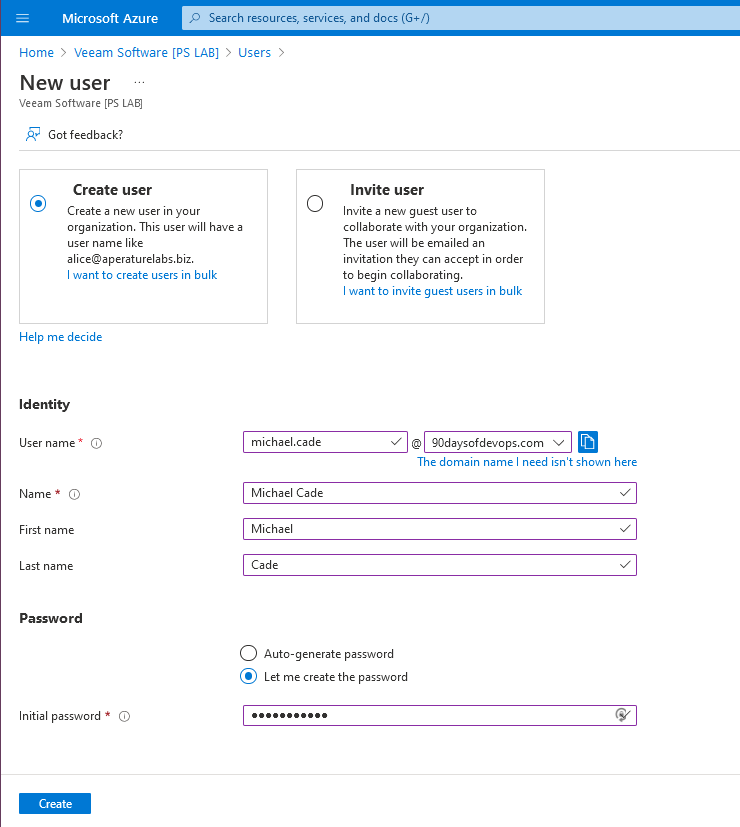
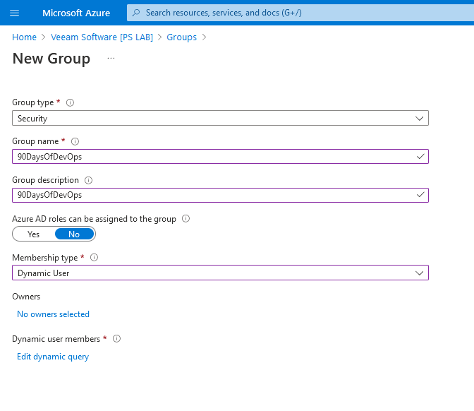
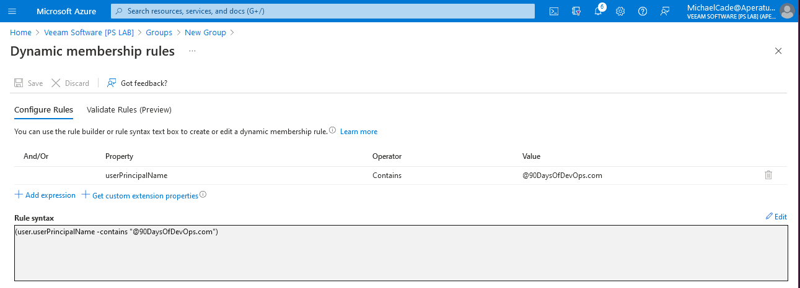

## Microsoft Azure Security Models

Following on from the Microsoft Azure Overview, we are going to start with Azure Security and see where this can help in our day to day. For the most part, I have found the built-in roles have been sufficient but knowing that we can create and work with many different areas of authentication and configurations. I have found Microsoft Azure to be quite advanced with its Active Directory background compared to other public clouds.

This is one area in which Microsoft Azure seemingly works differently from other public cloud providers, in Azure there is ALWAYS Azure AD.

### Directory Services

- Azure Active Directory hosts the security principles used by Microsoft Azure and other Microsoft cloud services.
- Authentication is accomplished through protocols such as SAML, WS-Federation, OpenID Connect and OAuth2.
- Queries are accomplished through REST API called Microsoft Graph API.
- Tenants have a tenant.onmicrosoft.com default name but can also have custom domain names.
- Subscriptions are associated with an Azure Active Directory tenant.

If we think about AWS to compare the equivalent offering would be AWS IAM (Identity & Access Management) Although still very different

Azure AD Connect provides the ability to replicate accounts from AD to Azure AD. This can also include groups and sometimes objects. This can be granular and filtered. Supports multiple forests and domains.

It is possible to create cloud accounts in Microsoft Azure Active Directory (AD) but most organisations already have accounted for their users in their own Active Directory being on-premises.

Azure AD Connect also allows you to not only see Windows AD servers but also other Azure AD, Google and others. This also provides the ability to collaborate with external people and organisations this is called Azure B2B.

Authentication options between Active Directory Domain Services and Microsoft Azure Active Directory are possible with both identity sync with a password hash.

The passing of the password hash is optional, if this is not used then pass-through authentication is required.

There is a video linked below that goes into detail about Passthrough authentication.

[User sign-in with Azure Active Directory Pass-through Authentication](https://docs.microsoft.com/en-us/azure/active-directory/hybrid/how-to-connect-pta)

### Federation

It's fair to say that if you are using Microsoft 365, Microsoft Dynamics and on-premises Active Directory it is quite easy to understand and integrate into Azure AD for federation. However, you might be using other services outside of the Microsoft ecosystem.

Azure AD can act as a federation broker to these other Non-Microsoft apps and other directory services.

This will be seen in the Azure Portal as Enterprise Applications of which there are a large number of options.

If you scroll down on the enterprise application page you are going to see a long list of featured applications.

This option also allows for "bring your own" integration, an application you are developing or a non-gallery application.

I have not looked into this before but I can see that this is quite the feature set when compared to the other cloud providers and capabilities.

### Role-Based Access Control

We have already covered on [Day 29](day29.md) the scopes we are going to cover here, we can set our role-based access control according to one of these areas.

- Subscriptions
- Management Group
- Resource Group
- Resources

Roles can be split into three, there are many built-in roles in Microsoft Azure. Those three are:

- Owner
- Contributor
- Reader

Owner and Contributor are very similar in their boundaries of scope however the owner can change permissions.

Other roles are specific to certain types of Azure Resources as well as custom roles.

We should focus on assigning permissions to groups vs users.

Permissions are inherited.

If we go back and look at the "90DaysOfDevOps" Resource group we created and check the Access Control (IAM) within you can see we have a list of contributors and a customer User Access Administrator, and we do have a list of owners (But I cannot show this)

We can also check the roles we have assigned here if they are BuiltInRoles and which category they fall under.

We can also use the check access tab if we want to check an account against this resource group and make sure that the account we wish to have that access to has the correct permissions or maybe we want to check if a user has too much access.

### Microsoft Defender for Cloud

- Microsoft Defender for Cloud (formerly known as Azure Security Center) provides insight into the security of the entire Azure environment.

- A single dashboard for visibility into the overall security health of all Azure and non-Azure resources (via Azure Arc) and security hardening guidance.

- Free tier includes continuous assessment and security recommendations.

- Paid plans for protected resource types (e.g. Servers, AppService, SQL, Storage, Containers, KeyVault).

I have switched to another subscription to view the Azure Security Center and you can see here based on very few resources that I have some recommendations in one place.

### Azure Policy

- Azure Policy is an Azure native service that helps to enforce organizational standards and assess compliance at scale.

- Integrated into Microsoft Defender for Cloud. Azure Policy audits non-compliant resources and applies remediation.

- Commonly used for governing resource consistency, regulatory compliance, security, cost, and management standards.

- Uses JSON format to store evaluation logic and determine whether a resource is compliant or not, and any actions to take for non-compliance (e.g. Audit, AuditIfNotExists, Deny, Modify, DeployIfNotExists).

- Free for use. The exception is Azure Arc connected resources charged per server/month for Azure Policy Guest Configuration usage.

### Hands-On

I have gone out and I have purchased www.90DaysOfDevOps.com and I would like to add this domain to my Azure Active Directory portal, [Add your custom domain name using the Azure Active Directory Portal](https://docs.microsoft.com/en-us/azure/active-directory/fundamentals/add-custom-domain)

With that now, we can create a new user on our new Active Directory Domain.

Now we want to create a group for all of our new 90DaysOfDevOps users in one group. We can create a group as per the below, notice that I am using "Dynamic User" which means Azure AD will query user accounts and add them dynamically vs assigned which is where you manually add the user to your group.

There are lots of options when it comes to creating your query, I plan to simply find the principal name and make sure that the name contains @90DaysOfDevOps.com.

Now because we have created our user account already for michael.cade@90DaysOfDevOps.com we can validate the rules are working. For comparison I have also added another account I have associated to another domain here and you can see that because of this rule our user will not land in this group.

I have since added a new user1@90DaysOfDevOps.com and if we go and check the group we can see our members.

If we have this requirement x100 then we are not going to want to do this all in the console we are going to want to take advantage of either bulk options to create, invite, and delete users or you are going to want to look into PowerShell to achieve this automated approach to scale.

Now we can go to our Resource Group and specify that on the 90DaysOfDevOps resource group we want the owner to be the group we just created.

We can equally go in here and deny assignments access to our resource group as well.

Now if we log in to the Azure Portal with our new user account, you can see that we only have access to our 90DaysOfDevOps resource group and not the others seen in previous pictures because we do not have the access.

The above is great if this is a user that has access to resources inside of your Azure portal, not every user needs to be aware of the portal, but to check access we can use the [Apps Portal](https://myapps.microsoft.com/) This is a single sign-on portal for us to test.

You can customise this portal with your branding and this might be something we come back to later on.

## Resources

- [Hybrid Cloud and MultiCloud](https://www.youtube.com/watch?v=qkj5W98Xdvw)
- [Microsoft Azure Fundamentals](https://www.youtube.com/watch?v=NKEFWyqJ5XA&list=WL&index=130&t=12s)
- [Google Cloud Digital Leader Certification Course](https://www.youtube.com/watch?v=UGRDM86MBIQ&list=WL&index=131&t=10s)
- [AWS Basics for Beginners - Full Course](https://www.youtube.com/watch?v=ulprqHHWlng&t=5352s)

See you on [Day 31](day31.md)
