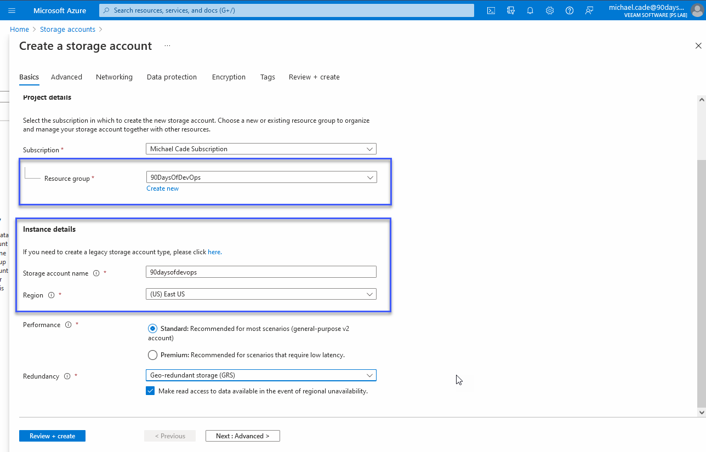
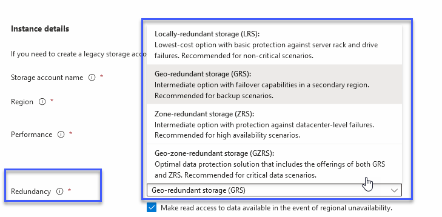
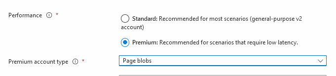
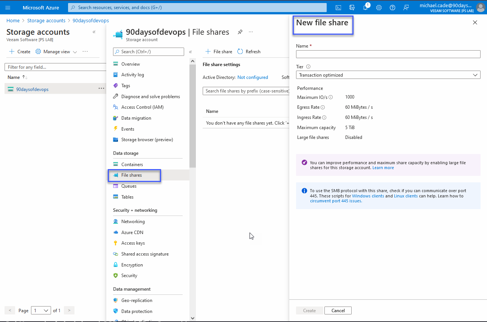
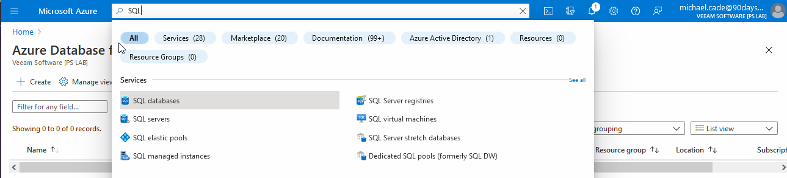
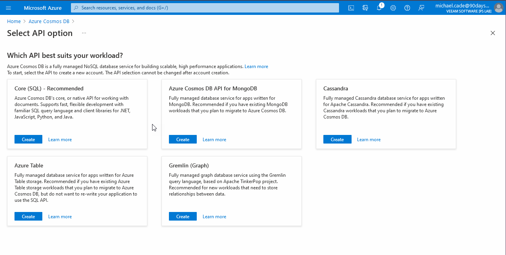
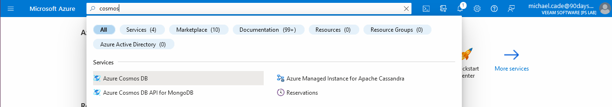

## Microsoft Azure Storage Models

### Storage Services

- Azure storage services are provided by storage accounts. 
- Storage accounts are primarily accessed via REST API. 
- A storage account must have a unique name that is part of a DNS name `<Storage Account name>.core.windows.net`
- Various replication and encryption options.
- Sits within a resource group

We can create our storage group by simply searching for Storage Group in the search bar at the top of the Azure Portal. 

We can then run through the steps to create our storage account remembering that this name needs to be unique and it also needs to be all lower case, no spaces but can include numbers. 

We can also choose the level of redundancy we would like against our storage account and anything we store within here. The further down the list the more expensive option but also the spread of your data. 

Even the default redundancy option gives us 3 copies of our data. 

[Azure Storage Redundancy](https://docs.microsoft.com/en-us/azure/storage/common/storage-redundancy)

Summary of the above link down below: 

- **Locally-redundant storage** - replicates your data three times within a single data centre in the primary region.
  
- **Geo-redundant storage** - copies your data synchronously three times within a single physical location in the primary region using LRS.
  
- **Zone-redundant storage** - replicates your Azure Storage data synchronously across three Azure availability zones in the primary region.
  
- **Geo-zone-redundant storage** - combines the high availability provided by redundancy across availability zones with protection from regional outages provided by geo-replication. Data in a GZRS storage account is copied across three Azure availability zones in the primary region and is also replicated to a second geographic region for protection from regional disasters.

Just moving back up to performance options. We have Standard and Premium to choose from. We have chosen Standard in our walkthrough but premium gives you some specific options. 

Then in the drop-down, you can see we have these three options to choose from. 

There are lots more advanced options available for your storage account but for now, we do not need to get into these areas. These options are around encryption and data protection. 

### Managed Disks 

Storage access can be achieved in a few different ways. 

Authenticated access via: 
- A shared key for full control. 
- Shared Access Signature for delegated, granular access.
- Azure Active Directory (Where Available)

Public Access: 
- Public access can also be granted to enable anonymous access including via HTTP. 
- An example of this could be to host basic content and files in a block blob so a browser can view and download this data. 

If you are accessing your storage from another Azure service, traffic stays within Azure. 

When it comes to storage performance we have two different types: 
- **Standard** - Maximum number of IOPS
- **Premium** - Guaranteed number of IOPS

There is also a difference between unmanaged and managed disks to consider when choosing the right storage for the task you have. 

### Virtual Machine Storage 

- Virtual Machine OS disks are typically stored on persistent storage. 
- Some stateless workloads do not require persistent storage and reduced latency is a larger benefit. 
- There are VMs that support ephemeral OS managed disks that are created on the node-local storage. 
  - These can also be used with VM Scale Sets.

Managed Disks are durable block storage that can be used with Azure Virtual Machines. You can have Ultra Disk Storage, Premium SSD, Standard SSD, Standard HDD. They also carry some characteristics. 

- Snapshot and Image support 
- Simple movement between SKUs 
- Better availability when combined with availability sets 
- Billed based on disk size not on consumed storage.  

## Archive Storage 

- **Cool Tier** - A cool tier of storage is available to block and append BLOBs. 
  - Lower Storage cost
  - Higher transaction cost.  
- **Archive Tier** - Archive storage is available for block BLOBs. 
  - This is configured on a per-BLOB basis. 
  - Cheaper cost, Longer Data retrieval latency. 
  - Same Data Durability as regular Azure Storage. 
  - Custom Data tiering can be enabled as required.  

### File Sharing 

From the above creation of our storage account, we can now create file shares.

This will provide SMB2.1 and 3.0 file shares in Azure. 

Useable within the Azure and externally via SMB3 and port 445 open to the internet. 

Provides shared file storage in Azure. 

Can be mapped using standard SMB clients in addition to REST API. 

You might also notice [Azure NetApp Files](https://vzilla.co.uk/vzilla-blog/azure-netapp-files-how) (SMB and NFS) 

### Caching & Media Services 

The Azure Content Delivery Network provides a cache of static web content with locations throughout the world. 

Azure Media Services, provides media transcoding technologies in addition to playback services. 

## Microsoft Azure Database Models

Back on [Day 28](day28.md), we covered various service options. One of these was PaaS (Platform as a Service) where you abstract a large amount of the infrastructure and operating system away and you are left with the control of the application or in this case the database models. 

### Relational Databases

Azure SQL Database provides a relational database as a service based on Microsoft SQL Server. 

This is SQL running the latest SQL branch with database compatibility level available where specific functionality version is required. 

There are a few options on how this can be configured, we can provide a single database that provides one database in the instance, while an elastic pool enables multiple databases that share a pool of capacity and collectively scale. 

These database instances can be accessed like regular SQL instances. 

Additional managed offerings for MySQL, PostgreSQL and MariaDB. 

### NoSQL Solutions 

Azure Cosmos DB is a scheme agnostic NoSQL implementation. 

99.99% SLA 

Globally distributed database with single-digit latencies at the 99th percentile anywhere in the world with automatic homing. 

Partition key leveraged for the partitioning/sharding/distribution of data. 

Supports various data models (documents, key-value, graph, column-friendly)

Supports various APIs (DocumentDB SQL, MongoDB, Azure Table Storage and Gremlin) 

Various consistency models are available based around [CAP theorem](https://en.wikipedia.org/wiki/CAP_theorem). 

### Caching 

Without getting into the weeds about caching systems such as Redis I wanted to include that Microsoft Azure have their service called Azure Cache for Redis. 

Azure Cache for Redis provides an in-memory data store based on the Redis software. 

- It is an implementation of the open-source Redis Cache. 
    - A hosted, secure Redis cache instance.
    - Different tiers are available
    - Application must be updated to leverage the cache. 
    - Aimed for an application that has high read requirements compared to writes. 
    - Key-Value store based.  

I appreciate the last few days have been a lot of note-taking and theory on Microsoft Azure but I wanted to cover the building blocks before we get into the hands-on aspects of how these components come together and work. 

We have one more bit of theory remaining around networking before we can get some scenario-based deployments of services up and running. We also want to take a look at some of the different ways we can interact with Microsoft Azure vs just using the portal that we have been using so far. 

## Resources 

- [Hybrid Cloud and MultiCloud](https://www.youtube.com/watch?v=qkj5W98Xdvw)
- [Microsoft Azure Fundamentals](https://www.youtube.com/watch?v=NKEFWyqJ5XA&list=WL&index=130&t=12s)
- [Google Cloud Digital Leader Certification Course](https://www.youtube.com/watch?v=UGRDM86MBIQ&list=WL&index=131&t=10s)
- [AWS Basics for Beginners - Full Course](https://www.youtube.com/watch?v=ulprqHHWlng&t=5352s)

See you on [Day 33](day33.md) 
