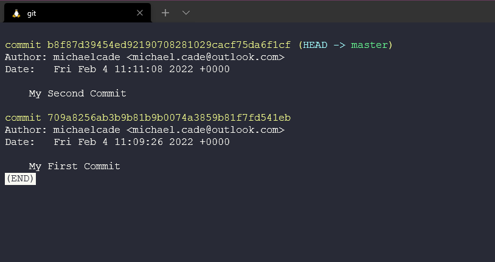

## The Big Picture: Git - Version Control

Before we get into git, we need to understand what version control is and why? In this opener for Git, we will take a look at what version control is, the basics of git.  

### What is Version Control? 

Git is not the only version control system so here we want to cover what options and what methodologies are available around version control. 

The most obvious and a big benefit of Version Control is the ability to track a project's history. We can look back over this repository using `git log` and see that we have many commits and many comments and what has happened so far in the project. Don't worry we will get into the commands later. Now think if this was an actual software project full of source code and multiple people are committing to our software at different times, different authors and then reviewers all are logged here so that we know what has happened, when, by whom and who reviewed. 

Version Control before it was cool, would have been something like manually creating a copy of your version before you made changes. It might be that you also comment out old useless code with the just in case mentality. 

I have started using version control over not just source code but pretty much anything, talks about projects like this (90DaysOfDevOps) because why would you not want that rollback and log of everything that has gone on. 

However, a big disclaimer **Version Control is not a Backup!**

Another benefit of Version Control is the ability to manage multiple versions of a project, Let's create an example, we have a free app that is available on all operating systems and then we have a paid-for app also available on all operating systems. The majority of the code is shared between both applications. We could copy and paste our code each commit to each app but that is going to be very messy especially as you scale your development to more than just one person, also mistakes will be made. 

The premium app is where we are going to have additional features, let's call them premium commits, the free edition will just contain the normal commits. 

The way this is achieved in Version Control is through branching. 

Branching allows for two code streams for the same app as we stated above. But we will still want new features that land in our source code free version to be in our premium and to achieve this we have something called merging. 

Now, this same easy but merging can be complicated because you could have a team working on the free edition and you could have another team working on the premium paid for version and what if both change code that affects aspects of the overall code. Maybe a variable gets updated and breaks something. Then you have a conflict that breaks one of the features. Version Control cannot fix the conflicts that are down to you. But version control allows this to be easily managed. 

The primary reason if you have not picked up so far for version control, in general, is the ability to collaborate. The ability to share code amongst developers and when I say code as I said before more and more we are seeing much more use cases for other reasons to use source control, maybe its a joint presentation you are working on with a colleague or a 90DaysOfDevOps challenge where you have the community offering their corrections and updates throughout the project. 

Without version control how did teams of software developers even handle this? I find it hard enough when I am working on my projects to keep track of things. I expect they would split out the code into each functional module. Maybe a little part of the puzzle then was bringing the pieces together and then problems and issues before anything would get released. 

With version control, we have a single source of truth. We might all still work on different modules but it enables us to collaborate better. 

Another thing to mention here is that it's not just developers that can benefit from Version Control, it's all members of the team to have visibility but also tools all having awareness or leverage, Project Management tools can be linked here, tracking the work. We might also have a build machine for example Jenkins which we will talk about in another module. A tool that Builds and Packages the system, automating the deployment tests and metrics. 

### What is Git? 

Git is a tool that tracks changes to source code or any file, or we could also say Git is an open-source distributed version control system. 

There are many ways in which git can be used on our systems, most commonly or at least for me I have seen it in at the command line, but we also have graphical user interfaces and tools like Visual Studio Code that have git aware operations we can take advantage of. 

Now we are going to run through a high-level overview before we even get Git installed on our local machine. 

Let's take the folder we created earlier. 

To use this folder with version control we first need to initiate this directory using the `git init command. For now, just think that this command puts our directory as a repository in a database somewhere on our computer. 

Now we can create some files and folders and our source code can begin or maybe it already has and we have something in here already. We can use the `git add .` command which puts all files and folders in our directory into a snapshot but we have not yet committed anything to that database. We are just saying all files with the `.` are ready to be added.   

Then we want to go ahead and commit our files, we do this with the `git commit -m "My First Commit"` command. We can give a reason for our commit and this is suggested so we know what has happened for each commit. 

We can now see what has happened within the history of the project. Using the `git log` command.

We can also check the status of our repository by using `git status` this shows we have nothing to commit and we can add a new file called samplecode.ps1. If we then run the same `git status you will see that we file to be committed. 

Add our new file using the `git add samplecode.ps1` command and then we can run `git status` again and see our file is ready to be committed. 

Then issue `git commit -m "My Second Commit"` command.

Another `git status` now shows everything is clean again.

We can then use the `git log` command which shows the latest changes and first commit. 

If we wanted to see the changes between our commits i.e what files have been added or modified we can use the `git diff b8f8 709a`

Which then displays what has changed in our case we added a new file. 

We can also and we will go deeper into this later on but we can jump around our commits i.e we can go time travelling! By using our commit number we can use the `git checkout 709a` command to jump back in time without losing our new file. 

But then equally we will want to move forward as well and we can do this the same way with the commit number or you can see here we are using the `git switch -` command to undo our operation. 

The TLDR; 

- Tracking a projects history
- Managing multiple versions of a project
- Sharing code amongst developers and a wider scope of teams and tools
- Coordinating teamwork
- Oh and there is some time travel! 

This might have seemed a jump around but hopefully, you can see without really knowing the commands used the powers and the big picture behind Version Control. 

Next up we will be getting git installed and set up on your local machine and diving a little deeper into some other use cases and commands that we can achieve in Git. 

## Resources 

- [What is Version Control?](https://www.youtube.com/watch?v=Yc8sCSeMhi4)
- [Types of Version Control System](https://www.youtube.com/watch?v=kr62e_n6QuQ)
- [Git Tutorial for Beginners](https://www.youtube.com/watch?v=8JJ101D3knE&t=52s) 
- [Git for Professionals Tutorial](https://www.youtube.com/watch?v=Uszj_k0DGsg) 
- [Git and GitHub for Beginners - Crash Course](https://www.youtube.com/watch?v=RGOj5yH7evk&t=8s) 
- [Complete Git and GitHub Tutorial](https://www.youtube.com/watch?v=apGV9Kg7ics)

See you on [Day 36](day36.md) 

