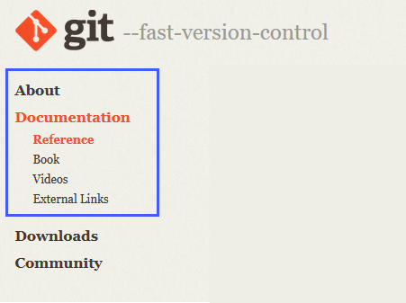
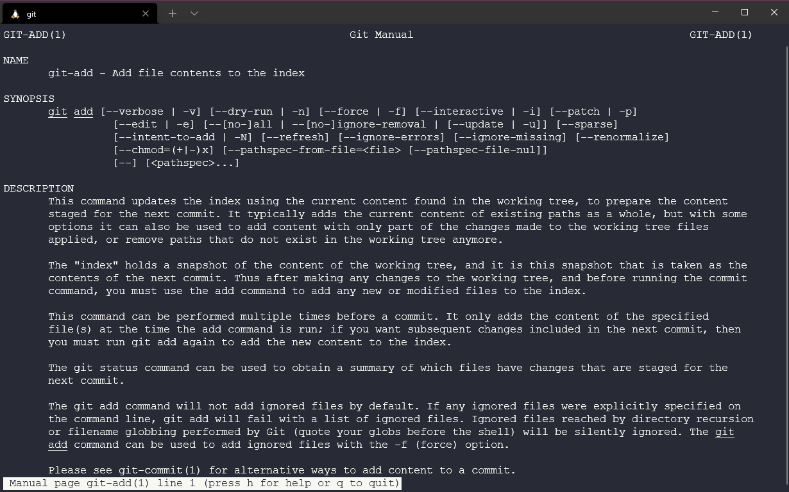
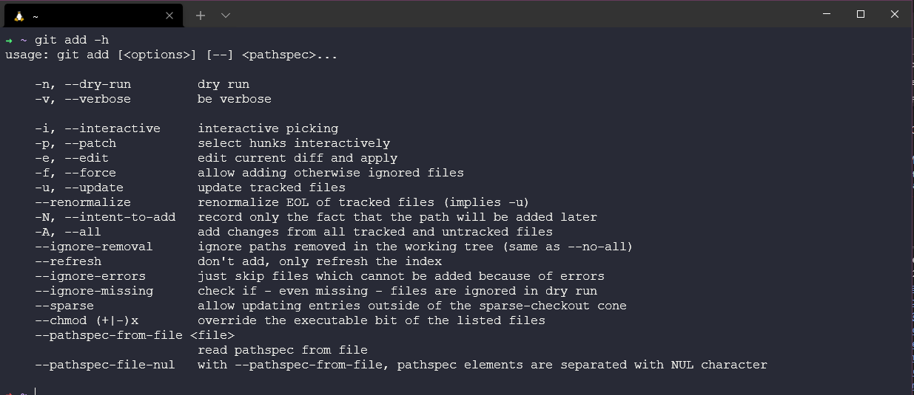

## Gitting to know Git

Apoligies for the terrible puns in the title and throughout. I am surely not the first person to turn Git into a dad joke! 

In the last two posts we learnt about version control systems, and some of the fundamental workflows of git as a version control system [Day 35](day35.md) Then we got git installed on our system, updated and configured. We also went a little deeper on the theory between Client-Server version control system and Git which is a distributed version control system [Day 36](day36.md).

Now we are going to run through some of the commands and use cases that we will all commonly see with git.

### Where to git help with git? 

There is going to be times where you just cannot remember or just don't know the command you need to get things done with git. You are going to need help. 

It goes without saying that  google or any search engine is likely to be your first port of call when searching help. 

Secondly the next place is going to be the official git site and the documentation. [git-scm.com/docs](http://git-scm.com/docs) Here you will find not only a solid reference to all the commands available but also lots of different resources. 

We can also access this same documentation which is super useful if you are without connectivity from the terminal. If we chose the `git add` command for example we can run `git add --help` and we see below the manual. 

We can also in the shell use `git add -h` which is going to give us a short summary of the options we have available. 

### Myths surrounding Git

"Git has no access control" - You can empower a leader to maintain source code. 

"Git is too heavy" - Git has the ability to provide shallow repositories which basically means a reduced amount of history if you have large projects. 

### Real shortcomings

Not ideal for Binary files. Great for source code but not great for executable files or videos for example. 

Git is not user friendly, the fact that we have to spend time talking about commands and functions of the tool is probably a key sign of that. 

Overall though, git is hard to learn, but easy to use. 

### The git ecosystem 

I want to briefly cover the ecosystem around git but not deep dive into some of these areas but I think its important to note these here at a high level. 

Almost all modern development tools support Git. 

- Developer tools - We have already mentioned visual studio code but you will find git plugins and integrations into sublime text and other text editors and IDEs. 
  
- Team tools - Also mentioned around tools like Jenkins from a CI/CD point of view, Slack from a messaging framework and Jira for project management and issue tracking. 

- Cloud Providers - All the large cloud providers support git, Microsoft Azure, Amazon AWS, Google Cloud Platform. 
  
- Git-Based services - Then we have the GitHub, GitLab and BitBucket of which we will cover in more detail later on. I have heard these services as the social network for code! 

### The Git Cheatsheet 

We have not covered most of these commands but having looked at some cheatsheets available online I wanted to document some of the git commands and what their purpose are. We don't need to remember these all, and with more hands on practice and using you will pick at least the git basics. 

I have taken these from [atlassian](https://www.atlassian.com/git/tutorials/atlassian-git-cheatsheet) but writing them down and reading the description is a good way to get to know what the commands are as well as getting hands on in every day tasks. 

### Git Basics 

| Command           |           Example                       |           Description                                                                                                       | 
| ---------------   |   ------------------------------------- |   ------------------------------------------------------------------------------------------------------------------------- |
| git init          | `git init <directory>`                  | Create an empty git repository in specified directory.                                                                      |
| git clone         | `git clone <repo>`                      | Clone repository located at <repo> onto local machine.                                                                      |
| git config        | `git config user.name`                  | Define author name to be used for all commits in current repository `system`, `global`, `local` flag to set config options. |
| git add           | `git add <directory>`                   | Stage all changes in <directory> for the next commit. We can also add <files> and <.> for everything.                       |
| git commit -m     | `git commit -m "<message>"`             | Commit the staged snapshot, use <message> to detail what is being committed.                                                |
| git status        | `git status`                            | List files that are staged, unstaged and untracked.                                                                         |
| git log           | `git log`                               | Display all commit history using the default format. There are additional options with this command.                        |
| git diff          | `git diff`                              | Show unstaged changes between your index and working directory.                                                             |

### Git Undoing Changes 

| Command           |           Example                       |           Description                                                                                                                 | 
| ---------------   |   ------------------------------------- |   ----------------------------------------------------------------------------------------------------------------------------------- |
| git revert        | `git revert <commit>`                   | Create a new commit that undoes all of the changes made in <commit> then apply it to the current branch.                              |
| git reset         | `git reset <file>`                      | Remove <file> from the staging area, but leave the working directory unchanged. This unstages a file without overwriting any changes. |
| git clean         | `git clean -n`                          | Shows which files would be removed from the working directory. Use `-f` in place of `-n` to execute the clean.                        |

### Git Rewriting History

| Command           |           Example                       |           Description                                                                                                                 | 
| ---------------   |   ------------------------------------- |   ----------------------------------------------------------------------------------------------------------------------------------- |
| git commit        | `git commit --amend`                    | Replace the last commit with the staged changes and last commit combined. Use with nothing staged to edit the last commit’s message.  |
| git rebase        | `git rebase <base>`                     | Rebase the current branch onto <base>. <base> can be a commit ID, branch name, a tag, or a relative reference to HEAD.                |
| git reflog        | `git reflog`                            | Show a log of changes to the local repository’s HEAD. Add --relative-date flag to show date info or --all to show all refs.           |

### Git Branches

| Command           |           Example                       |           Description                                                                                                                 | 
| ---------------   |   ------------------------------------- |   ----------------------------------------------------------------------------------------------------------------------------------- |
| git branch        | `git branch`                            | List all of the branches in your repo. Add a <branch> argument to create a new branch with the name <branch>.                         |
| git checkout      | `git checkout -b <branch>`              | Create and check out a new branch named <branch>. Drop the -b flag to checkout an existing branch.                                    |
| git merge         | `git merge <branch>`                    | Merge <branch> into the current branch.                                                                                               |

### Git Remote Repositories

| Command           |           Example                       |           Description                                                                                                                 | 
| ---------------   |   ------------------------------------- |   ----------------------------------------------------------------------------------------------------------------------------------- |
| git remote add    | `git remote add <name> <url>`           | Create a new connection to a remote repo. After adding a remote, you can use <name> as a shortcut for <url> in other commands.        |
| git fetch         | `git fetch <remote> <branch>`           | Fetches a specific <branch>, from the repo. Leave off <branch> to fetch all remote refs.                                              |
| git pull          | `git pull <remote>`                     | Fetch the specified remote’s copy of current branch and immediately merge it into the local copy.                                     |
| git push          | `git push <remote> <branch>`            | Push the branch to <remote>, along with necessary commits and objects. Creates named branch in the remote repo if it doesn’t exist.   |

### Git Diff

| Command           |           Example                       |           Description                                                                                                                 | 
| ---------------   |   ------------------------------------- |   ----------------------------------------------------------------------------------------------------------------------------------- |
| git diff HEAD     | `git diff HEAD`                         | Show difference between working directory and last commit.                                                                            |
| git diff --cached | `git diff --cached`                     | Show difference between staged changes and last commit                                                                                |

### Git Config

| Command                                               |           Example                                      |           Description                                                                                                                         | 
| ----------------------------------------------------- |   ---------------------------------------------------- |   ------------------------------------------------------------------------------------------------------------------------------------------- |
| git config --global user.name <name>                  | `git config --global user.name <name>`                 | Define the author name to be used for all commits by the current user.                                                                        |
| git config --global user.email <email>                | `git config --global user.email <email>`               | Define author email to be used for all commits by the current user.                                                                           |
| git config --global alias <alias-name> <git-command>  | `git config --global alias <alias-name> <git-command>` | Create shortcut for a git command .                                                                                                           |
| git config --system core.editor <editor>              | `git config --system core.editor <editor>`             | Set the text editor to be used by commands for all users on the machine. <editor> arg should be the comamnd that launches the desired editor. |
| git config --global --edit                            | `git config --global --edit `                          | Open the global configuration file in a text editor for manual editing.                                                                       |

### Git Rebase

| Command                               |           Example                      |           Description                                                                                                                         | 
| ------------------------------------- |   ------------------------------------ |   ------------------------------------------------------------------------------------------------------------------------------------------- |
| git rebase -i <base>                  | `git rebase -i <base>`                 | Interactively rebase current branch onto <base>. Launches editor to enter commands for how each commit will be transferred to the new base.   |

### Git Pull

| Command                               |           Example                      |           Description                                                                                                                         | 
| ------------------------------------- |   ------------------------------------ |   ------------------------------------------------------------------------------------------------------------------------------------------- |
| git pull --rebase <remote>            | `git pull --rebase <remote>`           | Fetch the remote’s copy of current branch and rebases it into the local copy. Uses git rebase instead of merge to integrate the branches.     |

### Git Reset

| Command                   |           Example           |           Description                                                                                                                           | 
| ------------------------- |   --------------------------|   --------------------------------------------------------------------------------------------------------------------------------------------- |
| git reset                 | `git reset `                | Reset staging area to match most recent commit, but leave the working directory unchanged.                                                      |
| git reset --hard          | `git reset --hard`          | Reset staging area and working directory to match most recent commit and overwrites all changes in the working directory                        |
| git reset <commit>        | `git reset <commit>`        | Move the current branch tip backward to <commit>, reset the staging area to match, but leave the working directory alone                        |
| git reset --hard <commit> | `git reset --hard <commit>` | Same as previous, but resets both the staging area & working directory to match. Deletes uncommitted changes, and all commits after <commit>.   |

### Git Push

| Command                   |           Example           |           Description                                                                                                                           | 
| ------------------------- |   --------------------------|   --------------------------------------------------------------------------------------------------------------------------------------------- |
| git push <remote> --force                 | `git push <remote> --force`                | Forces the git push even if it results in a non-fast-forward merge. Do not use the --force flag unless you’re absolutely sure you know what you’re doing. |
| git push <remote> --all          | `git push <remote> --all`          | Push all of your local branches to the specified remote.                        |
| git push <remote> --tags        | `git push <remote> --tags`        | Tags aren’t automatically pushed when you push a branch or use the --all flag. The --tags flag sends all of your local tags to the remote repo. |

## Resources 

- [What is Version Control?](https://www.youtube.com/watch?v=Yc8sCSeMhi4)
- [Types of Version Control System](https://www.youtube.com/watch?v=kr62e_n6QuQ)
- [Git Tutorial for Beginners](https://www.youtube.com/watch?v=8JJ101D3knE&t=52s) 
- [Git for Professionals Tutorial](https://www.youtube.com/watch?v=Uszj_k0DGsg) 
- [Git and GitHub for Beginners - Crash Course](https://www.youtube.com/watch?v=RGOj5yH7evk&t=8s) 
- [Complete Git and GitHub Tutorial](https://www.youtube.com/watch?v=apGV9Kg7ics)
- [Git cheatsheet](https://www.atlassian.com/git/tutorials/atlassian-git-cheatsheet)

See you on [Day 38](day38.md) 
