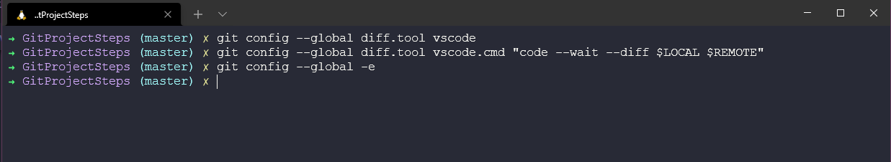
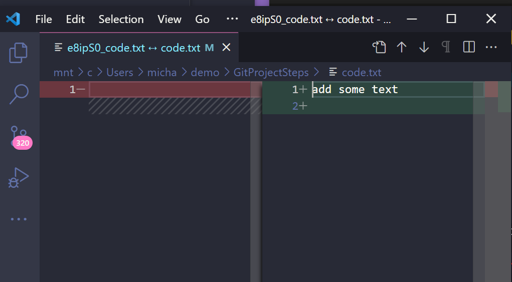
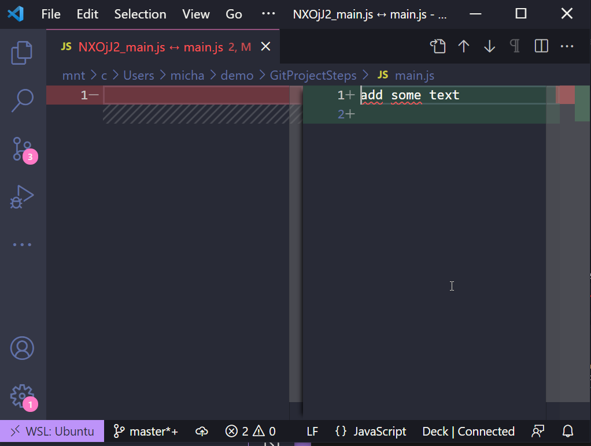
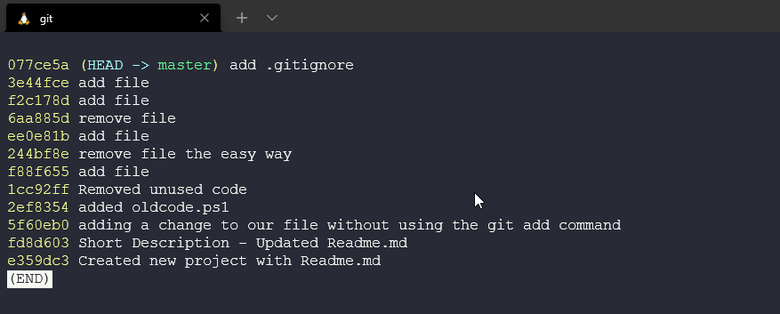
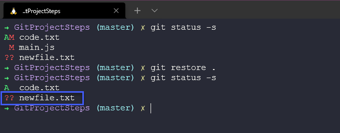
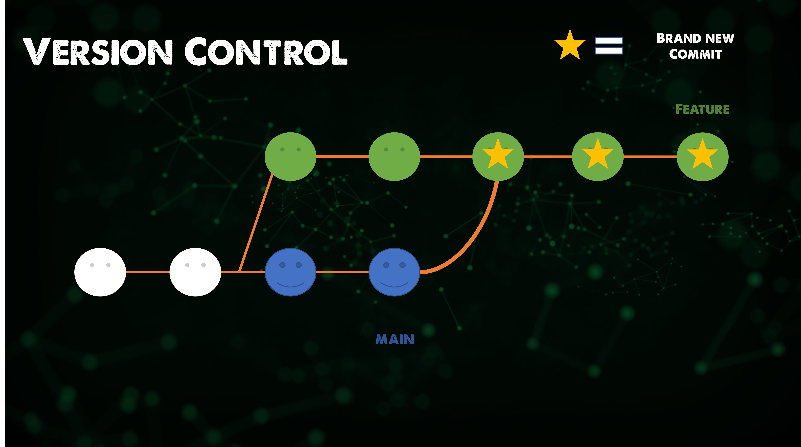

## Viewing, unstaging, discarding & restoring

Continuing from where we finished yesterday around some of the commands that we have with git and how to leverage git with your projects. Remember we have not touched GitHub or any other git-based services yet this is all to help you keep control of your projects locally at the moment, but they will all become useful when we start to integrate into those tools.

### Viewing the Staged and Unstaged Changes

It is good practice to make sure you view the staged and unstaged code before committing. We can do this by running the `git diff --staged` command


This then shows us all the changes we have made and all new files we have added or deleted.

changes in the modified files are indicated with `---` or `+++` you can see below that we just added +add some text below which means they are new lines.


We can also run `git diff` to compare our staging area with our working directory. If we make some changes to our newly added file code.txt and add some lines of text.


If we then run `git diff` we compare and see the output below.


### Visual Diff Tools

For me, the above is more confusing so I would much rather use a visual tool,

To name a few visual diff tools:

- KDiff3
- P4Merge
- WinMerge (Windows Only)
- VSCode

To set this in git we run the following command `git config --global diff.tool vscode`

We are going to run the above and we are going to set some parameters when we launch VScode.



We can also check our configuration with `git config --global -e`


We can then use `git difftool` to now open our diff visual tool.


Which then opens our VScode editor on the diff page and compares the two, we have only modified one file from nothing to now adding a line of code on the right side.



I find this method much easier to track changes and this is something similar to what we will see when we look into git-based services such as GitHub.

We can also use `git difftool --staged` to compare stage with committed files.


Then we can cycle through our changed files before we commit.



I am using VScode as my IDE and like most IDEs they have this functionality built in it is very rare you would need to run these commands from the terminal, although helpful if you don't have an IDE installed for some reason.

### Viewing the History

We previously touched on `git log` which will provide us with a comprehensive view of all commits we have made in our repository.


Each commit has its hexadecimal string, unique to the repository. Here you can see which branch we are working on and then also the author, date and commit message.

We also have `git log --oneline` and this gives us a much smaller version of the hexadecimal string which we can use in other `diff` commands. We also only have the one-line description or commit message.



We can reverse this into a start with the first commit by running `git log --oneline --reverse` and now we see our first commit at the top of our page.


### Viewing a Commit

Being able to look at the commit message is great if you have been conscious about following best practices and you have added a meaningful commit message, however, there is also `git show` command which allows us to inspect and view a commit.

We can use `git log --oneline --reverse` to get a list of our commits. and then we can take those and run `git show <commit ID>`


The output of that command will look like below with the detail of the commit, author and what changed.


We can also use `git show HEAD~1` where 1 is how many steps back from the current version we want to get back to.

This is great if you want some detail on your files, but if we want to list all the files in a tree for the whole snapshot directory. We can achieve this by using the `git ls-tree HEAD~1` command, again going back one snapshot from the last commit. We can see below we have two blobs, these indicate files whereas the tree would indicate a directory. You can also see commits and tags in this information.


We can then use the above to drill in and see the contents of our file (blobs) using the `git show` command.


Then the contents of that specific version of the file will be shown.


### Unstaging Files

There will be a time when you have maybe used `git add .` but there are files you do not wish to commit to that snapshot just yet. In this example below I have added newfile.txt to my staging area but I am not ready to commit this file so I am going to use the `git restore --staged newfile.txt` to undo the `git add` step.


We can also do the same to modified files such as main.js and unstage the commit, see above we have a greem M for modified and then below we are unstaging those changes.


I have found this command quite useful during the 90DaysOfDevOps as I sometimes work ahead of the days where I feel I want to make notes for the following day but I don't want to commit and push to the public GitHub repository.

### Discarding Local Changes

Sometimes we might make changes but we are not happy with those changes and we want to throw them away. We are going to use the `git restore` command again and we are going to be able to restore files from our snapshots or previous versions. We can run `git restore .` against our directory and we will restore everything from our snapshot but notice that our untracked file is still present. There is no previous file being tracked called newfile.txt.



Now to remove newfile.txt or any untracked files. We can use `git clean` we will get a warning alone.


Or if we know the consequences then we might want to run `git clean -fd` to force and remove all directories.


### Restoring a File to an Earlier Version

As we have alluded to throughout a big portion of what Git can help with is being able to restore copies of your files from your snapshots (this is not a backup but it is a very fast restore point) My advice is that you also save copies of your code in other locations using a backup solution for this.

As an example let's go and delete our most important file in our directory, notice we are using Unix-based commands to remove this from the directory, not git commands.


Now we have no readme.mdin our working directory. We could have used `git rm readme.md` and this would then be reflected in our git database. Let's also delete it from here to simulate it being removed completely.


Let's now commit this with a message and prove that we no longer have anything in our working directory or staging area.


Mistakes were made and we now need this file back!

We could use the `git undo` command which will undo the last commit, but what if it was a while back? We can use our `git log` command to find our commits and then we find that our file is in the last commit but we don't all of those commits to be undone so we can then use this command `git restore --source=HEAD~1 README.md` to specifically find the file and restore it from our snapshot.

You can see using this process we now have the file back in our working directory.


We now have a new untracked file and we can use our commands previously mentioned to track, stage and commit our files and changes.

### Rebase vs Merge

This seems to be the biggest headache when it comes to Git and when to use rebase vs using merge on your git repositories.

The first thing to know is that both `git rebase` and `git merge` solve the same problem. Both are to integrate changes from one branch into another branch. However, they do this in different ways.

Let's start with a new feature in a new dedicated branch. The Main branch continues with new commits.


The easy option here is to use `git merge feature main` which will merge the main branch into the feature branch.


Merging is easy because it is non-destructive. The existing branches are not changed in any way. However, this also means that the feature branch will have an irrelevant merge commit every time you need to incorporate upstream changes. If the main is very busy or active this will or can pollute the feature branch history.

As an alternate option, we can rebase the feature branch onto the main branch using

```
git checkout feature
git rebase main
```

This moves the feature branch (the entire feature branch) effectively incorporating all of the new commits in the main. But, instead of using a merge commit, rebasing re-writes the project history by creating brand new commits for each commit in the original branch.



The biggest benefit of rebasing is a much cleaner project history. It also eliminates unnecessary merge commits. and as you compare the last two images, you can follow arguably a much cleaner linear project history.

Although it's still not a foregone conclusion, choosing the cleaner history also comes with tradeoffs, If you do not follow the [The Golden rule of rebasing](https://www.atlassian.com/git/tutorials/merging-vs-rebasing#the-golden-rule-of-rebasing) re-writing project history can be potentially catastrophic for your collaboration workflow. And, less importantly, rebasing loses the context provided by a merge commit—you can’t see when upstream changes were incorporated into the feature.

## Resources

- [What is Version Control?](https://www.youtube.com/watch?v=Yc8sCSeMhi4)
- [Types of Version Control System](https://www.youtube.com/watch?v=kr62e_n6QuQ)
- [Git Tutorial for Beginners](https://www.youtube.com/watch?v=8JJ101D3knE&t=52s)
- [Git for Professionals Tutorial](https://www.youtube.com/watch?v=Uszj_k0DGsg)
- [Git and GitHub for Beginners - Crash Course](https://www.youtube.com/watch?v=RGOj5yH7evk&t=8s)
- [Complete Git and GitHub Tutorial](https://www.youtube.com/watch?v=apGV9Kg7ics)
- [Git cheatsheet](https://www.atlassian.com/git/tutorials/atlassian-git-cheatsheet)
- [Exploring the Git command line – A getting started guide](https://veducate.co.uk/exploring-the-git-command-line/)

See you on [Day40](day40.md)
