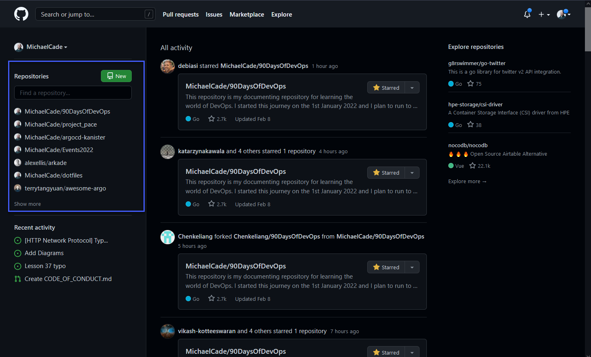
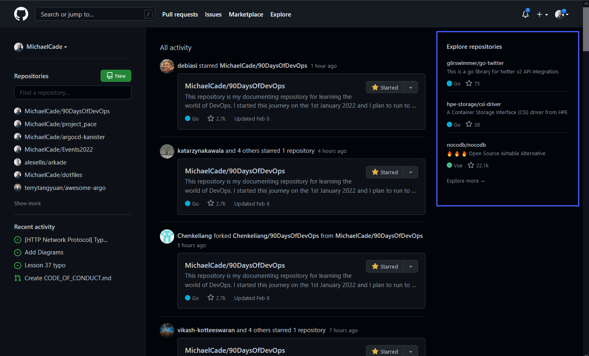
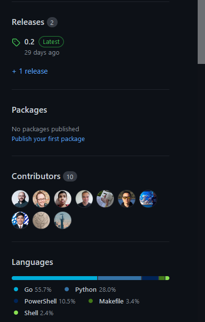
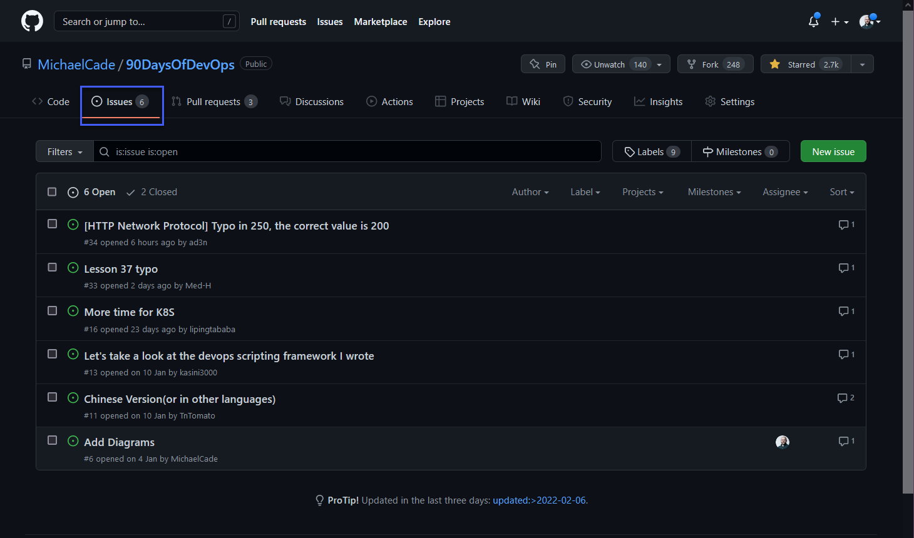
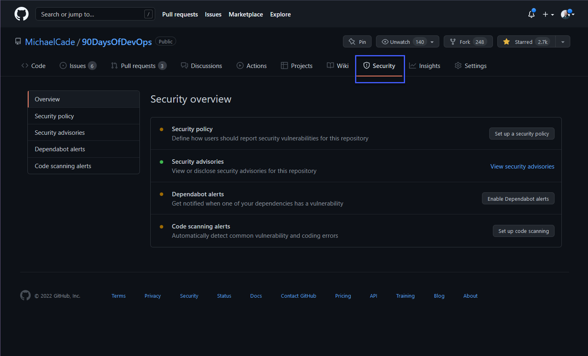
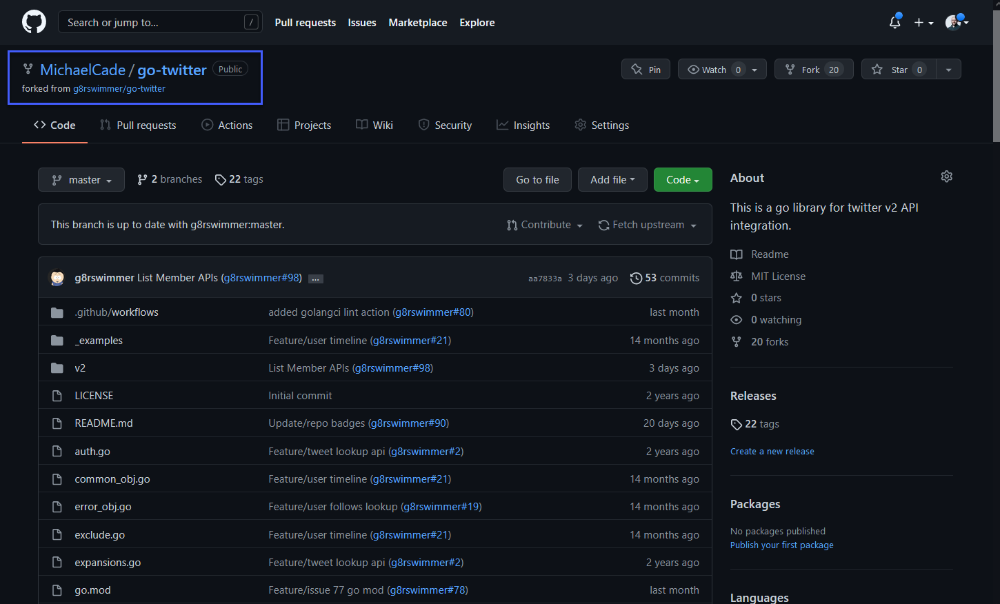
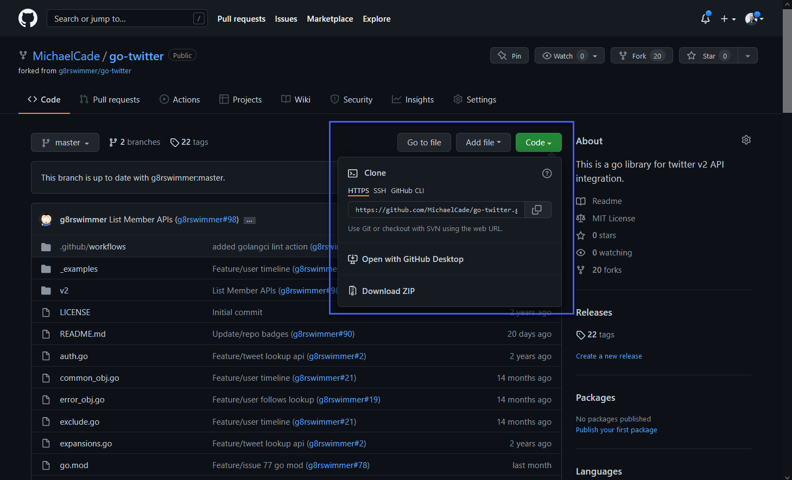
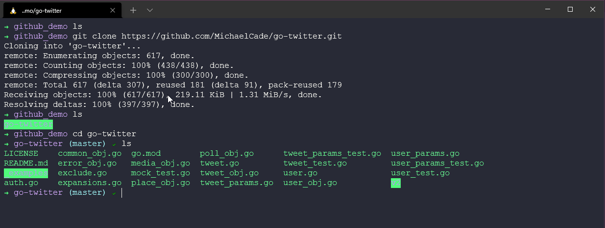

## Social Network for code

Exploring GitHub | GitLab | BitBucket

Today I want to cover some of the git-based services that we have likely all heard of and expect we also use daily.

We will then use some of our prior session knowledge to move copies of our data to each of the main services.

I called this section "Social Network for Code" let me explain why?

### GitHub

Most common at least for me is GitHub, GitHub is a web-based hosting service for git. It is most commonly used by software developers to store their code. Source Code Management with the git version control features as well as a lot of additional features. It allows for teams or open contributors to easily communicate and provides a social aspect to coding. (hence the social networking title) Since 2018 GitHub is part of Microsoft.

GitHub has been around for quite some time and was founded in 2007/2008. With Over 40 million users on the platform today.

GitHub Main Features

- Code Repository
- Pull Requests
- Project Management toolset - Issues
- CI / CD Pipeline - GitHub Actions

In terms of pricing, GitHub has different levels of pricing for its users. More can be found on [Pricing](https://github.com/pricing)

For this, we will cover the free tier.

I am going to be using my already created GitHub account during this walkthrough, if you do not have an account then on the opening GitHub page there is a sign-up option and some easy steps to get set up.

### GitHub opening page

When you first log in to your GitHub account you get a page containing a lot of widgets giving you options of where and what you would like to see or do. First up we have the "All Activity" this is going to give you a look into what is happening with your repositories or activity in general associated with your organisation or account.

Next, we have our Code Repositories, either our own or repositories that we have interacted with recently. We can also quickly create new repositories or search repositories.

We then have our recent activity, these for me are issues and pull requests that I have created or contributed to recently.

Over on the right side of the page, we have some referrals for repositories that we might be interested in, most likely based on your recent activity or own projects.

To be honest I am very rarely on my home page that we just saw and described, although I now see that the feed could be really useful to help interact with the community a little better on certain projects.

Next up if we want to head into our GitHub Profile we can navigate to the top right corner and on your image, there is a drop-down which allows you to navigate through your account. From here to access your Profile select "Your Profile"

Next, your profile page will appear, by default, unless you change your configuration you are not going to see what I have, I have added some functionality that shows my recent blog posts over on [vZilla](https://vzilla.co.uk) and then also my latest videos on my [YouTube](https://m.youtube.com/c/MichaelCade1) Channel.

You are not going to be spending much time looking at your profile, but this is a good profile page to share around your network so they can see the cool projects you are working on.

We can then drill down into the building block of GitHub, the repositories. Here you are going to see your repositories and if you have private repositories they are also going to be shown in this long list.

As the repository is so important to GitHub let me choose a pretty busy one of late and run through some of the core functionality that we can use here on top of everything I am already using when it comes to editing our "code" in git on my local system.

First of all, from the previous window, I have selected the 90DaysOfDevOps repository and we get to see this view. You can see from this view we have a lot of information, we have our main code structure in the middle showing our files and folders that are stored in our repository. We have our readme. mdbeing displayed down at the bottom. Over to the right of the page, we have an about section where the repository has a description and purpose. Then we have a lot of information underneath this showing how many people have starred in the project, forked, and watched.

If we scroll down a little further you will also see that we have Released, these are from the golang part of the challenge. We do not have any packages in our project, we have our contributors listed here. (Thank you community for assisting in my spelling and fact checking) We then have languages used again these are from different sections in the challenge.

A the top of the page you are going to see a list of tabs. These may vary and these can be modified to only show the ones you require. You will see here that I am not using all of these and I should remove them to make sure my whole repository is tidy.

First up we had the code tab which we just discussed but these tabs are always available when navigating through a repository which is super useful so we can jump between sections quickly and easily. Next, we have the issues tab.

Issues let you track your work on GitHub, where development happens. In this specific repository you can see I have some issues focused on adding diagrams or typos but also we have an issue stating a need or requirement for a Chinese version of the repository.

If this was a code repository then this is a great place to raise concerns or issues with the maintainers, but remember to be mindful and detailed about what you are reporting, and give as much detail as possible.

The next tab is Pull Requests, Pull requests let you tell others about changes you've pushed to a branch in a repository. This is where someone may have forked your repository, made changes such as bug fixes or feature enhancements or just typos in a lot of the cases in this repository.

We will cover forking later on.

I believe the next tab is quite new? But I thought for a project like #90DaysOfDevOps this could help guide the content journey but also help the community as they walk through their learning journey. I have created some discussion groups for each section of the challenge so people can jump in and discuss.

The Actions tab is going to enable you to build, test and deploy code and a lot more right from within GitHub. GitHub Actions will be something we cover in the CI/CD section of the challenge but this is where we can set some configuration here to automate steps for us.

On my main GitHub Profile, I am using GitHub Actions to fetch the latest blog posts and YouTube videos to keep things up to date on that home screen.

I mentioned above how GitHub is not just a source code repository but is also a project management tool, The Project tab enables us to build out project tables kanban type boards so that we can link issues and PRs to better collaborate on the project and have visibility of those tasks.

I know that issues to me seem like a good place to log feature requests and they are but the wiki page allows for a comprehensive roadmap for the project to be outlined with the current status and in general better document your project is it troubleshooting or how-to type content.

Not so applicable to this project but the Security tab is there to make sure that contributors know how to deal with certain tasks, we can define a policy here but also code scanning add-ons to make sure your code for example does not contain secret environment variables.

For me the insights tab is great, it provides so much information about the repository from how much activity has been going on down to commits and issues, but it also reports on traffic to the repository. You can see a list on the left side that allows you to go into great detail about metrics on the repository.

Finally, we have the Settings tab, this is where we can get into the details of how we run our repository, I am currently the only maintainer of the repository but we could share this responsibility here. We can define integrations and other such tasks here.

This was a super quick overview of GitHub, I think there are some other areas that I might have mentioned that need explaining in a little more detail. As mentioned GitHub houses millions of repositories mostly these are holding source code and these can be public or privately accessible.

### Forking

I am going to get more into Open-Source in the session tomorrow but a big part of any code repository is the ability to collaborate with the community. Let's think of the scenario I want a copy of a repository because I want to make some changes to it, maybe I want to fix a bug or maybe I want to change something to use it for a use case that I have that was maybe not the intended use case for the original maintainer of the code. This is what we would call forking a repository. A fork is a copy of a repository. Forking a repository allows you to freely experiment with changes without affecting the original project.

Let me head back to the opening page after login and see one of those suggested repositories.

If we click on that repository we are going to get the same look as we have just walked through on the 90DaysOfDevOps repository.

If we notice below we have 3 options, we have watch, fork and star.

- Watch - Updates when things happen to the repository.
- Fork - a copy of a repository.
- Star - "I think your project is cool"

Given our scenario of wanting a copy of this repository to work on we are going to hit the fork option. If you are a member of multiple organisations then you will have to choose where the fork will take place, I am going to choose my profile.

Now we have our copy of the repository that we can freely work on and change as we see fit. This would be the start of the pull request process that we mentioned briefly before but we will cover it in more detail tomorrow.

Ok, I hear you say, but how do I make changes to this repository and code if it's on a website, well you can go through and edit on the website but it's not going to be the same as using your favourite IDE on your local system with your favourite colour theme. For us to get a copy of this repository on our local machine we will perform a clone of the repository. This will allow us to work on things locally and then push our changes back into our forked copy of the repository.

We have several options when it comes to getting a copy of this code as you can see below.

There is a local version available of GitHub Desktop which gives you a visual desktop application to track changes and push and pull changes between local and GitHub.

For this little demo, I am going to use the HTTPS URL we see on there.

Now on our local machine, I am going to navigate to a directory I am happy to download this repository to and then run `git clone url`

Now we could take it to VScode to make some changes to this.

Let's now make some changes, I want to make a change to all those links and replace that with something else.

Now if we check back on GitHub and we find our readme.mdin that repository, you should be able to see a few changes that I made to the file.

At this stage, this might be complete and we might be happy with our change as we are the only people going to use our new change but maybe it was a bug change and if that is the case then we will want to contribute via a Pull Request to notify the original repository maintainers of our change and see if they accept our changes.

We can do this by using the contribute button highlighted below. I will cover more on this tomorrow when we look into Open-Source workflows.

I have spent a long time looking through GitHub and I hear some of you cry but what about other options!

Well, there are and I am going to find some resources that cover the basics for some of those as well. You are going to come across GitLab and BitBucket amongst others in your travels and whilst they are git-based services they have their differences.

You will also come across hosted options. Most commonly here I have seen GitLab as a hosted version vs GitHub Enterprise (Don't believe there is a free hosted GitHub?)

## Resources

- [Learn GitLab in 3 Hours | GitLab Complete Tutorial For Beginners](https://www.youtube.com/watch?v=8aV5AxJrHDg)
- [BitBucket Tutorials Playlist](https://www.youtube.com/watch?v=OMLh-5O6Ub8&list=PLaD4FvsFdarSyyGl3ooAm-ZyAllgw_AM5)
- [What is Version Control?](https://www.youtube.com/watch?v=Yc8sCSeMhi4)
- [Types of Version Control System](https://www.youtube.com/watch?v=kr62e_n6QuQ)
- [Git Tutorial for Beginners](https://www.youtube.com/watch?v=8JJ101D3knE&t=52s)
- [Git for Professionals Tutorial](https://www.youtube.com/watch?v=Uszj_k0DGsg)
- [Git and GitHub for Beginners - Crash Course](https://www.youtube.com/watch?v=RGOj5yH7evk&t=8s)
- [Complete Git and GitHub Tutorial](https://www.youtube.com/watch?v=apGV9Kg7ics)
- [Git cheatsheet](https://www.atlassian.com/git/tutorials/atlassian-git-cheatsheet)

See you on [Day 41](day41.md)
