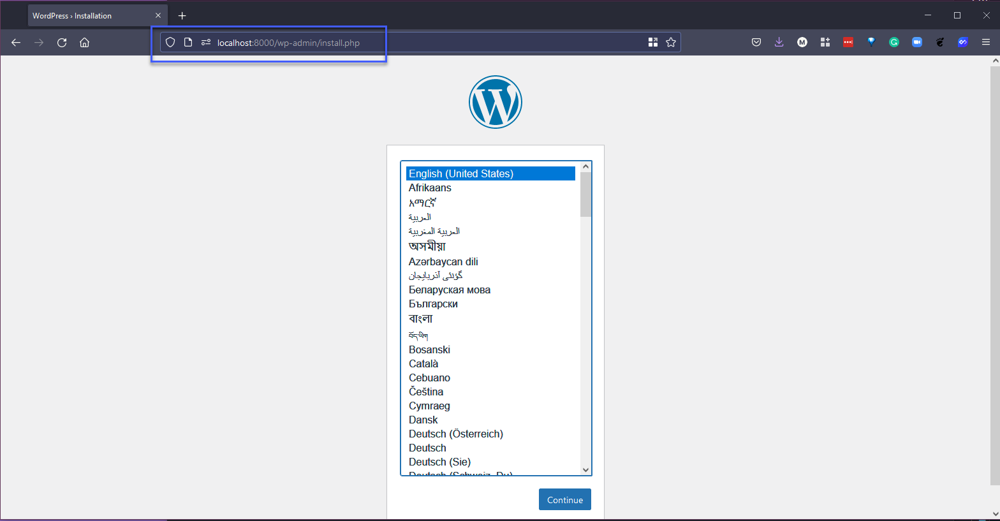
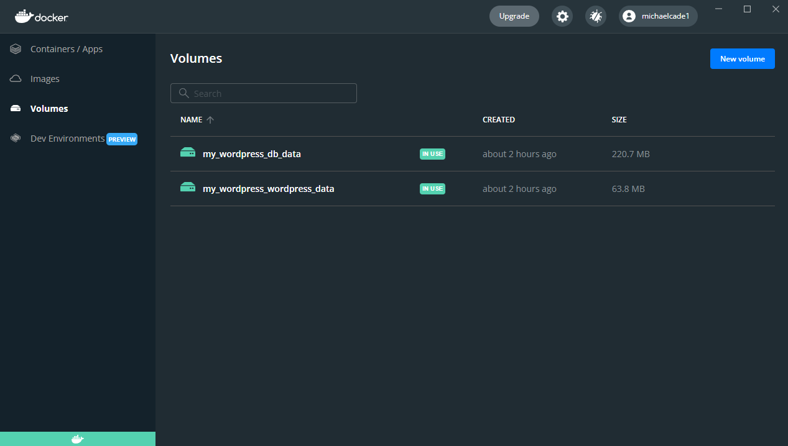
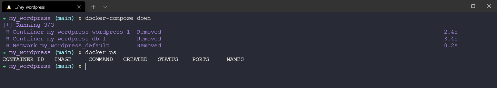
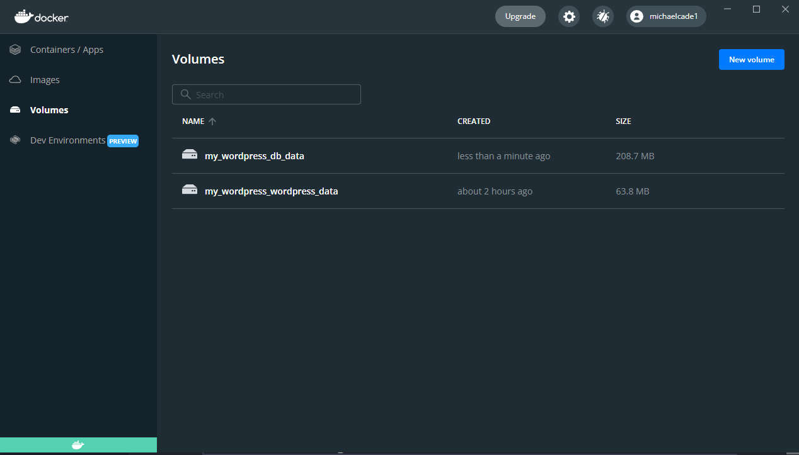
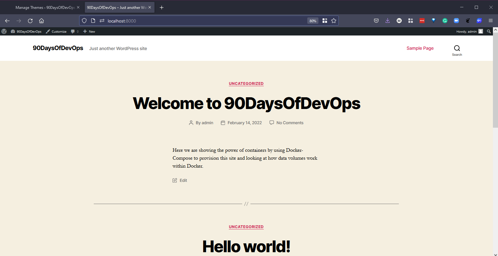
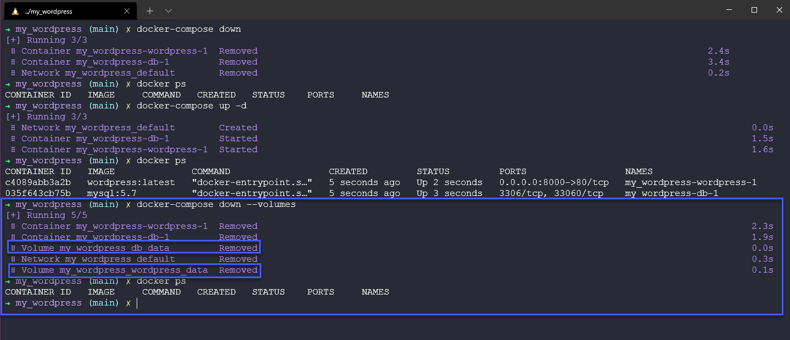
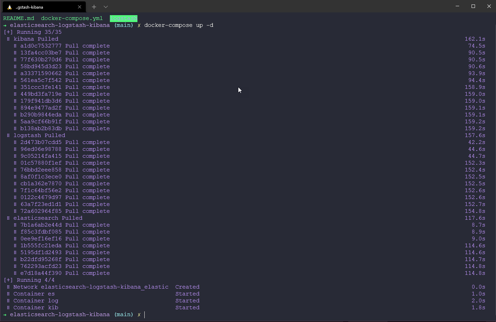
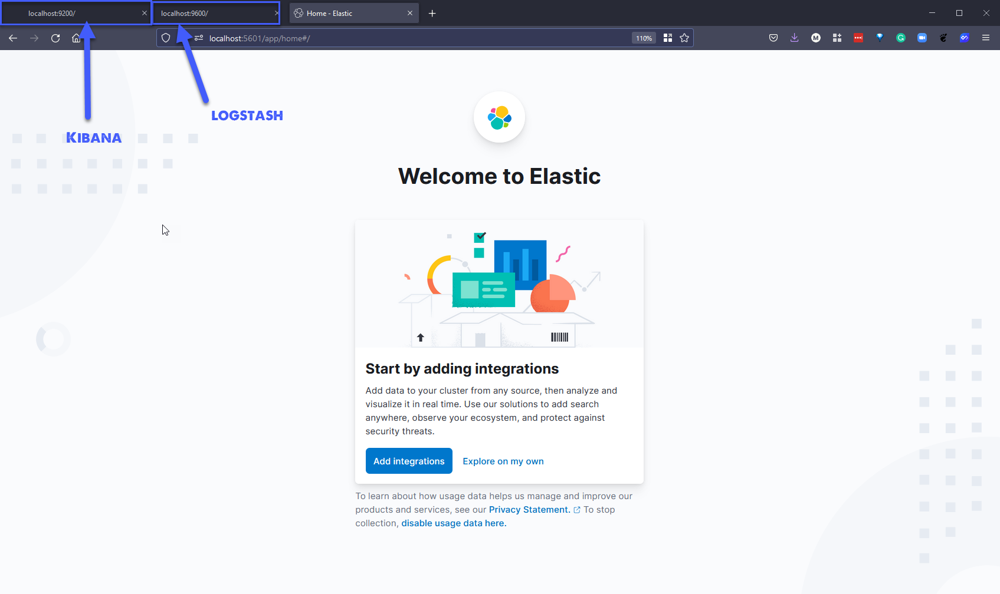

## Docker Compose 

The ability to run one container could be great if you have a self contained image that has everything you need for your single use case, where things get interesting is when you are looking to build multiple applications between different container images. For example if I had a website front end but had a requirement for a backend database I could put everything in one container but better and more efficient would be to have its own container for the database. 

This is where Docker compose comes in which is a tool that allows you to run more complex apps over multiple containers. With the benefit of being able to use a single file and command to spin up your application. The example I am going to walkthrough in this post is from the [Docker QuickStart sample apps (Quickstart: Compose and WordPress)](https://docs.docker.com/samples/wordpress/).

In this first example we are going to: 

- Use Docker compose to bring up WordPress and a separate MySQL instance. 
- Use a YAML file which will be called `docker-compose.yml`
- Build the project 
- Configure WordPress via a Browser
- Shutdown and Clean up

### Install Docker Compose 
As mentioned Docker Compose is a tool, If you are on macOS or Windows then compose is included in your Docker Desktop installation. However you might be wanting to run your containers on a Windows server host or Linux server and in which case you can install using these instructions [Install Docker Compose](https://docs.docker.com/compose/install/) 

To confirm we have `docker-compose` installed on our system we can open a terminal and simply type the above command. 


### Docker-Compose.yml (YAML)

The next thing to talk about is the docker-compose.yml which you can find in the container folder of the repository. But more importantly we need to discuss YAML in general a little. 

YAML could almost have its own session as you are going to find it in so many different places. But for the most part 

"YAML is a human-friendly data serialization language for all programming languages."

It is commonly used for configuration files and in some applications where data is being stored or transmitted. You have no doubt come across XML files that tend to offer that same configuration file. YAML provides a minimal syntax but is aimed at those same use cases. 

YAML Ain't Markup Language (YAML) is a serialisation language that has steadily increased in popularity over the last few years. The object serialisation abilities make it a viable replacement for languages like JSON.

The YAML acronym was shorthand for Yet Another Markup Language. But the maintainers renamed it to YAML Ain't Markup Language to place more emphasis on its data-oriented features.

Anyway, back to the docker-compose.yml file. This is a configuration file of what we want to do when it comes to multiple containers being deployed on our single system. 

Straight from the tuturial linked above you can see the contents of the file looks like this: 

```
version: "3.9"
    
services:
  db:
    image: mysql:5.7
    volumes:
      - db_data:/var/lib/mysql
    restart: always
    environment:
      MYSQL_ROOT_PASSWORD: somewordpress
      MYSQL_DATABASE: wordpress
      MYSQL_USER: wordpress
      MYSQL_PASSWORD: wordpress
    
  wordpress:
    depends_on:
      - db
    image: wordpress:latest
    volumes:
      - wordpress_data:/var/www/html
    ports:
      - "8000:80"
    restart: always
    environment:
      WORDPRESS_DB_HOST: db
      WORDPRESS_DB_USER: wordpress
      WORDPRESS_DB_PASSWORD: wordpress
      WORDPRESS_DB_NAME: wordpress
volumes:
  db_data: {}
  wordpress_data: {}
```

We declare a version and then a large part of this docker-compose.yml file is made up of our services, we have a db service and a wordpress service. You can see each of those have an image defined wiht a version tag associated. We are now also introducing state into our configuration unlike our first walkthroughs, but now we are going to create volumes so we can store our databases there. 

We then have some environmental variables such as passwords and usernames. Obviously these files can get very complicated but the YAML configuration file simplifies what these look like overall. 

### Build the project 

Next up we can head back into our terminal and we can use some commands with our docker-compose tool. Navigate to your directory, where your docker-compose.yml file is located. 

From the terminal we can simply run `docker-compose up -d` this will start the process of pulling those images and standing up your multi container application. 

The `-d` in this command means detached mode, which means that the Run command is or will be in the background.


If we now run the `docker ps` command, you can see we have 2 containers running, one being wordpress and the other being mySQL. 


Next we can validate that we have WordPress up and running by opening a browser and going to `http://localhost:8000` and you should see the wordpress set up page. 



We can run through the setup of WordPress, and then we can start building our website as we see fit in the console below. 


If we then open a new tab and navigate to that same address we did before `http://localhost:8000` we will now see a simple default theme with our site title "90DaysOfDevOps" and then a sample post. 


Before we make any changes, open Docker Desktop and navigate to the volumes tab and here you will see two volumes associated to our containers, one for wordpress and one for db. 



My Current theme for wordpress is "Twenty Twenty-Two" and I want to change this to "Twenty Twenty" Back in the dashboard we can make those changes. 


I am also going to add a new post to my site, and here below you see the latest version of our new site. 


### Clean Up or not

If we were now to use the command `docker-compose down` this would bring down our containers. But will leave our volumes in place. 



We can just confirm in Docker Desktop that our volumes are still there though. 



If we then want to bring things back up then we can issue the `docker up -d` command from within the same directory and we have our application back up and running. 


We then navigate in our browser to that same address of `http://localhost:8000` and notice that our new post and our theme change is all still in place. 



If we want to get rid of the containers and those volumes then issueing the `docker-compose down --volumes` will also destroy the volumes. 



Now when we use `docker-compose up -d` again we will be starting again, however the images will still be local on our system so you won't need to re pull them from the DockerHub repository. 

I know that when I started diving into docker-compose and its capabilities I was then confused as to where this sits alongside or with Container Orchestration tools such as Kubernetes, well everything we have done here in this short demo is focused on one host we have wordpress and db running on the local desktop machine. We don't have multiple virtual machines or multiple physical machines, we also don't have the ability to easily scale up and down the requirements of our application. 

Our next section is going to cover Kubernetes but we have a few more days of Containers in general first. 

This is also a great resource for samples of docker compose applications with multiple integrations. [Awesome-Compose](https://github.com/docker/awesome-compose)

In the above repository there is a great example which will deploy an Elasticsearch, Logstash, and Kibana (ELK) in single-node. 

I have uploaded the files to the [Containers folder](/Days/Containers/elasticsearch-logstash-kibana/) When you have this folder locally, navigate there and you can simply use `docker-compose up -d` 



We can then check we have those running containers with `docker ps` 


Now we can open a browser for each of containers: 



To remove everything we can use the `docker-compose down` command. 

## Resources 

- [TechWorld with Nana - Docker Tutorial for Beginners](https://www.youtube.com/watch?v=3c-iBn73dDE)
- [Programming with Mosh - Docker Tutorial for Beginners](https://www.youtube.com/watch?v=pTFZFxd4hOI)
- [Docker Tutorial for Beginners - What is Docker? Introduction to Containers](https://www.youtube.com/watch?v=17Bl31rlnRM&list=WL&index=128&t=61s)
- [WSL 2 with Docker getting started](https://www.youtube.com/watch?v=5RQbdMn04Oc)
- [Blog on gettng started building a docker image](https://stackify.com/docker-build-a-beginners-guide-to-building-docker-images/)
- [Docker documentation for building an image](https://docs.docker.com/develop/develop-images/dockerfile_best-practices/)
- [YAML Tutorial: Everything You Need to Get Started in Minute](https://www.cloudbees.com/blog/yaml-tutorial-everything-you-need-get-started)

See you on [Day 47](day47.md) 
