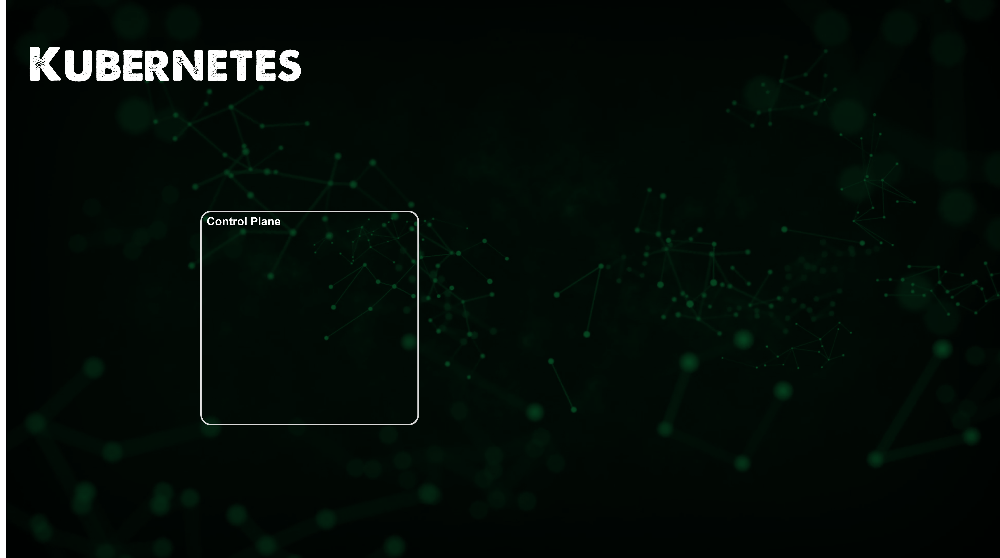
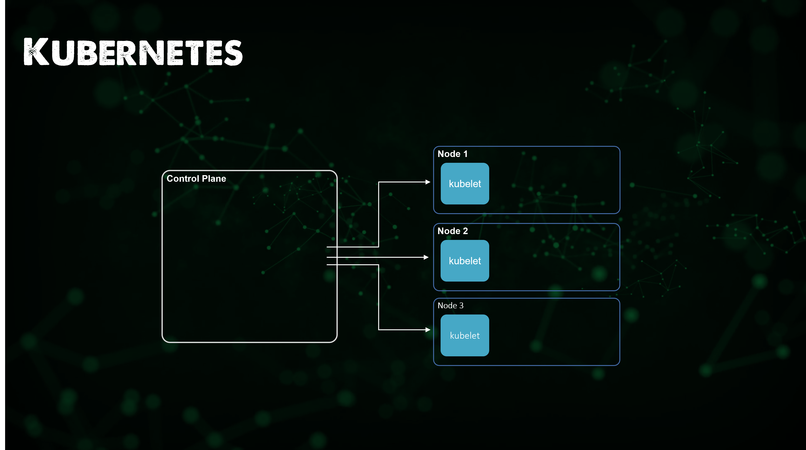
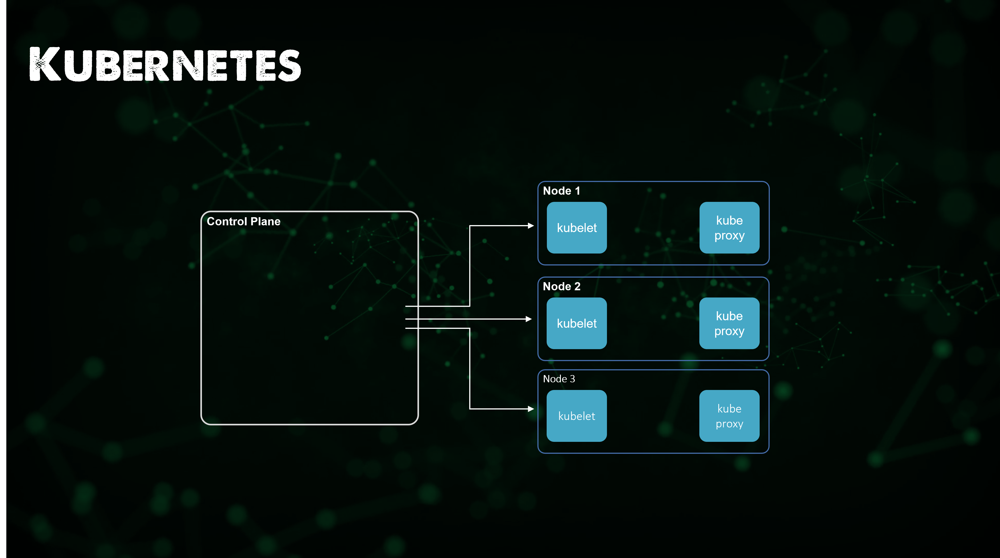
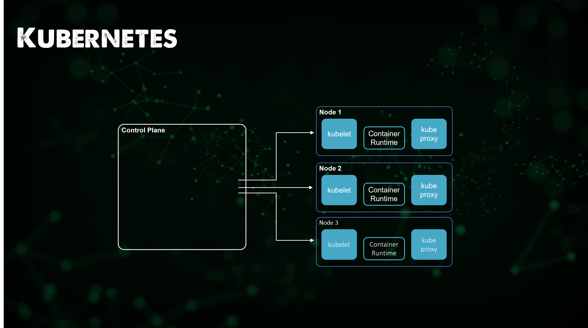

## The Big Picture: Kubernetes

In the last section we covered Containers, Containers fall short when it comes to scale and orchestration alone. The best we can do is use docker-compose to bring up multiple containers together. When it comes to Kubernetes which is a Container Orchestrator, this gives us the ability to scale up and down in an automated way or based on the load of your applications and services. 

As a platform Kubernetes offers the ability to orchestrate containers according to your requirements and desired state. We are going to cover Kubernetes in this section as it is growing rapidly as the next wave of infrastructure. I would also suggest that from a DevOps perspective Kubernetes is just one platform that you will need to have a basic understanding of, you will also need to understand bare metal, virtualisation and most likely cloud based services as well. Kubernetes is just another option to run our applications. 

### What is Container Orchestration?

I have mentioned Kubernetes and I have mentioned Container Orchestration, Kubernetes is the technology where as the container orchestration is the concept or the process behind the technology. Kubernetes is not the only Container Orchestration platform we also have Docker Swarm, HashiCorp Nomad and others. But Kubernetes is going from strength to strength so I want to cover Kubernetes but wanted to say that it is not the only one out there. 

### What is Kubernetes?

The first thing you should read if you are new to Kubernetes is the official documentation, My experience of really deep diving into Kubernetes a little over a year ago was that this is going to be a steep learning curve. Coming from a virtualisation and storage background I was thinking how daunting this felt. 

But actually the community, free learning resources and documentation is actually amazing. [Kubernetes.io](https://kubernetes.io/docs/concepts/overview/what-is-kubernetes/) 

*Kubernetes is a portable, extensible, open-source platform for managing containerized workloads and services, that facilitates both declarative configuration and automation. It has a large, rapidly growing ecosystem. Kubernetes services, support, and tools are widely available.*

Important things to note from the above qoute, Kubernetes is Open-Source with a rich history that goes back to Google who donated the project to the Cloud Native computing foundation (CNCF) and it has now been progressed by the open-source community as well as large enterprise vendors contributing to make Kubernetes what it is today. 

I mentioned above that containers are great and in the previous section we spoke about how containers and container images have changed and accelerated the adoption of cloud-native systems. But containers alone are not going to give you the production ready experience you need from your application. Kubernetes gives us the following: 

- Service discovery and load balancing Kubernetes can expose a container using the DNS name or using their own IP address. If traffic to a container is high, Kubernetes is able to load balance and distribute the network traffic so that the deployment is stable.

- Storage orchestration Kubernetes allows you to automatically mount a storage system of your choice, such as local storages, public cloud providers, and more.

- Automated rollouts and rollbacks You can describe the desired state for your deployed containers using Kubernetes, and it can change the actual state to the desired state at a controlled rate. For example, you can automate Kubernetes to create new containers for your deployment, remove existing containers and adopt all their resources to the new container.

- Automatic bin packing You provide Kubernetes with a cluster of nodes that it can use to run containerized tasks. You tell Kubernetes how much CPU and memory (RAM) each container needs. Kubernetes can fit containers onto your nodes to make the best use of your resources.

- Self-healing Kubernetes restarts containers that fail, replaces containers, kills containers that don't respond to your user-defined health check, and doesn't advertise them to clients until they are ready to serve.

- Secret and configuration management Kubernetes lets you store and manage sensitive information, such as passwords, OAuth tokens, and SSH keys. You can deploy and update secrets and application configuration without rebuilding your container images, and without exposing secrets in your stack configuration. 

Kubernetes provides you with a framework to run distributed systems resiliently.

Container Orchestration manages the deployment, placement, and lifecycle of containers.​

It also has many other responsibilities: ​

- Cluster management federates hosts into one target.​

- Schedule management distributes containers across nodes through the scheduler.
    ​
- Service discovery knows where containers are located and distributes client requests across them.​

- Replication ensures that the right number of nodes and containers are available for the requested workload.​

- Health management detects and replaces unhealthy​ containers and nodes.

### Main Kubernetes Components 

Kubernetes is a container orchestrator to provision, manage, and scale apps. You can use it to manage the lifecycle of containerized apps in a cluster of nodes, which is a collection of worker machines such as VMs or physical machines.​

Your apps might need many other resources to run, such as volumes, networks, and secrets that can help you connect to databases, talk to firewalled back ends, and secure keys. With Kubernetes, you can add those resources into your app. Infrastructure resources that your apps need are managed declaratively.​

The key paradigm of Kubernetes is its declarative model. You provide the state that you want and Kubernetes makes it happen. If you need five instances, you don't start five separate instances on your own. Instead, you tell Kubernetes that you need five instances, and Kubernetes automatically reconciles the state. If something goes wrong with one of your instances and it fails, Kubernetes still knows the state that you want and creates instances on an available node.​

### Node

**Control Plane**

Every Kubernetes cluster requires a Control Plane node, the control plane's components make global decisions about the cluster (for example, scheduling), as well as detecting and responding to cluster events. 

**Worker Node**
 A worker machine that runs Kubernetes workloads. It can be a physical (bare metal) machine or a virtual machine (VM). Each node can host one or more pods. Kubernetes nodes are managed by a control plane

There are other node types but I won't be covering them here. 

**kubelet**​

An agent that runs on each node in the cluster. It makes sure that containers are running in a Pod.​

The kubelet takes a set of PodSpecs that are provided through various mechanisms and ensures that the containers described in those PodSpecs are running and healthy. The kubelet doesn't manage containers which were not created by Kubernetes.​

**kube-proxy​**

kube-proxy is a network proxy that runs on each node in your cluster, implementing part of the Kubernetes Service concept.​

kube-proxy maintains network rules on nodes. These network rules allow network communication to your Pods from network sessions inside or outside of your cluster.​

kube-proxy uses the operating system packet filtering layer if there is one and it's available. Otherwise, kube-proxy forwards the traffic itself.​

**Container runtime**​

The container runtime is the software that is responsible for running containers.​

Kubernetes supports several container runtimes: Docker, containerd, CRI-O, and any implementation of the Kubernetes CRI (Container Runtime Interface).​

​
### Cluster

A cluster is a group of nodes, where a node can be a physical machine or virtual machines. Each of the nodes will have the container runtime (Docker) and will also be running a kubelet service, which is an agent that takes in the commands from the Master controller (more on that later) and a Proxy, that is used to proxy connections to the Pods from another component (Services, that we will see later).​

On our control plane which can be made highly available will contain some unique roles compared to the worker nodes, the most important will be the kube API server, this is where any communication will take place in order to get information or push information to our Kubernetes cluster. 

**Kube API-Server**

The Kubernetes API server validates and configures data for the api objects which include pods, services, replicationcontrollers, and others. The API Server services REST operations and provides the frontend to the cluster's shared state through which all other components interact.

**Scheduler**

The Kubernetes scheduler is a control plane process which assigns Pods to Nodes. The scheduler determines which Nodes are valid placements for each Pod in the scheduling queue according to constraints and available resources. The scheduler then ranks each valid Node and binds the Pod to a suitable Node.

**Controller Manager**

The Kubernetes controller manager is a daemon that embeds the core control loops shipped with Kubernetes. In applications of robotics and automation, a control loop is a non-terminating loop that regulates the state of the system. In Kubernetes, a controller is a control loop that watches the shared state of the cluster through the apiserver and makes changes attempting to move the current state towards the desired state.

**etcd**

Consistent and highly-available key value store used as Kubernetes' backing store for all cluster data.

**kubectl**

In order to manage this from a CLI point of view we have kubectl, kubectl interacts with the API server. 

The Kubernetes command-line tool, kubectl, allows you to run commands against Kubernetes clusters. You can use kubectl to deploy applications, inspect and manage cluster resources, and view logs.

### Pods

A Pod is a group of containers that form a logical application. For e.g. If you have a web application that is running a NodeJS container and also a MySQL container, then both these containers will be located in a single Pod. A Pod can also share common data volumes and they also share the same networking namespace. Remember that Pods are ephemeral and they could be brought up and down by the Master Controller. Kubernetes uses a simple but effective means to identify the Pods via the concepts of Labels (name – values).​

​- Pods handle Volumes, Secrets, and configuration for containers.​

- Pods are ephemeral. They are intended to be restarted automatically when they die.​

- Pods are replicated when the app is scaled horizontally by the ReplicationSet. Each Pod will run the same container code.​

- Pods live on Worker Nodes.​

​
### Deployments

- You can just decide to run Pods but when they die they die. ​

- A Deployment will enable your pod to run continuously. ​

- Deployments allow you to update a running app without downtime. ​

- Deployments also specify a strategy to restart Pods when they die

### ReplicaSets

- The Deployment can also create​ the ReplicaSet ​

- A ReplicaSet ensures your app has the desired number of Pods​

- ReplicaSets will create and scale Pods based on the Deployment ​

- Deployments, ReplicaSets, Pods are not exclusive but can be

### StatefulSets

- Does your App require you to keep information about its state? ​

- A database needs state​

- A StatefulSet’s Pods are not interchangeable.​

- Each Pod has a unique, persistent identifier that the controller maintains over any rescheduling.​

- Each Pod has a unique, persistent identifier that the controller maintains over any rescheduling.​

### DaemonSets

- DaemonSets are for continuous process ​

- They run one Pod per Node. ​

- Each new node added to the cluster gets a pod started​​

- Useful for background tasks such as monitoring and log collection ​

​- Each Pod has a unique, persistent identifier that the controller maintains over any rescheduling.

### Services 

- A single endpoint to access Pods ​

- a unified way to route traffic to a cluster and eventually to a list of Pods. ​

- By using a Service, Pods can be brought up and down without affecting anything..

This is just a quick overview and notes around the fundamental building blocks of Kubernetes, we can take this knowledge and add in some other areas around Storage and Ingress to enhance our applications but we then also have a lot of choices on where our Kubernetes cluster runs. The next session will focus on those options on where can I run a Kubernetes cluster, whilst also exploring some specifics around Storage.

### What we will cover in the series on Kubernetes 

- Kubernetes Architecture 
- Kubectl Commands 
- Kubernetes YAML 
- Kubernetes Ingress 
- Kubernetes Services
- Helm Package Manager 
- Persistant Storage 
- Stateful Apps 

## Resources 

- [Kubernetes Documentation](https://kubernetes.io/docs/home/)
- [TechWorld with Nana - Kubernetes Tutorial for Beginners [FULL COURSE in 4 Hours]](https://www.youtube.com/watch?v=X48VuDVv0do)
- [TechWorld with Nana - Kubernetes Crash Course for Absolute Beginners](https://www.youtube.com/watch?v=s_o8dwzRlu4)
- [Kunal Kushwaha - Kubernetes Tutorial for Beginners | What is Kubernetes? Architecture Simplified!](https://www.youtube.com/watch?v=KVBON1lA9N8)

See you on [Day 50](day50.md) 
