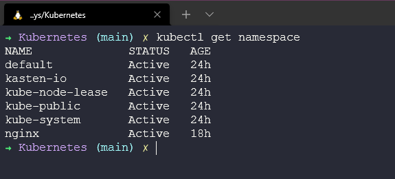
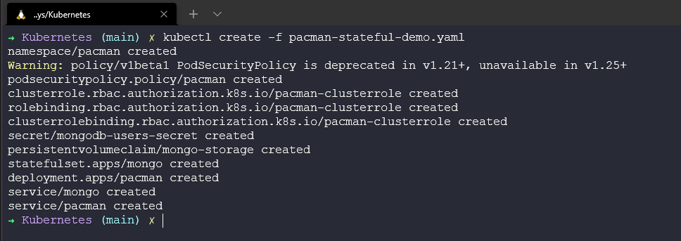
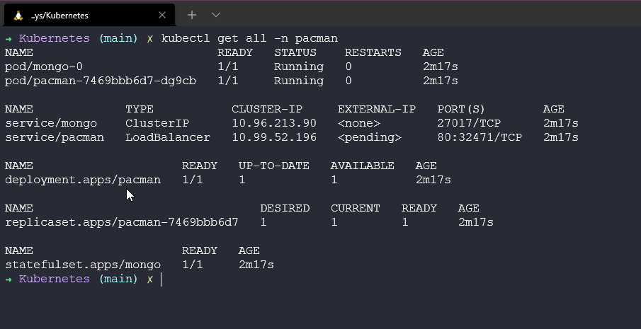

## State and Ingress in Kubernetes

In this closing section of Kubernetes, we are going to take a look at State and ingress.

Everything we have said so far is about stateless, stateless is really where our applications do not care which network it is using and does not need any permanent storage. Whereas stateful apps and databases for example for such an application to function correctly, you’ll need to ensure that pods can reach each other through a unique identity that does not change (hostnames, IPs...etc.). Examples of stateful applications include MySQL clusters, Redis, Kafka, MongoDB and others. Basically, through any application that stores data.

### Stateful Application

StatefulSets represent a set of Pods with unique, persistent identities and stable hostnames that Kubernetes maintains regardless of where they are scheduled. The state information and other resilient data for any given StatefulSet Pod are maintained in persistent disk storage associated with the StatefulSet.

### Deployment vs StatefulSet

- Replicating stateful applications is more difficult.
- Replicating our pods in a deployment (Stateless Application) is identical and interchangeable.
- Create pods in random order with random hashes
- One Service that load balances to any Pod.

When it comes to StatefulSets or Stateful Applications the above is more difficult.

- Cannot be created or deleted at the same time.
- Can't be randomly addressed.
- replica Pods are not identical

Something you will see in our demonstration shortly is that each pod has its own identity. With a stateless Application, you will see random names. For example `app-7469bbb6d7-9mhxd` whereas a Stateful Application would be more aligned to `mongo-0` and then when scaled it will create a new pod called `mongo-1`.

These pods are created from the same specification, but they are not interchangeable. Each StatefulSet pod has a persistent identifier across any rescheduling. This is necessary because when we require stateful workloads such as a database where we require writing and reading to a database, we cannot have two pods writing at the same time with no awareness as this will give us data inconsistency. We need to ensure that only one of our pods is writing to the database at any given time however we can have multiple pods reading that data.

Each pod in a StatefulSet would have access to its persistent volume and replica copy of the database to read from, this is continuously updated from the master. It's also interesting to note that each pod will also store its pod state in this persistent volume, if then `mongo-0` dies then when a new one is provisioned it will take over the pod state stored in storage.

TLDR; StatefulSets vs Deployments

- Predictable pod name = `mongo-0`
- Fixed individual DNS name
- Pod Identity - Retain State, Retain Role
- Replicating stateful apps is complex
  - There are lots of things you must do:
    - Configure cloning and data synchronisation.
    - Make remote shared storage available.
    - Management & backup

### Persistant Volumes | Claims | StorageClass

How to persist data in Kubernetes?

We mentioned above when we have a stateful application, we have to store the state somewhere and this is where the need for a volume comes in, out of the box Kubernetes does not provide persistence out of the box.

We require a storage layer that does not depend on the pod lifecycle. This storage should be available and accessible from all of our Kubernetes nodes. The storage should also be outside of the Kubernetes cluster to be able to survive even if the Kubernetes cluster crashes.

### Persistent Volume

- A cluster resource (like CPU and RAM) to store data.
- Created via a YAML file
- Needs actual physical storage (NAS)
- External integration to your Kubernetes cluster
- You can have different types of storage available in your storage.
- PVs are not namespaced
- Local storage is available but it would be specific to one node in the cluster
- Database persistence should use remote storage (NAS)

### Persistent Volume Claim

A persistent volume alone above can be there and available but unless it is claimed by an application it is not being used.

- Created via a YAML file
- Persistent Volume Claim is used in pod configuration (volumes attribute)
- PVCs live in the same namespace as the pod
- Volume is mounted into the pod
- Pods can have multiple different volume types (ConfigMap, Secret, PVC)

Another way to think of PVs and PVCs is that

PVs are created by the Kubernetes Admin
PVCs are created by the user or application developer

We also have two other types of volumes that we will not get into detail on but are worth mentioning:

### ConfigMaps | Secrets

- Configuration file for your pod.
- Certificate file for your pod.

### StorageClass

- Created via a YAML file
- Provisions Persistent Volumes Dynamically when a PVC claims it
- Each storage backend has its provisioner
- Storage backend is defined in YAML (via provisioner attribute)
- Abstracts underlying storage provider
- Define parameters for that storage

### Walkthrough time

In the session yesterday we walked through creating a stateless application, here we want to do the same but we want to use our minikube cluster to deploy a stateful workload.

A recap on the minikube command we are using to have the capability and addons to use persistence is `minikube start --addons volumesnapshots,csi-hostpath-driver --apiserver-port=6443 --container-runtime=containerd -p mc-demo --Kubernetes-version=1.21.2`

This command uses the CSI-hostpath-driver which is what gives us our storageclass, something I will show later.

The build-out of the application looks like the below:

You can find the YAML configuration file for this application here [pacman-stateful-demo.yaml](Kubernetes)

### StorageClass Configuration

There is one more step though that we should run before we start deploying our application and that is to make sure that our storageclass (CSI-hostpath-sc) is our default one. We can firstly check this by running the `kubectl get storageclass` command but out of the box, the minikube cluster will be showing the standard storageclass as default so we have to change that with the following commands.

This first command will make our CSI-hostpath-sc storageclass our default.

`kubectl patch storageclass csi-hostpath-sc -p '{"metadata": {"annotations":{"storageclass.kubernetes.io/is-default-class":"true"}}}'`

This command will remove the default annotation from the standard StorageClass.

`kubectl patch storageclass standard -p '{"metadata": {"annotations":{"storageclass.kubernetes.io/is-default-class":"false"}}}'`

We start with no Pacman namespace in our cluster. `kubectl get namespace`

We will then deploy our YAML file. `kubectl create -f pacman-stateful-demo.yaml` you can see from this command we are creating several objects within our Kubernetes cluster.

We now have our newly created namespace.

You can then see from the next image and command `kubectl get all -n pacman` that we have several things happening inside of our namespace. We have our pods running our NodeJS web front end, we have mongo running our backend database. There are services for both Pacman and mongo to access those pods. We have a deployment for Pacman and a statefulset for mongo.

We also have our persistent volume and persistent volume claim by running `kubectl get pv` will give us our non-namespaced persistent volumes and running `kubectl get pvc -n pacman` will give us our namespaced persistent volume claims.

### Playing the game | I mean accessing our mission-critical application

Because we are using Minikube as mentioned in the stateless application we have a few hurdles to get over when it comes to accessing our application, however, we had access to ingress or a load balancer within our cluster the service is set up to automatically get an IP from that to gain access externally. (you can see this above in the image of all components in the Pacman namespace).

For this demo, we are going to use the port forward method to access our application. By opening a new terminal and running the following `kubectl port-forward svc/pacman 9090:80 -n pacman` command, opening a browser we will now have access to our application. If you are running this in AWS or specific locations then this will also report on the cloud and zone as well as the host which equals your pod within Kubernetes, again you can look back and see this pod name in our screenshots above.

Now we can go and create a high score which will then be stored in our database.

Ok, great we have a high score but what happens if we go and delete our `mongo-0` pod? by running `kubectl delete pod mongo-0 -n pacman` I can delete that and if you are still in the app you will see that high score not available at least for a few seconds.

Now if I go back to my game I can create a new game and see my high scores. The only way you can truly believe me on this though is if you give it a try and share on social media your high scores!

With the deployment, we can scale this up using the commands that we covered in the previous session but in particular here, especially if you want to host a huge Pacman party then you can scale this up using `kubectl scale deployment pacman --replicas=10 -n pacman`

### Ingress explained

Before we wrap things up with Kubernetes I also wanted to touch on a huge aspect of Kubernetes and that is ingress.

### What is ingress?

So far with our examples, we have used port-forward or we have used specific commands within minikube to gain access to our applications but this in production is not going to work. We are going to want a better way of accessing our applications at scale with multiple users.

We also spoke about NodePort being an option but again this should be only for test purposes.

Ingress gives us a better way of exposing our applications, this allows us to define routing rules within our Kubernetes cluster.

For ingress, we would create a forward request to the internal service of our application.

### When do you need ingress?

If you are using a cloud provider, a managed Kubernetes offering they most likely will have their ingress option for your cluster or they provide you with their load balancer option. You don't have to implement this yourself, one of the benefits of managed Kubernetes.

If you are running your cluster then you will need to configure an entrypoint.

### Configure Ingress on Minikube

On my particular running cluster called mc-demo, I can run the following command to get ingress enabled on my cluster.

`minikube --profile='mc-demo' addons enable ingress`

If we check our namespaces now you will see that we have a new ingress-nginx namespace. `kubectl get ns`

Now we must create our ingress YAML configuration to hit our Pacman service I have added this file to the repository [pacman-ingress.yaml](Kubernetes)

We can then create this in our ingress namespace with `kubectl create -f Pacman-ingress.yaml`

Then if we run `kubectl get ingress -n Pacman

I am then told because we are using minikube running on WSL2 in Windows we have to create the minikube tunnel using `minikube tunnel --profile=mc-demo`

But I am still not able to gain access to 192.168.49.2 and play my Pacman game.

If anyone has or can get this working on Windows and WSL I would appreciate the feedback. I will raise an issue on the repository for this and come back to it once I have time and a fix.

UPDATE: I feel like this blog helps identify maybe the cause of this not working with WSL [Configuring Ingress to run Minikube on WSL2 using Docker runtime](https://hellokube.dev/posts/configure-minikube-ingress-on-wsl2/)

## Resources

If you have FREE resources that you have used then please feel free to add them here via a PR to the repository and I will be happy to include them.

- [Kubernetes StatefulSet simply explained](https://www.youtube.com/watch?v=pPQKAR1pA9U)
- [Kubernetes Volumes explained](https://www.youtube.com/watch?v=0swOh5C3OVM)
- [Kubernetes Ingress Tutorial for Beginners](https://www.youtube.com/watch?v=80Ew_fsV4rM)
- [Kubernetes Documentation](https://kubernetes.io/docs/home/)
- [TechWorld with Nana - Kubernetes Tutorial for Beginners [FULL COURSE in 4 Hours]](https://www.youtube.com/watch?v=X48VuDVv0do)
- [TechWorld with Nana - Kubernetes Crash Course for Absolute Beginners](https://www.youtube.com/watch?v=s_o8dwzRlu4)
- [Kunal Kushwaha - Kubernetes Tutorial for Beginners | What is Kubernetes? Architecture Simplified!](https://www.youtube.com/watch?v=KVBON1lA9N8)

This wraps up our Kubernetes section, there is so much additional content we could cover on Kubernetes and 7 days gives us foundational knowledge but people are running through [100DaysOfKubernetes](https://100daysofkubernetes.io/overview.html) where you can get really into the weeds.

Next up we are going to be taking a look at Infrastructure as Code and the important role it plays from a DevOps perspective.

See you on [Day 56](day56.md)
