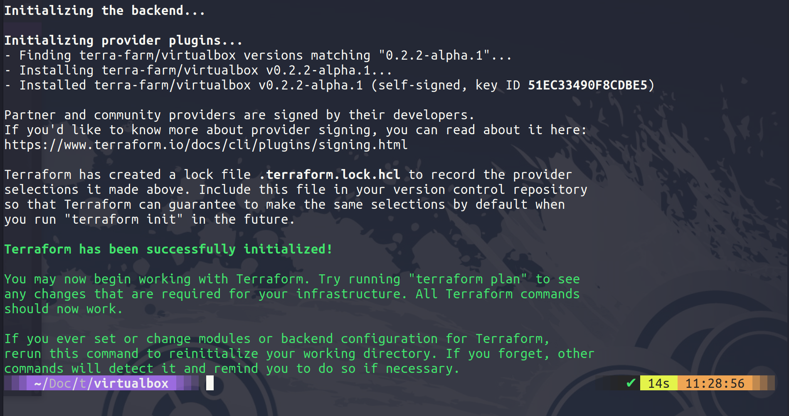

## Create a VM with Terraform & Variables

In this session we are going to be creating a VM or two VMs using terraform inside VirtualBox. This is not the normal, VirtualBox is a workstation virtualisation option and really this would not be a use case for Terraform but I am currently 36,000ft in the air and as much as I have deployed public cloud resources this high in the clouds it is much faster to do this locally on my laptop. 

Purely demo purpose but the concept is the same we are going to have our desired state configuration code and then we are going to run that against the virtualbox provider. In the past we have used vagrant here and I covered off the differences between vagrant and terraform at the beginning of the section. 

### Create virtual machine in VirtualBox 

The first thing we are going to do is create a new folder called virtualbox, we can then create a virtualbox.tf file and this is going to be where we define our resources. 


<code>

Now that we have our code defined we can now perform the `terraform init` on our folder to download the provider for virtualbox. 




Obviously you will also need to have virtualbox installed on your system as well. We can then next run `terraform plan` to see what our code will create for us. Followed by `terraform apply` 


### Change configuration so that it then becomes a web server 


### Add additional virtual machine to change our desired state 


### Variables & Outputs 

We did mention outputs when we ran our hello-world example in the last session. But we can get into more detail here. 

But there are many other variables that we can use here as well, there are also a few different ways in which we can define variables. 

- We can manually enter our variables with the `terraform plan` or `terraform apply` command

- We can define them in the .tf file within the block 

- We can use environment variables within our system using `TF_VAR_NAME` as the format. 

- My preference is to use a terraform.tfvars file in our project folder. 

- There is an *auto.tfvars file option 

- or we can define when we run the `terraform plan` or `terraform apply` with the `-var` or `-var-file`. 

Starting from the bottom moving up would be the order in which the variables are defined. 

We have also mentioned that the state file will contain sensitive information. We can define our sensitive information as a variable and we can define this as being sensitive. 

```
variable "some resource"  {
    description = "something important"
    type: string
    sensitive = true

}
```


Variables and Outputs
Additional Language Features
Project Organization + Modules
Managing Multiple Environments
Testing Terraform Code
Developer Workflows and Automation


## Resources 
I have listed a lot of resources down below and I think this topic has been covered so many times out there, If you have additional resources be sure to raise a PR with your resources and I will be happy to review and add them to the list. 

- [What is Infrastructure as Code? Difference of Infrastructure as Code Tools ](https://www.youtube.com/watch?v=POPP2WTJ8es)
- [Terraform Tutorial | Terraform Course Overview 2021](https://www.youtube.com/watch?v=m3cKkYXl-8o)
- [Terraform explained in 15 mins | Terraform Tutorial for Beginners ](https://www.youtube.com/watch?v=l5k1ai_GBDE)
- [Terraform Course - From BEGINNER to PRO!](https://www.youtube.com/watch?v=7xngnjfIlK4&list=WL&index=141&t=16s)
- [HashiCorp Terraform Associate Certification Course](https://www.youtube.com/watch?v=V4waklkBC38&list=WL&index=55&t=111s)
- [Terraform Full Course for Beginners](https://www.youtube.com/watch?v=EJ3N-hhiWv0&list=WL&index=39&t=27s)
- [KodeKloud -  Terraform for DevOps Beginners + Labs: Complete Step by Step Guide!](https://www.youtube.com/watch?v=YcJ9IeukJL8&list=WL&index=16&t=11s)
- [Terraform Simple Projects](https://terraform.joshuajebaraj.com/)
- [Terraform Tutorial - The Best Project Ideas](https://www.youtube.com/watch?v=oA-pPa0vfks)
- [Awesome Terraform](https://github.com/shuaibiyy/awesome-terraform)

See you on [Day 57](day57.md)