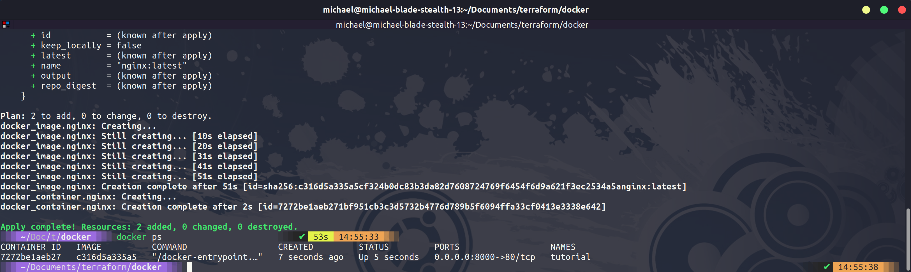

## Docker Containers, Provisioners & Modules

On [Day 59](day59.md) we provisioned a virtual machine using Terraform to our local FREE VirtualBox environment. In this section, we are going to deploy a Docker container with some configuration to our local Docker environment.

### Docker Demo

First up we are going to use the code block below, the outcome of the below is that we would like a simple web app to be deployed into docker and to publish this so that it is available to our network. We will be using nginx and we will make this available externally on our laptop over localhost and port 8000. We are using a docker provider from the community and you can see the docker image we are using also stated in our configuration.

```
terraform {
  required_providers {
    docker = {
      source  = "kreuzwerker/docker"
      version = "2.16.0"
    }
  }
}

provider "docker" {}

resource "docker_image" "nginx" {
  name         = "nginx:latest"
  keep_locally = false
}

resource "docker_container" "nginx" {
  image = docker_image.nginx.latest
  name  = "tutorial"
  ports {
    internal = 80
    external = 8000
  }
}
```

The first task is to use `terraform init` command to download the provider to our local machine.


We then run our `terraform apply` followed by `docker ps` and you can see we have a running container.



If we then open a browser we can navigate to `http://localhost:8000/` and you will see we have access to our NGINX container.


You can find out more information on the [Docker Provider](https://registry.terraform.io/providers/kreuzwerker/docker/latest/docs/resources/container)

The above is a very simple demo of what can be done with Terraform plus Docker and how we can now manage this under the Terraform state. We covered docker-compose in the containers section and there is a little crossover in a way between this, infrastructure as code as well as then Kubernetes.

To show this and how Terraform can handle a little more complexity, we are going to take the docker-compose file for WordPress and MySQL that we created with docker-compose and we will put this to Terraform. You can find the [docker-wordpress.tf](/Days/IaC/Docker-WordPress/docker-WordPress.tf)

```
terraform {
  required_providers {
    docker = {
      source  = "kreuzwerker/docker"
      version = "2.16.0"
    }
  }
}

provider "docker" {}

variable wordpress_port {
  default = "8080"
}

resource "docker_volume" "db_data" {
  name = "db_data"
}

resource "docker_network" "wordpress_net" {
  name = "wordpress_net"
}

resource "docker_container" "db" {
  name  = "db"
  image = "mysql:5.7"
  restart = "always"
  network_mode = "wordpress_net"
  env = [
     "MYSQL_ROOT_PASSWORD=wordpress",
     "MYSQL_PASSWORD=wordpress",
     "MYSQL_USER=wordpress",
     "MYSQL_DATABASE=wordpress"
  ]
  mounts {
    type = "volume"
    target = "/var/lib/mysql"
    source = "db_data"
    }
}

resource "docker_container" "wordpress" {
  name  = "wordpress"
  image = "wordpress:latest"
  restart = "always"
  network_mode = "wordpress_net"
  env = [
    "WORDPRESS_DB_HOST=db:3306",
    "WORDPRESS_DB_USER=wordpress",
    "WORDPRESS_DB_NAME=wordpress",
    "WORDPRESS_DB_PASSWORD=wordpress"
  ]
  ports {
    internal = "80"
    external = "${var.wordpress_port}"
  }
}
```

We again put this in a new folder and then run our `terraform init` command to pull down our provisioners required.


We then run our `terraform apply` command and then take a look at our docker ps output we should see our newly created containers.


We can then also navigate to our WordPress front end. Much like when we went through this process with docker-compose in the containers section we can now run through the setup and our WordPress posts would be living in our MySQL database.


Now we have covered containers and Kubernetes in some detail, we probably know that this is ok for testing but if you were going to be running a website you would not do this with containers alone and you would look at using Kubernetes to achieve this, Next up we are going to take a look using Terraform with Kubernetes.

### Provisioners

Provisioners are there so that if something cannot be declarative we have a way in which to parse this to our deployment.

If you have no other alternative and adding this complexity to your code is the place to go then you can do this by running something similar to the following block of code.

```
resource "docker_container" "db" {
  # ...

  provisioner "local-exec" {
    command = "echo The server's IP address is ${self.private_ip}"
  }
}

```

The remote-exec provisioner invokes a script on a remote resource after it is created. This could be used for something OS-specific or it could be used to wrap in a configuration management tool. Although notice that we have some of these covered in their provisioners.

[More details on provisioners](https://www.terraform.io/language/resources/provisioners/syntax)

- file
- local-exec
- remote-exec
- vendor
  - ansible
  - chef
  - puppet

### Modules

Modules are containers for multiple resources that are used together. A module consists of a collection of .tf files in the same directory.

Modules are a good way to separate your infrastructure resources as well as be able to pull in third-party modules that have already been created so you do not have to reinvent the wheel.

For example, if we wanted to use the same project to build out some VMs, VPCs, Security Groups and then also a Kubernetes cluster we would likely want to split our resources out into modules to better define our resources and where they are grouped.

Another benefit to modules is that you can take these modules and use them on other projects or share them publicly to help the community.

We are breaking down our infrastructure into components, components are known here as modules.

## Resources

I have listed a lot of resources down below and I think this topic has been covered so many times out there, If you have additional resources be sure to raise a PR with your resources and I will be happy to review and add them to the list.

- [What is Infrastructure as Code? Difference of Infrastructure as Code Tools](https://www.youtube.com/watch?v=POPP2WTJ8es)
- [Terraform Tutorial | Terraform Course Overview 2021](https://www.youtube.com/watch?v=m3cKkYXl-8o)
- [Terraform explained in 15 mins | Terraform Tutorial for Beginners](https://www.youtube.com/watch?v=l5k1ai_GBDE)
- [Terraform Course - From BEGINNER to PRO!](https://www.youtube.com/watch?v=7xngnjfIlK4&list=WL&index=141&t=16s)
- [HashiCorp Terraform Associate Certification Course](https://www.youtube.com/watch?v=V4waklkBC38&list=WL&index=55&t=111s)
- [Terraform Full Course for Beginners](https://www.youtube.com/watch?v=EJ3N-hhiWv0&list=WL&index=39&t=27s)
- [KodeKloud - Terraform for DevOps Beginners + Labs: Complete Step by Step Guide!](https://www.youtube.com/watch?v=YcJ9IeukJL8&list=WL&index=16&t=11s)
- [Terraform Simple Projects](https://terraform.joshuajebaraj.com/)
- [Terraform Tutorial - The Best Project Ideas](https://www.youtube.com/watch?v=oA-pPa0vfks)
- [Awesome Terraform](https://github.com/shuaibiyy/awesome-terraform)

See you on [Day 61](day61.md)
