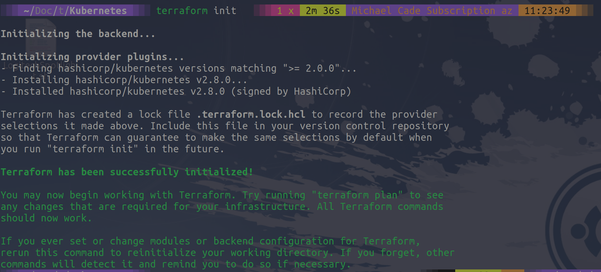

## Kubernetes & Multiple Environments 

Kubernetes Demo

`terraform init`

### Multiple Environments 

If we wanted to take any of the demos we have ran through but wanted to now have specific production, staging and development environments looking exactly the same and leveraging this code there are two approaches to achieve this with Terraform 

- `terraform workspaces` - multiple named sections within a single backend 

- file structure - Directory layout provides separation, modules provide reuse. 

Each of the above do have their pros and cons though. 

### terraform workspaces 

Pros 
- 

Cons 

## Resources 
I have listed a lot of resources down below and I think this topic has been covered so many times out there, If you have additional resources be sure to raise a PR with your resources and I will be happy to review and add them to the list. 

- [What is Infrastructure as Code? Difference of Infrastructure as Code Tools ](https://www.youtube.com/watch?v=POPP2WTJ8es)
- [Terraform Tutorial | Terraform Course Overview 2021](https://www.youtube.com/watch?v=m3cKkYXl-8o)
- [Terraform explained in 15 mins | Terraform Tutorial for Beginners ](https://www.youtube.com/watch?v=l5k1ai_GBDE)
- [Terraform Course - From BEGINNER to PRO!](https://www.youtube.com/watch?v=7xngnjfIlK4&list=WL&index=141&t=16s)
- [HashiCorp Terraform Associate Certification Course](https://www.youtube.com/watch?v=V4waklkBC38&list=WL&index=55&t=111s)
- [Terraform Full Course for Beginners](https://www.youtube.com/watch?v=EJ3N-hhiWv0&list=WL&index=39&t=27s)
- [KodeKloud -  Terraform for DevOps Beginners + Labs: Complete Step by Step Guide!](https://www.youtube.com/watch?v=YcJ9IeukJL8&list=WL&index=16&t=11s)
- [Terraform Simple Projects](https://terraform.joshuajebaraj.com/)
- [Terraform Tutorial - The Best Project Ideas](https://www.youtube.com/watch?v=oA-pPa0vfks)
- [Awesome Terraform](https://github.com/shuaibiyy/awesome-terraform)

See you on [Day 57](day57.md)