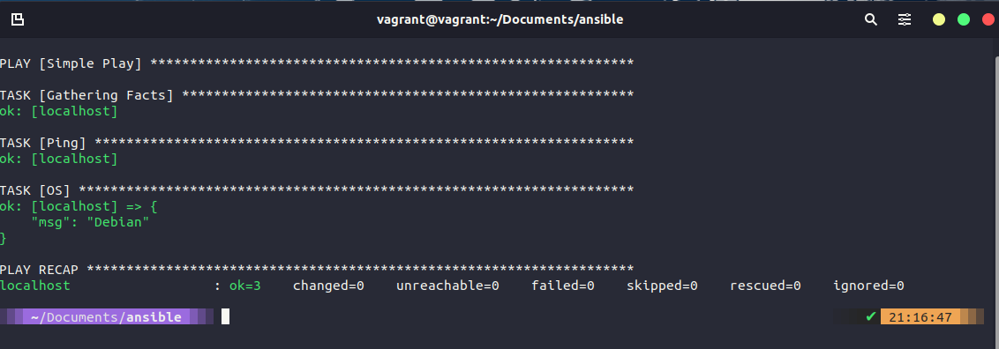

### Ansible Playbooks 

In this section we will take a look at the main reason that I can see at least for Ansible, I mean it is great to take a single command and hit many different servers to perform simple commands such as rebooting a long list of servers and saving the hassle of having to connect to each one individually.

But what about actually taking a bare operating system and declaring the software and services we want running on that system and making sure they are all running in that desired state.

This is where ansible playbooks come in. A playbook enables us to take our group of servers and perform configuration and installation tasks against that group.

### Playbook format

Playbook > Plays > Tasks

For anyone that comes from a sports background you may have come across the term playbook, a playbook then tells the team how you will play made up of various plays and tasks, if we think of the plays as the set pieces within the sport or game, and the tasks are associated to each play, you can have multiple tasks to make up a play and in the playbook you may have multiple different plays.

These playbooks are written in YAML (YAML ain’t markup language) you will find a lot of the sections we have covered so far especially Containers and Kubernetes to feature YAML formatted configuration files.

Let’s take a look at a simple playbook called playbook.yml.

```
- name: Simple Play
  hosts: localhost
  connection: local
  tasks:
    - name: Ping me
      ping:
    - name: print os
      debug:
        msg: "{{ ansible_os_family }}"
```

You will find the above file [simple_play](days/../Configmgmt/simple_play.yml). If we then use the `ansible-playbook simple_play.yml` command we will walk through the following steps. 



You can see the first task of "gathering steps" happened, but we didn't trigger or ask for this? This module is automatically called by playbooks to gather useful variables about remote hosts. [ansible.builtin.setup](https://docs.ansible.com/ansible/latest/collections/ansible/builtin/setup_module.html)

Our second task was to set a ping, this is not an ICMP ping but a python script to report back `pong` on successful connectivity to remote or localhost. [ansible.builtin.ping](https://docs.ansible.com/ansible/latest/collections/ansible/builtin/ping_module.html) 

Then our third or really our second defined task as the first one will run unless you disable was the printing of a message telling us our OS. In this task we are using conditionals, we could run this playbook against all different types of operating systems and this would return the OS name. We are simply messaging this output for ease but we could add a task to say something like: 

``` 
tasks: 
  - name: "shut down Debian flavoured systems"
    command: /sbin/shutdown -t now 
    when: ansible_os_family == "Debian"
``` 

### Vagrant to setup our environment

We are going to use Vagrant to set up our node environment, I am going to keep this at a reasonable number 4 nodes but you can hopefully see that this could easily be 300 or 3000 and this is the power of Ansible and other configuration management tools to be able to configure your servers.

You can find this file located here ([Vagrantfile](/Days/Configmgmt/Vagrantfile))

```
Vagrant.configure("2") do |config|
  servers=[
    {
      :hostname => "db01",
      :box => "bento/ubuntu-21.10",
      :ip => "10.0.2.16",
      :ssh_port => '2210'
    },
    {
      :hostname => "web01",
      :box => "bento/ubuntu-21.10",
      :ip => "10.0.2.17",
      :ssh_port => '2211'
    },
    {
      :hostname => "web02",
      :box => "bento/ubuntu-21.10",
      :ip => "10.0.2.18",
      :ssh_port => '2212'
    },
    {
      :hostname => "loadbalancer",
      :box => "bento/ubuntu-21.10",
      :ip => "10.0.2.19",
      :ssh_port => '2213'
    }

  ]

  servers.each do |machine|

    config.vm.define machine[:hostname] do |node|
      node.vm.box = machine[:box]
      node.vm.hostname = machine[:hostname]
    
      node.vm.network :private_network, ip: machine[:ip]
      node.vm.network "forwarded_port", guest: 22, host: machine[:ssh_port], id: "ssh"

      node.vm.provider :virtualbox do |v|
        v.customize ["modifyvm", :id, "--memory", 512]
        v.customize ["modifyvm", :id, "--name", machine[:hostname]]
      end
    end
  end

end
```

Use the `vagrant up` command to spin these machines up in VirtualBox, You might be able to add more memory and you might also want to define a different private_network address for each machine but this works in my environment. Remember our control box is the Ubuntu desktop we deployed during the Linux section. 

### Ansible host configuration

Now that we have our environment ready, we can check ansible and for this we will use our Ubuntu desktop as our control, let’s also add the new nodes to our group in the ansible hosts file, you can think of this file as an inventory, an alternative to this could be another inventory file that is called on as part of your ansible command with `-i filename` this could be useful vs using the ansible.cfg file as you can have different files for different environments, maybe production, test and staging. Because we are using the default hosts file we do not need to specify as this would be the default used.

Before moving on we want to make sure we can run a command against our nodes, let’s run `ansible nodes -m command -a hostname` this simple command will test that we have connectivity and report back our host names.

Also note that I have added these nodes and IPs to my Ubuntu control node within the /etc/hosts file to ensure connectivity. We might also need to do SSH configuration for each node from the Ubuntu box.

### Our First "real" Ansible Playbook
Our first Ansible playbook is going to configure our webservers, we have grouped these in our hosts file under the grouping.  

```
- hosts: webservers
  become: yes
  vars:
    http_port: 8000
    https_port: 4443
    html_welcome_msg: "Hello 90DaysOfDevOps"
  tasks:
  - name: ensure apache is at the latest version
    apt:
      name: apache2
      state: latest

  - name: write the apache2 ports.conf config file
    template:
      src: templates/ports.conf.j2
      dest: /etc/apache2/ports.conf
    notify:
    - restart apache

  - name: write a basic index.html file
    template:
      src: templates/index.html.j2
      dest: /var/www/html/index.html
    notify:
    - restart apache

  - name: ensure apache is running
    service:
      name: apache2
      state: started

  handlers:
    - name: restart apache
      service:
        name: apache2
        state: restarted
```
Breaking down the above playbook: 

- `- hosts: webservers` this is saying that our group to run this playbook on is a group called webservers
- `become: yes` means that our user running the playbook will become root on our remote systems. You will be prompted for the root password. 
- We then have `vars` and this defines some environment variables we want throughout our webservers. 

Following this we start our tasks, 

- Task 1 is to ensure that apache is running the latest version
- Task 2 is writing the ports.conf file from our source found in the templates folder. 
- Task 3 is creating a basic index.html file 
- Task 4 is making sure apache is running 

Finally we have a handlers section, [Handlers: Running operations on change](https://docs.ansible.com/ansible/latest/user_guide/playbooks_handlers.html)

"Sometimes you want a task to run only when a change is made on a machine. For example, you may want to restart a service if a task updates the configuration of that service, but not if the configuration is unchanged. Ansible uses handlers to address this use case. Handlers are tasks that only run when notified. Each handler should have a globally unique name."

At this stage you might be thinking but we have deployed 5 VMs (including our Ubuntu Desktop machine which is acting as our Ansible Control) The other systems will come into play during the rest of the section. 

### Run our Playbook

We are now ready to run our playbook against our nodes.

(The command to run our playbook - ‘ansible-playbook nodes playbook1.YAML’)

When the command is complete we get an output showing our plays and tasks

We can then double check this by jumping into a node and checking we have the installed software on our node.

We are going to build on this playbook as we move through the rest of this section. I am interested as well in taking our Ubuntu desktop and seeing if we could actually bootstrap our applications and configuration using Ansible so we might also touch this. You saw that we can use local host in our commands we can also run playbooks against our local host for example.

Another thing to add here is that we are only really working with Ubuntu VMs but Ansible is agnostic to the target systems. The alternatives that we have previously mentioned to manage your systems could be server by server (not scalable when you get over a large amount of servers, plus a pain even with 3 nodes) we can also use shell scripting which again we covered in the Linux section but these nodes are potentially different so yes it can be done but then someone needs to maintain and manage those scripts. Ansible is free and hits the easy button vs having to have a specialised script.