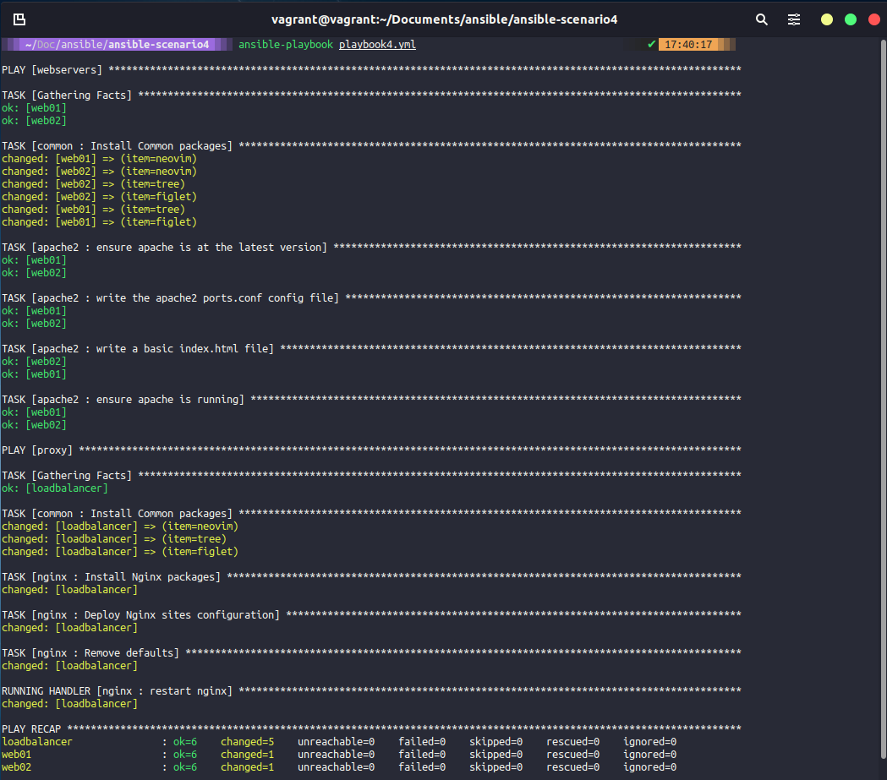
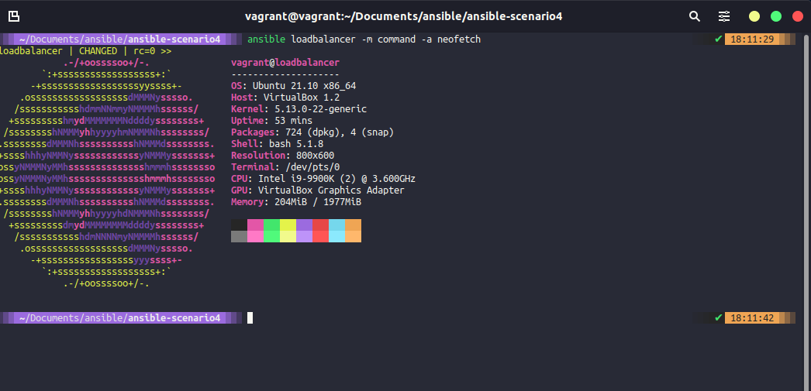

## Using Roles & Deploying a Loadbalancer

In the last session, we covered roles and used the `ansible-galaxy` command to help create our folder structures for some roles that we are going to use. We finished up with a much tidier working repository for our configuration code as everything is hidden away in our role folders.

However, we have only used the apache2 role and have a working playbook3.yaml to handle our webservers.

At this point if you have only used `vagrant up web01 web02` now is the time to run `vagrant up loadbalancer` this will bring up another Ubuntu system that we will use as our Load Balancer/Proxy.

We have already defined this new machine in our host's file, but we do not have the ssh key configured until it is available, so we need to also run `ssh-copy-id loadbalancer` when the system is up and ready.

### Common role

I created at the end of yesterday's session the role of `common`, common will be used across all of our servers whereas the other roles are specific to use cases, now the applications I am going to install are as common as spurious and I cannot see many reasons for this to be the case but it shows the objective. In our common role folder structure, navigate to the tasks folder and you will have a main.yml. In this YAML, we need to point this to our install_tools.yml file and we do this by adding a line `- import_tasks: install_tools.yml` this used to be `include` but this is going to be depreciated soon enough so we are using import_tasks.

```Yaml
- name: "Install Common packages"
  apt: name={{ item }} state=latest
  with_items:
   - neofetch
   - tree
   - figlet
```

In our playbook, we then add in the common role for each host block.

```Yaml
- hosts: webservers
  become: yes
  vars:
    http_port: 8000
    https_port: 4443
    html_welcome_msg: "Hello 90DaysOfDevOps - Welcome to Day 66!"
  roles:
    - common
    - apache2
```

### nginx

The next phase is for us to install and configure nginx on our loadbalancer VM. Like the common folder structure, we have the nginx based on the last session.

First of all, we are going to add a host block to our playbook. This block will include our common role and then our new nginx role.

The playbook can be found here. [playbook4.yml](Days/../Configmgmt/ansible-scenario4/playbook4.yml)

```Yaml
- hosts: webservers
  become: yes
  vars:
    http_port: 8000
    https_port: 4443
    html_welcome_msg: "Hello 90DaysOfDevOps - Welcome to Day 66!"
  roles:
    - common
    - apache2

- hosts: proxy
  become: yes
  roles:
    - common
    - nginx
```

For this to mean anything, we have to define the tasks that we wish to run, in the same way, we will modify the main.yml in tasks to point to two files this time, one for installation and one for configuration.

There are some other files that I have modified based on the outcome we desire, take a look in the folder [ansible-scenario4](Days/Configmgmt/ansible-scenario4) for all the files changed. You should check the folders tasks, handlers and templates in the nginx folder and you will find those additional changes and files.

### Run the updated playbook

Since yesterday we have added the common role which will now install some packages on our system and then we have also added our nginx role which includes installation and configuration.

Let's run our playbook4.yml using the `ansible-playbook playbook4.yml`



Now that we have our webservers and loadbalancer configured we should now be able to go to http://192.168.169.134/ which is the IP address of our loadbalancer.


If you are following along and you do not have this state then it could be down to the server IP addresses you have in your environment. The file can be found in `templates\mysite.j2` and looks similar to the below: You would need to update with your web server IP addresses.

```J2
    upstream webservers {
        server 192.168.169.131:8000;
        server 192.168.169.132:8000;
    }

    server {
        listen 80;

        location / {
                proxy_pass http://webservers;
        }
    }
```

I am pretty confident that what we have installed is all good but let's use an ad-hoc command using ansible to check these common tools installation.

`ansible loadbalancer -m command -a neofetch`



## Resources

- [What is Ansible](https://www.youtube.com/watch?v=1id6ERvfozo)
- [Ansible 101 - Episode 1 - Introduction to Ansible](https://www.youtube.com/watch?v=goclfp6a2IQ)
- [NetworkChuck - You need to learn Ansible right now!](https://www.youtube.com/watch?v=5hycyr-8EKs&t=955s)
- [Your complete guide to Ansible](https://www.youtube.com/playlist?list=PLnFWJCugpwfzTlIJ-JtuATD2MBBD7_m3u)

This final playlist listed above is where a lot of the code and ideas came from for this section, a great resource and walkthrough in video format.

See you on [Day 68](day68.md)
