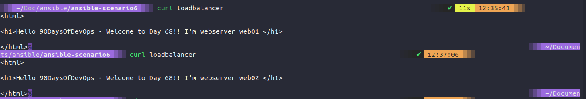
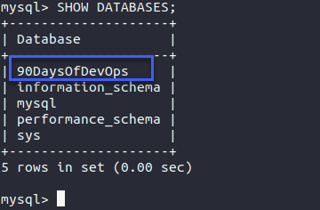

## Tags, Variables, Inventory & Database Server config

### Tags

As we left our playbook in the session yesterday we would need to run every task and play within that playbook. This means we would have to run the webservers and loadbalancer plays and tasks to completion.

However, tags can enable us to separate these if we want. This could be an efficient move if we have extra large and long playbooks in our environments.

In our playbook file, in this case, we are using [ansible-scenario5](Configmgmt/ansible-scenario5/playbook5.yml)

```Yaml
- hosts: webservers
  become: yes
  vars:
    http_port: 8000
    https_port: 4443
    html_welcome_msg: "Hello 90DaysOfDevOps - Welcome to Day 66!"
  roles:
    - common
    - apache2
  tags: web

- hosts: proxy
  become: yes
  roles:
    - common
    - nginx
  tags: proxy
```

We can then confirm this by using the `ansible-playbook playbook5.yml --list-tags` and the list tags are going to outline the tags we have defined in our playbook.


Now if we wanted to target just the proxy we could do this by running `ansible-playbook playbook5.yml --tags proxy` and this will as you can see below only run the playbook against the proxy.


tags can be added at the task level as well so we can get granular on where and what you want to happen. It could be application-focused tags, we could go through tasks for example and tag our tasks based on installation, configuration or removal. Another very useful tag you can use is

`tag: always` this will ensure no matter what --tags you are using in your command if something is tagged with the always value then it will always be running when you run the ansible-playbook command.

With tags, we can also bundle multiple tags together and if we choose to run `ansible-playbook playbook5.yml --tags proxy,web` this will run all of the items with those tags. Obviously, in our instance, that would mean the same as running the playbook but if we had multiple other plays then this would make sense.

You can also define more than one tag.

### Variables

There are two main types of variables within Ansible.

- User created
- Ansible Facts

### Ansible Facts

Each time we have run our playbooks, we have had a task that we have not defined called "Gathering facts" we can use these variables or facts to make things happen with our automation tasks.


If we were to run the following `ansible proxy -m setup` command we should see a lot of output in JSON format. There is going to be a lot of information on your terminal though to use this so we would like to output this to a file using `ansible proxy -m setup >> facts.json` you can see this file in this repository, [ansible-scenario5](Configmgmt/ansible-scenario5/facts.json)


If you open this file you can see all sorts of information for our command. We can get our IP addresses, architecture, and bios version. A lot of useful information if we want to leverage this and use this in our playbooks.

An idea would be to potentially use one of these variables within our nginx template mysite.j2 where we hard-coded the IP addresses of our webservers. You can do this by creating a for loop in your mysite.j2 and this is going to cycle through the group [webservers] this enables us to have more than our 2 webservers automatically and dynamically created or added to this load balancer configuration.

```
#Dynamic Config for server {{ ansible_facts['nodename'] }}
    upstream webservers {
  
        server {{ hostvars[host]['ansible_facts']['nodename'] }}:8000;
    
    }

    server {
        listen 80;

        location / {
                proxy_pass http://webservers;
        }
    }
```

The outcome of the above will look the same as it does right now but if we added more web servers or removed one this would dynamically change the proxy configuration. For this to work you will need to have name resolution configured.

### User created

User-created variables are what we have created ourselves. If you take a look in our playbook you will see we have `vars:` and then a list of 3 variables we are using there.

```Yaml
- hosts: webservers
  become: yes
  vars:
    http_port: 8000
    https_port: 4443
    html_welcome_msg: "Hello 90DaysOfDevOps - Welcome to Day 68!"
  roles:
    - common
    - apache2
  tags: web

- hosts: proxy
  become: yes
  roles:
    - common
    - nginx
  tags: proxy
```

We can however keep our playbook clear of variables by moving them to their file. We are going to do this but we will move into the [ansible-scenario6](Configmgmt/ansible-scenario6) folder. In the root of that folder, we are going to create a group_vars folder. We are then going to create another folder called all (all groups are going to get these variables). In there we will create a file called `common_variables.yml` and we will copy our variables from our playbook into this file. Removing them from the playbook along with vars: as well.

```Yaml
http_port: 8000
https_port: 4443
html_welcome_msg: "Hello 90DaysOfDevOps - Welcome to Day 68!"
```

Because we are associating this as a global variable we could also add in our NTP and DNS servers here as well. The variables are set from the folder structure that we have created. You can see below how clean our Playbook now looks.

```Yaml
- hosts: webservers
  become: yes
  roles:
    - common
    - apache2
  tags: web

- hosts: proxy
  become: yes
  roles:
    - common
    - nginx
  tags: proxy
```

One of those variables was the http_port, we can use this again in our for loop within the mysite.j2 as per below:

```J2
#Dynamic Config for server {{ ansible_facts['nodename'] }}
    upstream webservers {
  
        server {{ hostvars[host]['ansible_facts']['nodename'] }}:{{ http_port }};
    
    }

    server {
        listen 80;

        location / {
                proxy_pass http://webservers;
        }
    }
```

We can also define an ansible fact in our roles/apache2/templates/index.HTML.j2 file so that we can understand which webserver we are on.

```J2
<html>

<h1>{{ html_welcome_msg }}! I'm webserver {{ ansible_facts['nodename'] }} </h1>

</html>
```

The results of running the `ansible-playbook playbook6.yml` command with our variable changes mean that when we hit our loadbalancer you can see that we hit either of the webservers we have in our group.



We could also add a folder called host_vars and create a web01.yml and have a specific message or change what that looks like on a per host basis if we wish.

### Inventory Files

So far we have used the default hosts file in the /etc/ansible folder to determine our hosts. We could however have different files for different environments, for example, production and staging. I am not going to create more environments. But we can create our host files.

We can create multiple files for our different inventory of servers and nodes. We would call these using `ansible-playbook -i dev playbook.yml` you can also define variables within your host's file and then print that out or leverage that variable somewhere else in your playbooks for example in the example and training course I am following along to below they have added the environment variable created in the host file to the loadbalancer web page template to show the environment as part of the web page message.

### Deploying our Database server

We still have one more machine we have not powered up yet and configured. We can do this using `vagrant up db01` from where our Vagrantfile is located. When this is up and accessible we then need to make sure the SSH key is copied over using `ssh-copy-id db01` so that we can access it.

We are going to be working from the [ansible-scenario7](Configmgmt/ansible-scenario7) folder

Let's then use `ansible-galaxy init roles/mysql` to create a new folder structure for a new role called "MySQL"

In our playbook, we are going to add a new play block for the database configuration. We have our group database defined in our /etc/ansible/hosts file. We then instruct our database group to have the role common and a new role called MySQL which we created in the previous step. We are also tagging our database group with the database, this means as we discussed earlier we can choose to only run against these tags if we wish.

```Yaml
- hosts: webservers
  become: yes
  roles:
    - common
    - apache2
  tags:
    web

- hosts: proxy
  become: yes
  roles:
    - common
    - nginx
  tags:
    proxy

- hosts: database
  become: yes
  roles:
    - common
    - mysql
  tags: database
```

Within our roles folder structure, you will now have the tree automatically created, we need to populate the following:

Handlers - main.yml

```Yaml
# handlers file for roles/mysql
- name: restart mysql
  service:
    name: mysql
    state: restarted
```

Tasks - install_mysql.yml, main.yml & setup_mysql.yml

install_mysql.yml - this task is going to be there to install MySQL and ensure that the service is running.

```Yaml
- name: "Install Common packages"
  apt: name={{ item }} state=latest
  with_items:
   - python3-pip
   - mysql-client
   - python3-mysqldb
   - libmysqlclient-dev

- name: Ensure mysql-server is installed latest version
  apt: name=mysql-server state=latest

- name: Installing python module MySQL-python
  pip:
    name: PyMySQL

- name: Ensure mysql-server is running
  service:
    name: mysql
    state: started
```

main.yml is a pointer file that will suggest that we import_tasks from these files.

```Yaml
# tasks file for roles/mysql
- import_tasks: install_mysql.yml
- import_tasks: setup_mysql.yml
```

setup_mysql.yml - This task will create our database and database user.

```Yaml
- name: Create my.cnf configuration file
  template: src=templates/my.cnf.j2 dest=/etc/mysql/conf.d/mysql.cnf
  notify: restart mysql

- name: Create database user with name 'devops' and password 'DevOps90' with all database privileges
  community.mysql.mysql_user:
    login_unix_socket: /var/run/mysqld/mysqld.sock
    login_user: "{{ mysql_user_name }}"
    login_password: "{{ mysql_user_password }}"
    name: "{{db_user}}"
    password: "{{db_pass}}"
    priv: '*.*:ALL'
    host: '%'
    state: present

- name: Create a new database with name '90daysofdevops'
  mysql_db:
    login_user: "{{ mysql_user_name }}"
    login_password: "{{ mysql_user_password }}"
    name: "{{ db_name }}"
    state: present
```

You can see from the above we are using some variables to determine some of our configuration such as passwords, usernames and databases, this is all stored in our group_vars/all/common_variables.yml file.

```Yaml
http_port: 8000
https_port: 4443
html_welcome_msg: "Hello 90DaysOfDevOps - Welcome to Day 68!"

mysql_user_name: root
mysql_user_password: "vagrant"
db_user: devops
db_pass: DevOps90
db_name: 90DaysOfDevOps
```

We also have my.cnf.j2 file in the templates folder, which looks like below:

```J2
[mysql]
bind-address = 0.0.0.0
```

### Running the playbook

Now we have our VM up and running and we have our configuration files in place, we are now ready to run our playbook which will include everything we have done before if we run the following `ansible-playbook playbook7.yml` or we could choose to just deploy to our database group with the `ansible-playbook playbook7.yml --tags database` command, which will just run our new configuration files.

I ran only against the database tag but I stumbled across an error. This error tells me that we do not have pip3 (Python) installed. We can fix this by adding this to our common tasks and install


We fixed the above and ran the playbook again and we have a successful change.


We should probably make sure that everything is how we want it to be on our newly configured db01 server. We can do this from our control node using the `ssh db01` command.

To connect to MySQL I used `sudo /usr/bin/mysql -u root -p` and gave the vagrant password for root at the prompt.

When we have connected let's first make sure we have our user created called DevOps. `select user, host from mysql.user;`


Now we can issue the `SHOW DATABASES;` command to see our new database that has also been created.



I used the root to connect but we could also now log in with our DevOps account, in the same way, using `sudo /usr/bin/MySQL -u devops -p` but the password here is DevOps90.

One thing I have found is that in our `setup_mysql.yml` I had to add the line `login_unix_socket: /var/run/mysqld/mysqld.sock` to successfully connect to my db01 MySQL instance and now every time I run this it reports a change when creating the user, any suggestions would be greatly appreciated.

## Resources

- [What is Ansible](https://www.youtube.com/watch?v=1id6ERvfozo)
- [Ansible 101 - Episode 1 - Introduction to Ansible](https://www.youtube.com/watch?v=goclfp6a2IQ)
- [NetworkChuck - You need to learn Ansible right now!](https://www.youtube.com/watch?v=5hycyr-8EKs&t=955s)
- [Your complete guide to Ansible](https://www.youtube.com/playlist?list=PLnFWJCugpwfzTlIJ-JtuATD2MBBD7_m3u)

This final playlist listed above is where a lot of the code and ideas came from for this section, a great resource and walkthrough in video format.

See you on [Day 69](day69.md)
