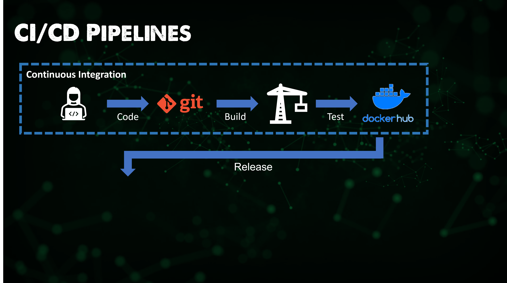

## The Big Picture: CI/CD Pipelines

A CI/CD (Continous Integration/Continous Deployment) Pipeline implementation is the backbone of the modern DevOps environment. 

It bridges the gap between development and operations by automating the build, test and deployment of applications. 

We covered a lot of this Continous mantra in the opening section of the challenge. But to reiterate: 

Continous Integration (CI) is a more modern software development practice in which incremental code changes are made more frequently and reliabily. Automated build and test workflow steps triggered by Contininous Integration ensures that code changes being merged into the repository are reliable. 

That code / Application is then delivered quickly and seamlessly as part of the Continuous Deployment process. 

### The importance of CI/CD? 

- Ship software quickly and efficiently 
- Facilitates an effective process for getting applications to market as fast as possible
- A continous flow of bug fixes and new features without waiting months or years for version releases. 

The ability for developers to make small impactful changes regular means we get faster fixes and more features quicker. 

### Ok, so what does this mean? 

On [Day 5](day5.md) we covered a lot of the theory behind DevOps and as already mentioned here already that the CI/CD Pipeline is the backbone of the modern DevOps environment. 

I want to reiterate some of the key points on this image above, now that we are a little further into our journey of learning the fundamentals of DevOps. 

We are referring to the software development life cycle (SDLC). 

The steps are usually written out within an infinity loop since it's a cycle that repeats forever.  

The steps in the cycle are, developers write the **code** then it gets **built** or all compiled together then it's **tested** for bugs then it's **deployed** into production where it's used (**Operated**) by end users or customers then we **monitor** and collect feedback and finally we **plan** improvements around that feedback **rinse and repeat**. 

### Let's go a little deeper into CI/CD

### CI

CI is a development practice that requires developers to integrate code into a shared repository several times a day.  

When the code is written and pushed to a repository like github or gitlab that's where the magic begins. 

The code is verified by an automated build which allows teams or the project owner to detect any problems early.

From there the code is analysed and given a series of automated tests three examples are 

- Unit testing this tests the individual units of the source code 
- Validation testing this makes sure that the software satisfies or fits the intended use
- Format testing this checks for syntax and other formatting errors 
  
These tests are created as a workflow and then are run every time you push to the master branch so pretty much every major development team has some sort of CI/CD workflow and remember on a development team the new code could be coming in from teams all over the world at different times of the day from developers working on all sorts of different projects it's more efficient to build an automated workflow of tests that make sure that everyone is on the same page before the code is accepted. It would take much longer for a human to do this each time. 

Once we have our tests complete and they are successful then we can compile and send to our repository. For example I am using Docker Hub but this could be anywhere that then gets leveraged for the CD aspect of the pipeline. 

So this process is obviously very much down to the software development process, we are creating our application, adding, fixing bugs etc and then updating our source control and versioning that whilst also testing. 

Moving onto the next phase is the CD element which in fact more and more is what we generally see from any off the shelf software, I would argue that we will see a trend that if we get our software from a vendor such as Oracle or Microsoft we will consume that from a Docker Hub type repository and then we would use our CD pipelines to deploy that into our environments. 

### CD 

Now we have our tested version of our code and we are ready to deploy out into the wild and like I say, the Software vendor will run through this stage but I strongly believe this is how we will all deploy the off the shelf software we require in the future. 

It is now time to release our code into an environment. This is going to include Production but also likely other environments as well such as staging. 

Our next step at least on Day 1 of v1 of the software deployment is we need to make sure we are pulling the correct code base to the correct environment. This could be pulling elements from the software repository (DockerHub) but it is more than likely that we are also pulling additional configuration from maybe another code repository, the configuration for the application for example. In the diagram below we are pulling the latest release of the software from DockerHub and then we are releasing this to our environments whilst possibly picking up configuration from a Git repository. Our CD tool is performing this and pushing everything to our environment. 

It is most likely that this is not done at the same time. i.e we would go to a staging environment run against this with our own configuration make sure things are correct and this could be a manual step for testing or it could again be automated (lets go with automated) before then allowing this code to be deployed into production. 

Then after this when v2 of the application comes out we rinse and repeat the steps this time we ensure our application + configuration is deployed to staging ensure everything is good and then we deploy to production. 

### Why use CI/CD? 

I think we have probably covered the benefits a number of time but it is because it automates things that otherwise would have to be done manually it finds small problems before it sneaks into the main codebase, you can probably imagine that if you push bad code out to your customers then you're going to have a bad time! 

It also helps to prevent something that we call technical debt which is the idea that since the main code repos are constantly being built upon over time then a shortcut fix taken on day one is now an exponentially more expensive fix years later because now that band-aid of a fix would be so deeply intertwined and baked into all the code bases and logic. 

### Tooling

Like with other sections we are going to get hands on with some of the tools that achieve the CI/CD pipeline process. 

I think it is also important to note that not all tools have to do both CI and CD, We will take a look at ArgoCD which you guessed it is great at the CD element of deploying our software to a Kubernetes cluster. But something like Jenkins can work across many different platforms. 

My plan is to look at the following: 

- Jenkins 
- ArgoCD 
- GitHub Actions 

## Resources

- [Jenkins is the way to build, test, deploy](https://youtu.be/_MXtbjwsz3A)
- [Jenkins.io](https://www.jenkins.io/)
- [ArgoCD](https://argo-cd.readthedocs.io/en/stable/)
- [ArgoCD Tutorial for Beginners](https://www.youtube.com/watch?v=MeU5_k9ssrs)
- [What is Jenkins?](https://www.youtube.com/watch?v=LFDrDnKPOTg)
- [Complete Jenkins Tutorial](https://www.youtube.com/watch?v=nCKxl7Q_20I&t=3s)
- [GitHub Actions](https://www.youtube.com/watch?v=R8_veQiYBjI)
- [GitHub Actions CI/CD](https://www.youtube.com/watch?v=mFFXuXjVgkU)

See you on [Day 71](day71.md)
