## Getting hands-on with Jenkins

The plan today is to get some hands-on with Jenkins and make something happen as part of our CI pipeline, looking at some example code bases that we can use.

### What is a pipeline?

Before we start we need to know what is a pipeline when it comes to CI, and we already covered this in the session yesterday with the following image.

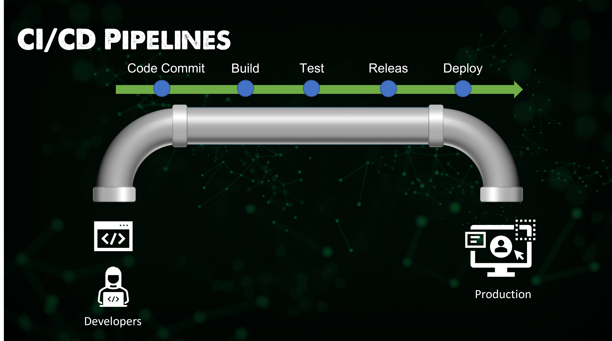

We want to take the processes or steps above and we want to automate them to get an outcome eventually meaning that we have a deployed application that we can then ship to our customers, end users etc.

This automated process enables us to have version control through to our users and customers. Every change, feature enhancement, bug fix etc goes through this automated process confirming that everything is fine without too much manual intervention to ensure our code is good.

This process involves building the software in a reliable and repeatable manner, as well as progressing the built software (called a "build") through multiple stages of testing and deployment.

A Jenkins pipeline is written into a text file called a Jenkinsfile. Which itself should be committed to a source control repository. This is also known as Pipeline as code, we could also very much liken this to Infrastructure as code which we covered a few weeks back.

[Jenkins Pipeline Definition](https://www.jenkins.io/doc/book/pipeline/#ji-toolbar)

### Deploying Jenkins

I had some fun deploying Jenkins, You will notice from the [documentation](https://www.jenkins.io/doc/book/installing/) that there are many options on where you can install Jenkins.

Given that I have minikube on hand and we have used this several times I wanted to use this for this task also. (also it is free!) Although the steps are given in the [Kubernetes Installation](https://www.jenkins.io/doc/book/installing/kubernetes/) had me hitting a wall and not getting things up and running, you can compare the two when I document my steps here.

The first step is to get our minikube cluster up and running, we can simply do this with the `minikube start` command.


I have added a folder with all the YAML configuration and values that can be found [here](CICD/Jenkins) Now that we have our cluster we can run the following to create our jenkins namespace. `kubectl create -f jenkins-namespace.yml`


We will be using Helm to deploy Jenkins into our cluster, we covered helm in the Kubernetes section. We first need to add the jenkinsci helm repository `helm repo add jenkinsci https://charts.jenkins.io` then update our charts `helm repo update`.

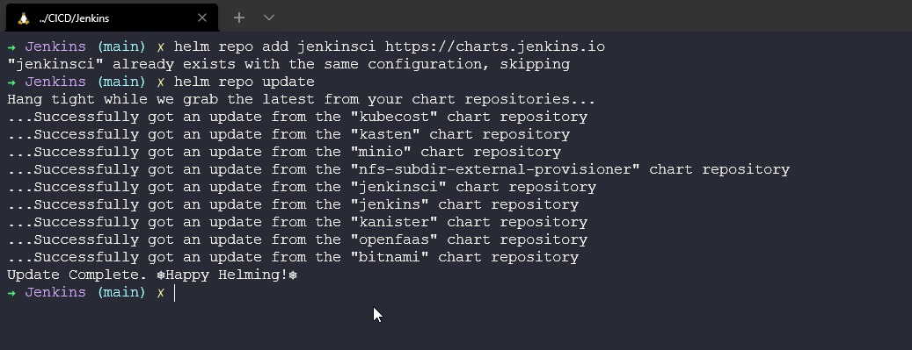

The idea behind Jenkins is that it is going to save state for its pipelines, you can run the above helm installation without persistence but if those pods are rebooted, changed or modified then any pipeline or configuration you have made will be lost. We will create a volume for persistence using the jenkins-volume.yml file with the `kubectl apply -f jenkins-volume.yml` command.


We also need a service account which we can create using this YAML file and command. `kubectl apply -f jenkins-sa.yml`

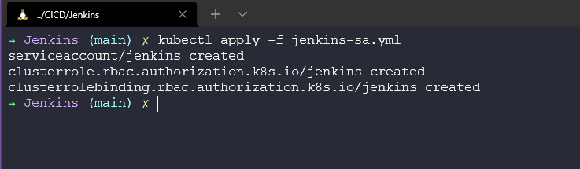

At this stage we are good to deploy using the helm chart, we will first define our chart using `chart=jenkinsci/jenkins` and then we will deploy using this command where the jenkins-values.yml contain the persistence and service accounts that we previously deployed to our cluster. `helm install jenkins -n jenkins -f jenkins-values.yml $chart`


At this stage, our pods will be pulling the image but the pod will not have access to the storage so no configuration can be started in terms of getting Jenkins up and running.

This is where the documentation did not help me massively understand what needed to happen. But we can see that we have no permission to start our Jenkins install.

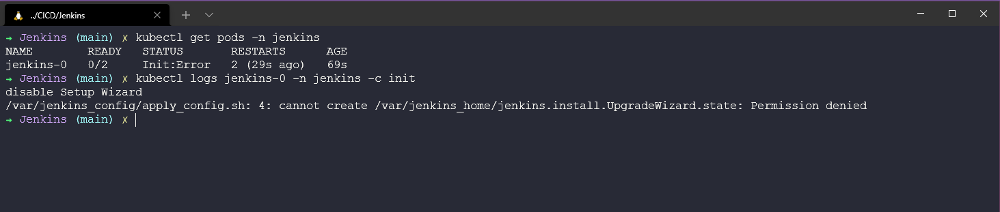

To fix the above or resolve it, we need to make sure we provide access or the right permission for our Jenkins pods to be able to write to this location that we have suggested. We can do this by using the `minikube ssh` which will put us into the minikube docker container we are running on, and then using `sudo chown -R 1000:1000 /data/jenkins-volume` we can ensure we have permissions set on our data volume.

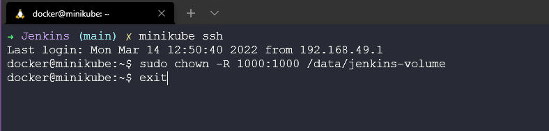

The above process should fix the pods, however, if not you can force the pods to be refreshed with the `kubectl delete pod jenkins-0 -n jenkins` command. At this point, you should have 2/2 running pods called jenkins-0.

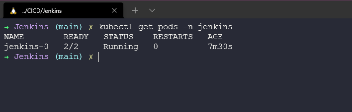

We now need our admin password and we can this using the following command. `kubectl exec --namespace jenkins -it svc/jenkins -c jenkins -- /bin/cat /run/secrets/chart-admin-password && echo`

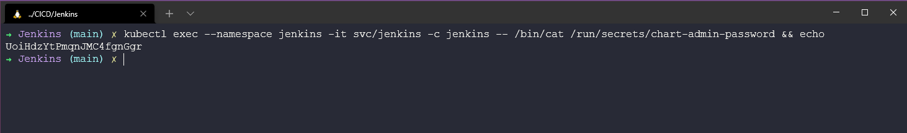

Now open a new terminal as we are going to use the `port-forward` command to allow us to gain access from our workstation. `kubectl --namespace jenkins port-forward svc/jenkins 8080:8080`

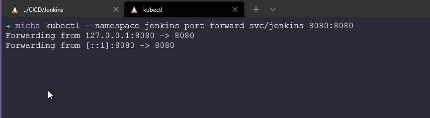

We should now be able to open a browser and log in to `http://localhost:8080` and authenticate with the username: admin and password we gathered in a previous step.

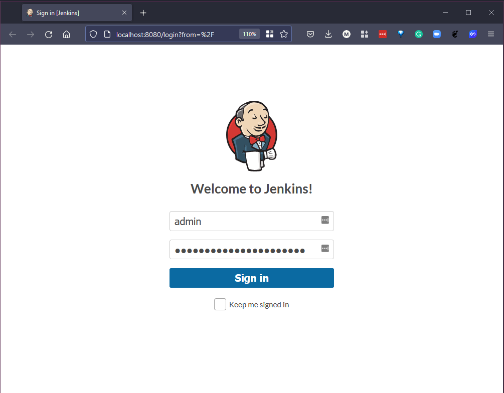

When we have authenticated, our Jenkins welcome page should look something like this:


From here, I would suggest heading to "Manage Jenkins" and you will see "Manage Plugins" which will have some updates available. Select all of those plugins and choose "Download now and install after restart"


If you want to go even further and automate the deployment of Jenkins using a shell script this great repository was shared with me on Twitter [mehyedes/nodejs-k8s](https://github.com/mehyedes/nodejs-k8s/blob/main/docs/automated-setup.md)

### Jenkinsfile

Now we have Jenkins deployed in our Kubernetes cluster, we can now go back and think about this Jenkinsfile.

Every Jenkinsfile will likely start like this, Which is firstly where you would define the steps of your pipeline, in this instance you have Build > Test > Deploy. But we are not doing anything other than using the `echo` command to call out the specific stages.

```

Jenkinsfile (Declarative Pipeline)

pipeline {
    agent any

    stages {
        stage('Build') {
            steps {
                echo 'Building..'
            }
        }
        stage('Test') {
            steps {
                echo 'Testing..'
            }
        }
        stage('Deploy') {
            steps {
                echo 'Deploying....'
            }
        }
    }
}

```

In our Jenkins dashboard, select "New Item" give the item a name, I am going to "echo1" I am going to suggest that this is a Pipeline.


Hit Ok and you will then have the tabs (General, Build Triggers, Advanced Project Options and Pipeline) for a simple test we are only interested in Pipeline. Under Pipeline you can add a script, we can copy and paste the above script into the box.

As we said above this is not going to do much but it will show us the stages of our Build > Test > Deploy


Click Save, We can now run our build using the build now highlighted below.

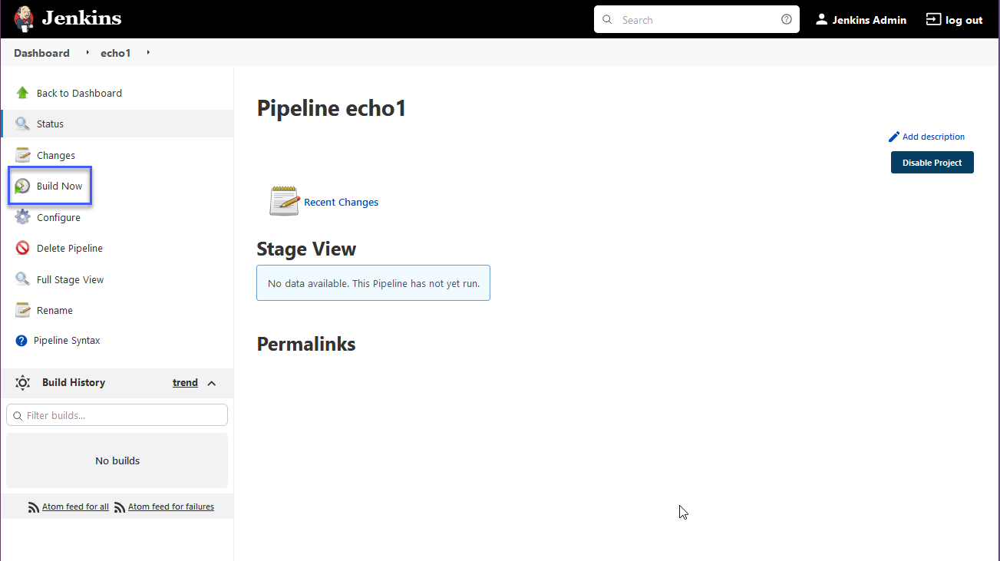

We should also open a terminal and run the `kubectl get pods -n jenkins` to see what happens there.

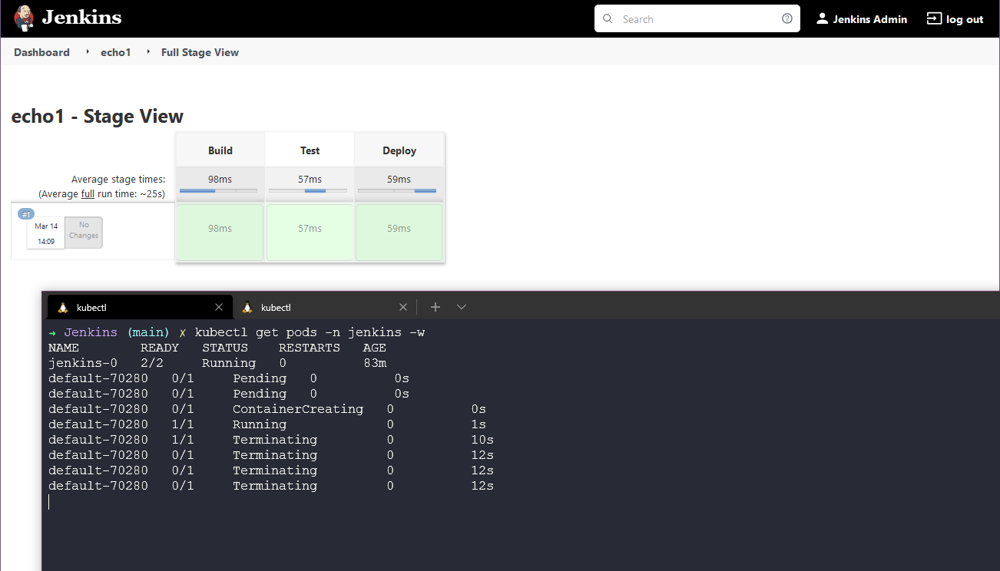

Ok, very simple stuff but we can now see that our Jenkins deployment and installation are working correctly and we can start to see the building blocks of the CI pipeline here.

In the next section, we will be building a Jenkins Pipeline.

## Resources

- [Jenkins is the way to build, test, deploy](https://youtu.be/_MXtbjwsz3A)
- [Jenkins.io](https://www.jenkins.io/)
- [ArgoCD](https://argo-cd.readthedocs.io/en/stable/)
- [ArgoCD Tutorial for Beginners](https://www.youtube.com/watch?v=MeU5_k9ssrs)
- [What is Jenkins?](https://www.youtube.com/watch?v=LFDrDnKPOTg)
- [Complete Jenkins Tutorial](https://www.youtube.com/watch?v=nCKxl7Q_20I&t=3s)
- [GitHub Actions](https://www.youtube.com/watch?v=R8_veQiYBjI)
- [GitHub Actions CI/CD](https://www.youtube.com/watch?v=mFFXuXjVgkU)

See you on [Day 73](day73.md)
