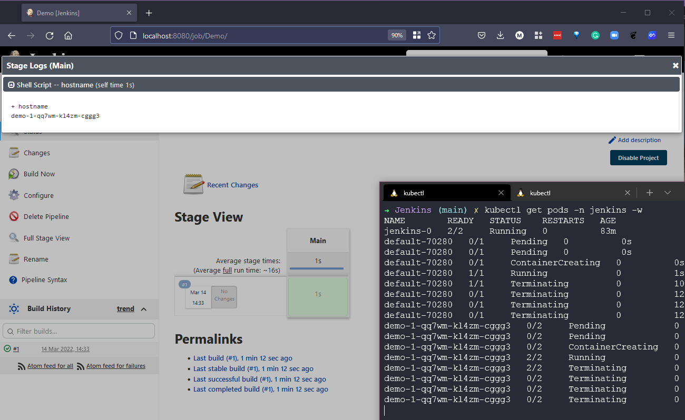
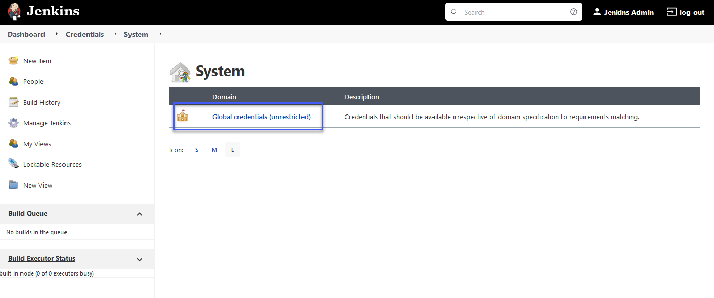
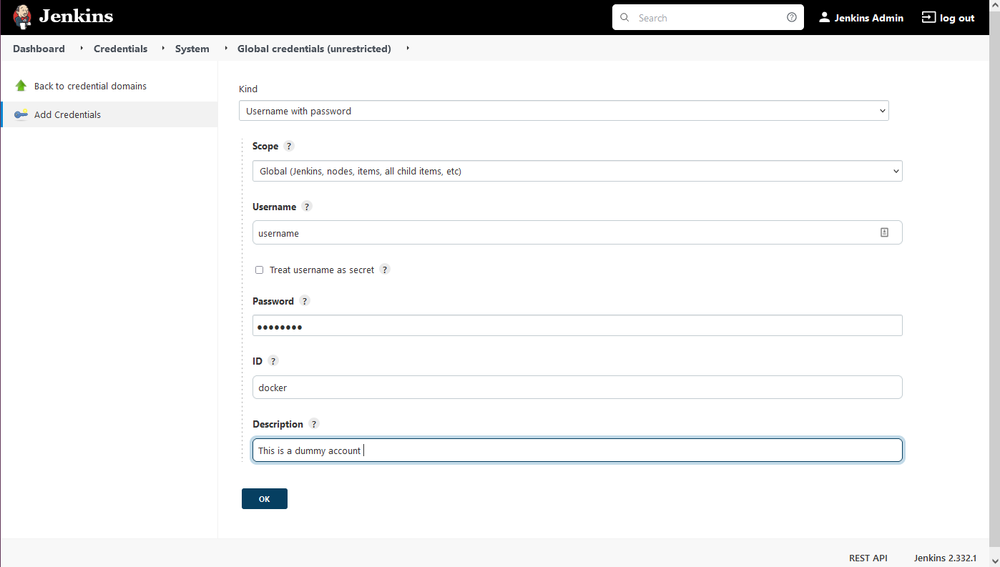
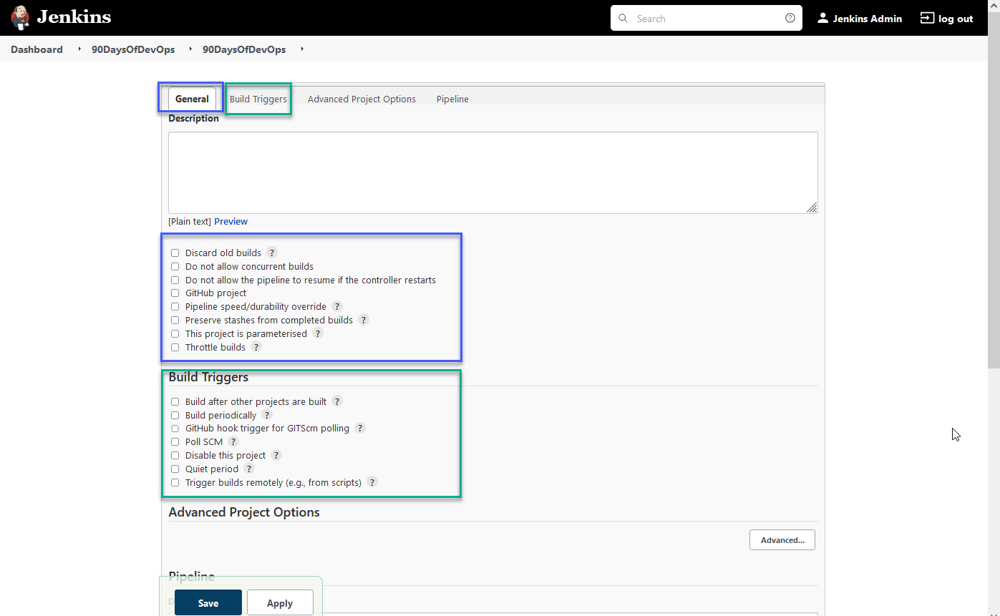
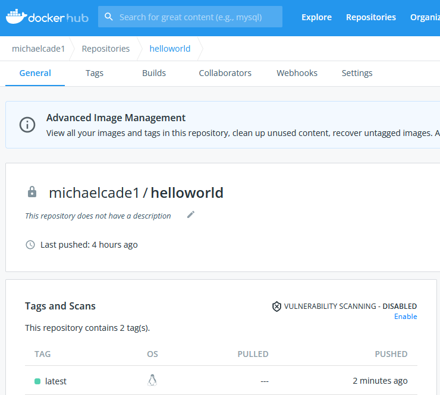

## Building a Jenkins Pipeline

In the last section, we got Jenkins deployed to our Minikube cluster and we set up a very basic Jenkins Pipeline, that didn't do much at all other than echo out the stages of a Pipeline.

You might have also seen that there are some example scripts available for us to run in the Jenkins Pipeline creation.


The first demo script is "Declarative (Kubernetes)" and you can see the stages below.

```Yaml
// Uses Declarative syntax to run commands inside a container.
pipeline {
    agent {
        kubernetes {
            // Rather than inline YAML, in a multibranch Pipeline you could use: yamlFile 'jenkins-pod.yaml'
            // Or, to avoid YAML:
            // containerTemplate {
            //     name 'shell'
            //     image 'ubuntu'
            //     command 'sleep'
            //     args 'infinity'
            // }
            yaml '''
apiVersion: v1
kind: Pod
spec:
  containers:
  - name: shell
    image: ubuntu
    command:
    - sleep
    args:
    - infinity
'''
            // Can also wrap individual steps:
            // container('shell') {
            //     sh 'hostname'
            // }
            defaultContainer 'shell'
        }
    }
    stages {
        stage('Main') {
            steps {
                sh 'hostname'
            }
        }
    }
}
```

You can see below the outcome of what happens when this Pipeline is run.



### Job creation

#### Goals

- Create a simple app and store it in GitHub public repository [https://github.com/scriptcamp/kubernetes-kaniko.git](https://github.com/scriptcamp/kubernetes-kaniko.git)

- Use Jenkins to build our docker Container image and push it to the docker hub. (for this we will use a private repository)

To achieve this in our Kubernetes cluster running in or using Minikube we need to use something called [Kaniko](https://github.com/GoogleContainerTools/kaniko#running-kaniko-in-a-kubernetes-cluster) It is general though if you are using Jenkins in a real Kubernetes cluster or you are running it on a server then you can specify an agent which will give you the ability to perform the docker build commands and upload that to DockerHub.

With the above in mind, we are also going to deploy a secret into Kubernetes with our GitHub credentials.

```Shell
kubectl create secret docker-registry dockercred \
    --docker-server=https://index.docker.io/v1/ \
    --docker-username=<dockerhub-username> \
    --docker-password=<dockerhub-password>\
    --docker-email=<dockerhub-email>
```

I want to share another great resource from [DevOpsCube.com](https://devopscube.com/build-docker-image-kubernetes-pod/) running through much of what we will cover here.

### Adding credentials to Jenkins

However, if you were on a Jenkins system unlike ours then you will likely want to define your credentials within Jenkins and then use them multiple times within your Pipelines and configurations. We can refer to these credentials in the Pipelines using the ID we determine on creation. I went ahead and stepped through and created a user entry for DockerHub and GitHub.

First of all select "Manage Jenkins" and then "Manage Credentials"


You will see in the centre of the page, Stores scoped to Jenkins click on Jenkins here.


Now select Global Credentials (Unrestricted)



Then in the top left, you have Add Credentials


Fill in your details for your account and then select OK, remember the ID is what you will refer to when you want to call this credential. My advice here also is that you use specific token access vs passwords.



For GitHub, you should use a [Personal Access Token](https://vzilla.co.uk/vzilla-blog/creating-updating-your-github-personal-access-token)

I did not find this process very intuitive to create these accounts, so even though we are not using I wanted to share the process as it is not clear from the UI.

### Building the pipeline

We have our DockerHub credentials deployed as a secret into our Kubernetes cluster which we will call upon for our docker deploy to the DockerHub stage in our pipeline.

The pipeline script is what you can see below, this could in turn become our Jenkinsfile located in our GitHub repository which you can also see is listed in the Get the project stage of the pipeline.

```Yaml
podTemplate(yaml: '''
    apiVersion: v1
    kind: Pod
    spec:
      containers:
      - name: maven
        image: maven:3.8.1-jdk-8
        command:
        - sleep
        args:
        - 99d
      - name: kaniko
        image: gcr.io/kaniko-project/executor:debug
        command:
        - sleep
        args:
        - 9999999
        volumeMounts:
        - name: kaniko-secret
          mountPath: /kaniko/.docker
      restartPolicy: Never
      volumes:
      - name: kaniko-secret
        secret:
            secretName: dockercred
            items:
            - key: .dockerconfigjson
              path: config.json
''') {
  node(POD_LABEL) {
    stage('Get the project') {
      git url: 'https://github.com/scriptcamp/kubernetes-kaniko.git', branch: 'main'
      container('maven') {
        stage('Test the project') {
          sh '''
          echo pwd
          '''
        }
      }
    }

    stage('Build & Test the Docker Image') {
      container('kaniko') {
        stage('Deploy to DockerHub') {
          sh '''
            /kaniko/executor --context `pwd` --destination michaelcade1/helloworld:latest
          '''
        }
      }
    }

  }
}
```

To kick things on the Jenkins dashboard we need to select "New Item"


We are then going to give our item a name, select Pipeline and then hit ok.


We are not going to be selecting any of the general or build triggers but have a play with these as there are some interesting schedules and other configurations that might be useful.



We are only interested in the Pipeline tab at the end.


In the Pipeline definition, we are going to copy and paste the pipeline script that we have above into the Script section and hit save.


Next, we will select the "Build Now" option on the left side of the page.


You should now wait a short amount of time, less than a minute. and you should see under status the stages that we defined above in our script.


More importantly, if we now head on over to our DockerHub and check that we have a new build.



Overall did take a while to figure out but I wanted to stick with it to get hands-on and work through a scenario that anyone can run through using minikube and access to GitHub and dockerhub.

The DockerHub repository I used for this demo was a private one. But in the next section, I want to advance some of these stages and have them do something vs just printing out `pwd` and running some tests and build stages.

## Resources

- [Jenkins is the way to build, test, deploy](https://youtu.be/_MXtbjwsz3A)
- [Jenkins.io](https://www.jenkins.io/)
- [ArgoCD](https://argo-cd.readthedocs.io/en/stable/)
- [ArgoCD Tutorial for Beginners](https://www.youtube.com/watch?v=MeU5_k9ssrs)
- [What is Jenkins?](https://www.youtube.com/watch?v=LFDrDnKPOTg)
- [Complete Jenkins Tutorial](https://www.youtube.com/watch?v=nCKxl7Q_20I&t=3s)
- [GitHub Actions](https://www.youtube.com/watch?v=R8_veQiYBjI)
- [GitHub Actions CI/CD](https://www.youtube.com/watch?v=mFFXuXjVgkU)

See you on [Day 74](day74.md)
