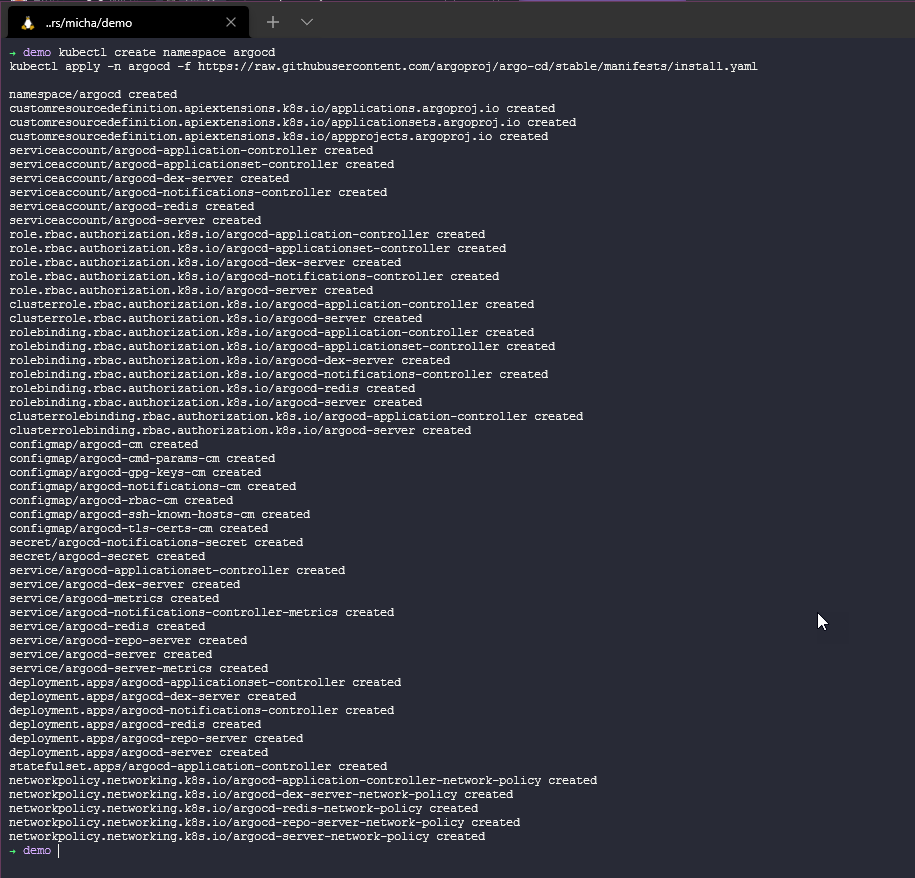
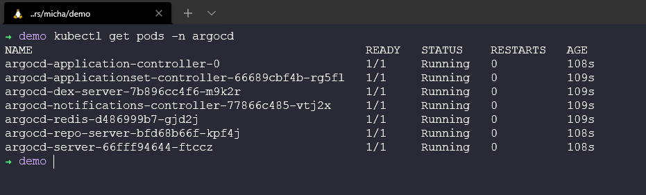
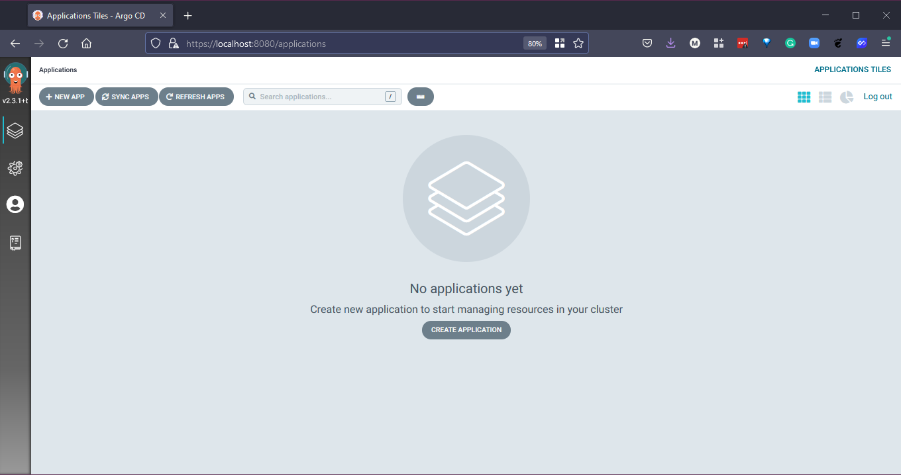

## ArgoCD Overview

“Argo CD is a declarative, GitOps continuous delivery tool for Kubernetes”

Version control is the key here, ever made a change to your environment on the fly and have no recollection of that change and because the lights are on and everything is green you continue to keep plodding along? Ever made a change and broken everything or some of everything? You might have known you made the change and you can quickly roll back your change, that bad script or misspelling. Now ever done this on a massive scale and maybe it was not you or maybe it was not found straight away and now the business is suffering. Therefore, version control is important. Not only that but “Application definitions, configurations, and environments should be declarative, and version controlled.” On top of this (which comes from ArgoCD), they also mention that “Application deployment and lifecycle management should be automated, auditable, and easy to understand.”

From an Operations background but having played a lot around Infrastructure as Code this is the next step to ensuring all of that good stuff is taken care of along the way with continuous deployment/delivery workflows.

[What is ArgoCD](https://argo-cd.readthedocs.io/en/stable/)

### Deploying ArgoCD

We are going to be using our trusty minikube Kubernetes cluster locally again for this deployment.

```Shell
kubectl create namespace argocd
kubectl apply -n argocd -f https://raw.githubusercontent.com/argoproj/argo-cd/stable/manifests/install.yaml
```



Make sure all the ArgoCD pods are up and running with `kubectl get pods -n argocd`



Also, let's check everything that we deployed in the namespace with `kubectl get all -n argocd`


When the above is looking good, we then should consider accessing this via the port forward. Using the `kubectl port-forward svc/argocd-server -n argocd 8080:443` command. Do this in a new terminal.

Then open a new web browser and head to `https://localhost:8080`


To log in you will need a username of admin and then grab your created secret as your password use the `kubectl -n argocd get secret argocd-initial-admin-secret -o jsonpath="{.data.password}" | base64 -d && echo`


Once you have logged in you will have your blank CD canvas.



### Deploying our application

Now we have ArgoCD up and running we can now start using it to deploy our applications from our Git repositories as well as Helm.

The application I want to deploy is Pac-Man, yes that's right the famous game and something I use in a lot of demos when it comes to data management, this will not be the last time we see Pac-Man.

You can find the repository for [Pac-Man](https://github.com/MichaelCade/pacman-tanzu.git) here.

Instead of going through each step using screenshots, I thought it would be easier to create a walkthrough video covering the steps taken for this one particular application deployment.

[ArgoCD Demo - 90DaysOfDevOps](https://www.youtube.com/watch?v=w6J413_j0hA)

Note - During the video, there is a service that is never satisfied as the app health is healthy this is because the LoadBalancer type set for the Pacman service is pending, in Minikube we do not have a loadbalancer configured. If you would like to test this you could change the YAML for the service to ClusterIP and use port forwarding to play the game.

This wraps up the CICD Pipelines section, I feel there is a lot of focus on this area in the industry at the moment and you will also hear terms around GitOps also related to the methodologies used within CICD in general.

The next section we move into is around Observability, another concept or area that is not new but it is more and more important as we look at our environments differently.

## Resources

- [Jenkins is the way to build, test, deploy](https://youtu.be/_MXtbjwsz3A)
- [Jenkins.io](https://www.jenkins.io/)
- [ArgoCD](https://argo-cd.readthedocs.io/en/stable/)
- [ArgoCD Tutorial for Beginners](https://www.youtube.com/watch?v=MeU5_k9ssrs)
- [What is Jenkins?](https://www.youtube.com/watch?v=LFDrDnKPOTg)
- [Complete Jenkins Tutorial](https://www.youtube.com/watch?v=nCKxl7Q_20I&t=3s)
- [GitHub Actions](https://www.youtube.com/watch?v=R8_veQiYBjI)
- [GitHub Actions CI/CD](https://www.youtube.com/watch?v=mFFXuXjVgkU)

See you on [Day 77](day77.md)
