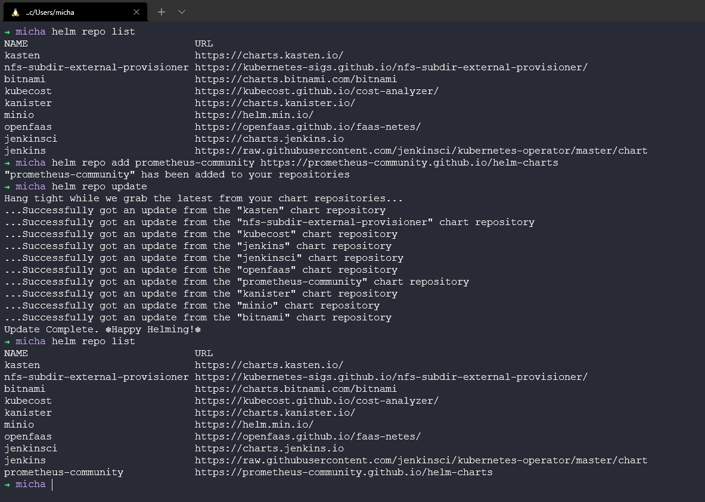
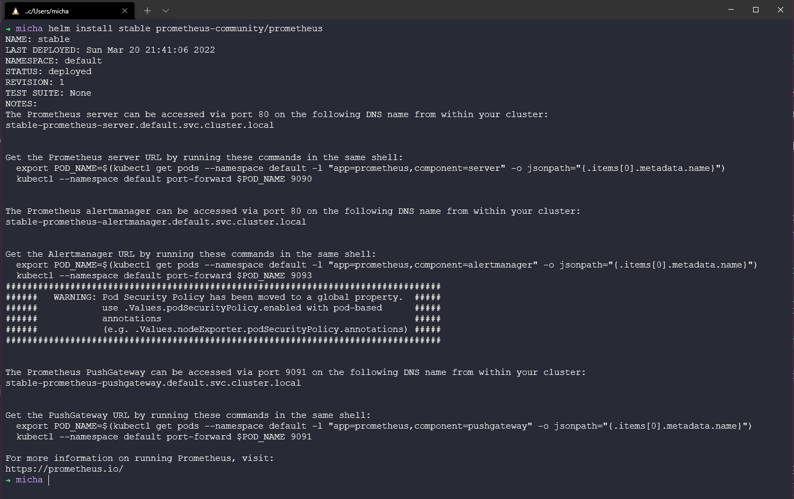
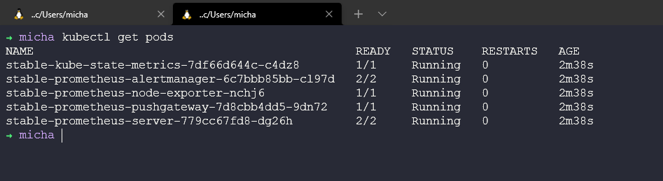
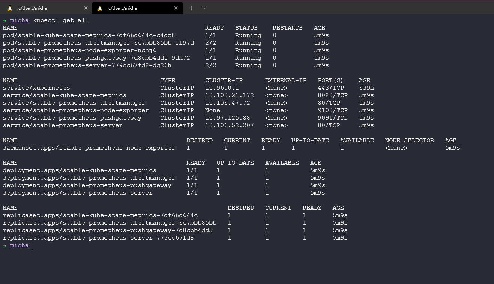
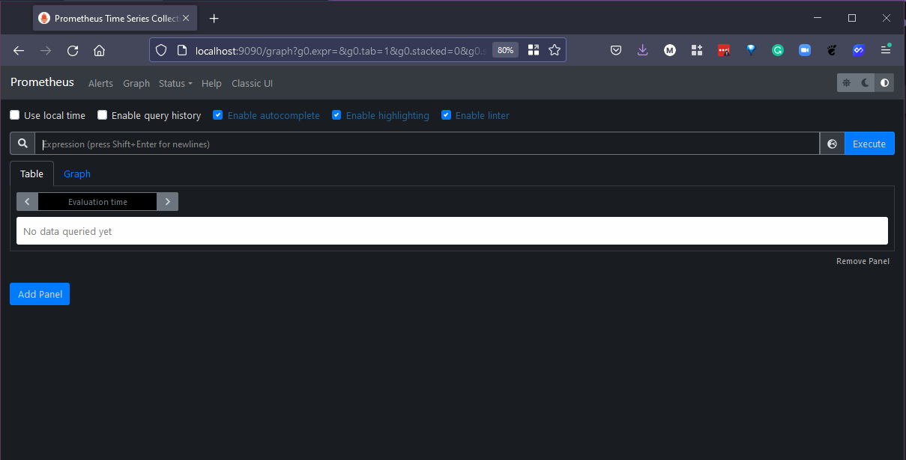
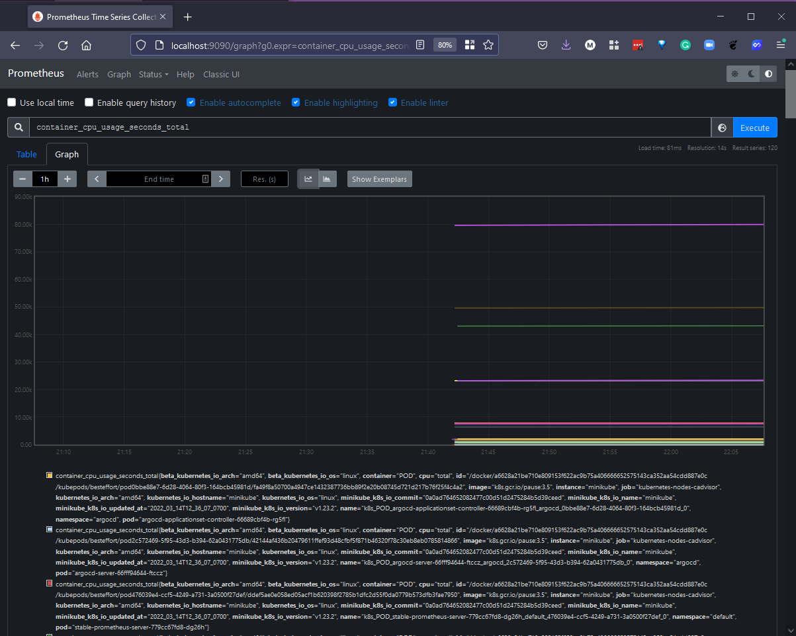

## Hands-On Monitoring Tools

In the last session, I spoke about the big picture of monitoring and I took a look into Nagios, there was two reasons for doing this. The first was this is a peice of software I have heard a lot of over the years so wanted to know a little more about its capabilities. 

Today I am going to be going into Prometheus, I have seen more and more of Prometheus in the Cloud-Native landscape but it can also be used to look after those physical resources as well outside of Kubernetes and the like. 

### Prometheus - Monitors nearly everything

First of all Prometheus is Open-Source that can help you monitor containers and microservice based systems as well as physical, virtual and other services. There is a large community behind Prometheus. 

Prometheus has a large array of [integrations and exporters](https://prometheus.io/docs/instrumenting/exporters/) The key being to exporting existing metrics as prometheus metrics. On top of this it also supports multiple proagramming languages. 

Pull approach - If you are talking to thousands of microservices or systems and services a push method is going to be where you generally see the service pushing to the monitoring system. This brings some challenges around flooding the network, high cpu and also a single point of failure. Where Pull gives us a much better experience where Prometheus will pull from the metrics endpoint on every service. 

Once again we see YAML for configuration for Prometheus. 


Later on you are going to see how this looks when deployed into Kubernetes, in particular we have the **PushGateway** which pulls our metrics from our jobs/exporters. 

We have the **AlertManager** which pushes alerts and this is where we can integrate into external services such as email, slack and other tooling. 

Then we have the Prometheus server which manages the retrieval of those pull metrics from the PushGateway and then sends those push alerts to the AlertManager. The Prometheus server also stores data on a local disk. Although can leverage remote storage solutions. 

We then also have PromQL which is the language used to interact with the metrics, this can be seen later on with the Prometheus Web UI but you will also see later on in this section how this is also used within Data visualisation tools such as Grafana. 

### Ways to Deploy Prometheus 

Various ways of installing Prometheus, [Download Section](https://prometheus.io/download/) Docker images are also available. 

`docker run --name prometheus -d -p 127.0.0.1:9090:9090 prom/prometheus`

But we are going to focus our efforts on deploying to Kubernetes. Which also has some options. 

- Create configuration YAML files 
- Using an Operator (manager of all prometheus components)
- Using helm chart to deploy operator 

### Deploying to Kubernetes 

We will be using our minikube cluster locally again for this quick and simple installation. As with previous touch points with minikube, we will be using helm to deploy the Prometheus helm chart. 

`helm repo add prometheus-community https://prometheus-community.github.io/helm-charts` 



As you can see from the above we have also ran a helm repo update, we are now ready to deploy Prometheus into our minikube environment using the `helm install stable prometheus-community/prometheus` command. 



After a couple of minutes you will see a number of new pods appear, for this demo I have deployed into the default namespace, I would normally push this to its own namespace. 



Once all the pods are running we can also take a look at all the deployed aspects of Prometheus. 



Now for us to access the Prometheus Server UI we can use the following command to port forward. 

```
export POD_NAME=$(kubectl get pods --namespace default -l "app=prometheus,component=server" -o jsonpath="{.items[0].metadata.name}")
  kubectl --namespace default port-forward $POD_NAME 9090
```
When we first open our browser to http://localhost:9090 we see the following very blank screen. 



Because we have deployed to our Kubernetes cluster we will automatically be picking up metrics from our Kubernetes API so we can use some PromQL to at least make sure we are capturing metrics `container_cpu_usage_seconds_total`



Short on learning PromQL and putting that into practice this is very much like I mentioned previously in that gaining metrics is great, so is monitoring but you have to know what you are monitoring and why and what you are not monitoring and why! 

I want to come back to Prometheus but for now I think we need to think about Log Management and Data Visualisation to bring us back to Prometheus later on. 

## Resources 

- [The Importance of Monitoring in DevOps](https://www.devopsonline.co.uk/the-importance-of-monitoring-in-devops/)
- [Understanding Continuous Monitoring in DevOps?](https://medium.com/devopscurry/understanding-continuous-monitoring-in-devops-f6695b004e3b) 
- [DevOps Monitoring Tools](https://www.youtube.com/watch?v=Zu53QQuYqJ0) 
- [Top 5 - DevOps Monitoring Tools](https://www.youtube.com/watch?v=4t71iv_9t_4)
- [How Prometheus Monitoring works](https://www.youtube.com/watch?v=h4Sl21AKiDg) 
- [Introduction to Prometheus monitoring](https://www.youtube.com/watch?v=5o37CGlNLr8)
- [Promql cheat sheet with examples](https://www.containiq.com/post/promql-cheat-sheet-with-examples)

See you on [Day 79](day79.md)
