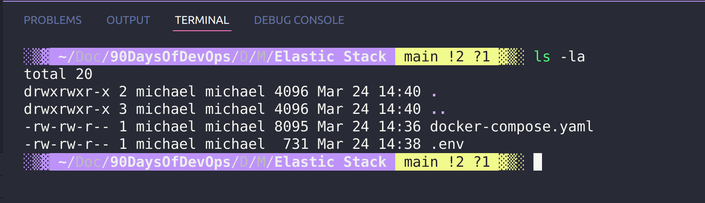
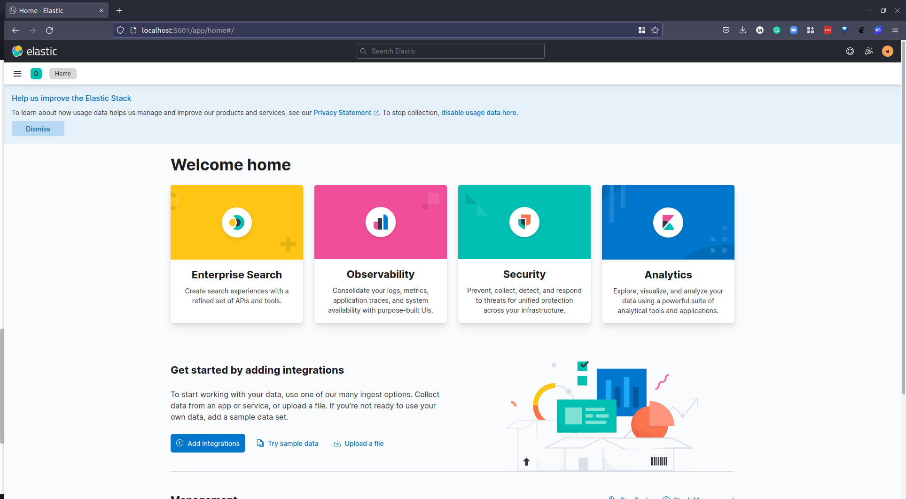
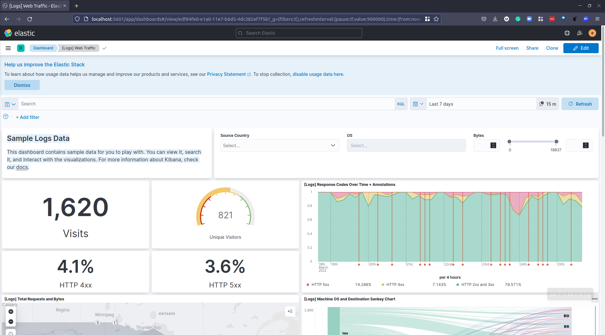

## ELK Stack  

In this session, we are going to get a little more hands-on with some of the options we have mentioned. 

### ELK Stack 

ELK Stack is the combination of 3 separate tools: 

- [Elasticsearch](https://www.elastic.co/what-is/elasticsearch) is a distributed, free and open search and analytics engine for all types of data, including textual, numerical, geospatial, structured, and unstructured.

- [Logstash](https://www.elastic.co/logstash/) is a free and open server-side data processing pipeline that ingests data from a multitude of sources, transforms it, and then sends it to your favorite "stash." 

- [Kibana](https://www.elastic.co/kibana/) is a free and open user interface that lets you visualize your Elasticsearch data and navigate the Elastic Stack. Do anything from tracking query load to understanding the way requests flow through your apps. 

ELK stack lets us reliably and securely take data from any source, in any format, then search, analyze, and visualize it in real time.

On top of the above mentioned components you might also see Beats which are lightweight agents that are installed on edge hosts to collect different types of data for forwarding into the stack.

- Logs: Server logs that need to be analyzed are identified

- Logstash: Collect logs and events data. It even parses and transforms data

- ElasticSearch: The transformed data from Logstash is	Store, Search, and indexed.

- Kibana uses Elasticsearch DB to Explore, Visualize, and Share

[Picture taken from Guru99](https://www.guru99.com/elk-stack-tutorial.html)

A good resource explaining this [The Complete Guide to the ELK Stack](https://logz.io/learn/complete-guide-elk-stack/)

With the addition of beats the ELK Stack is also now known as Elastic Stack. 

For the hands-on scenario there are many places you can deploy the Elastic Stack but we are going to be using docker compose to deploy locally on our system. 

[Start the Elastic Stack with Docker Compose](https://www.elastic.co/guide/en/elastic-stack-get-started/current/get-started-stack-docker.html#get-started-docker-tls)

You will find the original files and walkthrough that I used here [ deviantony/docker-elk](https://github.com/deviantony/docker-elk)

Now we can run `docker-compose up -d`, the first time this has been ran will require the pulling of images. 

If you follow either this repository or the one that I used you will have either have the password of "changeme" or in my repository the password of "90DaysOfDevOps". The username is "elastic"

After a few minutes we can navigate to http://localhost:5601/ which is our Kibana server / Docker container.

Your initial home screen is going to look something like this. 

Under the section titled "Get started by adding integrations" there is a "try sample data" click this and we can add one of the shown below. 

I am going to select "Sample web logs" but this is really to get a look and feel of what data sets you can get into the ELK stack. 

When you have selected "Add Data" it takes a while to populate some of that data and then you have the "View Data" option and a list of the available ways to view that data in the drop down. 

As it states on the dashboard view: 

**Sample Logs Data**

*This dashboard contains sample data for you to play with. You can view it, search it, and interact with the visualizations. For more information about Kibana, check our docs.*

This is using Kibana to visualise data that has been added into ElasticSearch via Logstash. This is not the only option but I personally wanted to deploy and look at this. 

We are going to cover Grafana at some point and you are going to see some data visualisation similarities between the two, you have also seen Prometheus. 

The key takeaway I have had between the Elastic Stack and Prometheus + Grafana is that Elastic Stack or ELK Stack is focused on Logs and Prometheus is focused on metrics. 

I was reading this article from MetricFire [Prometheus vs. ELK](https://www.metricfire.com/blog/prometheus-vs-elk/) to get a better understanding of the different offerings. 

## Resources 

- [Understanding Logging: Containers & Microservices](https://www.youtube.com/watch?v=MMVdkzeQ848)
- [The Importance of Monitoring in DevOps](https://www.devopsonline.co.uk/the-importance-of-monitoring-in-devops/)
- [Understanding Continuous Monitoring in DevOps?](https://medium.com/devopscurry/understanding-continuous-monitoring-in-devops-f6695b004e3b) 
- [DevOps Monitoring Tools](https://www.youtube.com/watch?v=Zu53QQuYqJ0) 
- [Top 5 - DevOps Monitoring Tools](https://www.youtube.com/watch?v=4t71iv_9t_4)
- [How Prometheus Monitoring works](https://www.youtube.com/watch?v=h4Sl21AKiDg) 
- [Introduction to Prometheus monitoring](https://www.youtube.com/watch?v=5o37CGlNLr8)
- [Promql cheat sheet with examples](https://www.containiq.com/post/promql-cheat-sheet-with-examples)
- [Log Management for DevOps | Manage application, server, and cloud logs with Site24x7](https://www.youtube.com/watch?v=J0csO_Shsj0)
- [Log Management what DevOps need to know](https://devops.com/log-management-what-devops-teams-need-to-know/)
- [What is ELK Stack?](https://www.youtube.com/watch?v=4X0WLg05ASw)
- [Fluentd simply explained](https://www.youtube.com/watch?v=5ofsNyHZwWE&t=14s) 

See you on [Day 81](day81.md)
