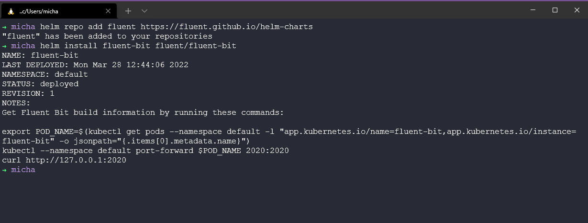

## Fluentd & FluentBit

Another data collector that I wanted to explore as part of this observability section was [Fluentd](https://docs.fluentd.org/). An Open-Source unified logging layer.

Fluentd has four key features that make it suitable to build clean, reliable logging pipelines:

Unified Logging with JSON: Fluentd tries to structure data as JSON as much as possible. This allows Fluentd to unify all facets of processing log data: collecting, filtering, buffering, and outputting logs across multiple sources and destinations. The downstream data processing is much easier with JSON since it has enough structure to be accessible without forcing rigid schemas.

Pluggable Architecture: Fluentd has a flexible plugin system that allows the community to extend its functionality. Over 300 community-contributed plugins connect dozens of data sources to dozens of data outputs, manipulating the data as needed. By using plugins, you can make better use of your logs right away.

Minimum Resources Required: A data collector should be lightweight so that it runs comfortably on a busy machine. Fluentd is written in a combination of C and Ruby and requires minimal system resources. The vanilla instance runs on 30-40MB of memory and can process 13,000 events/second/core.

Built-in Reliability: Data loss should never happen. Fluentd supports memory- and file-based buffering to prevent inter-node data loss. Fluentd also supports robust failover and can be set up for high availability.

[Installing Fluentd](https://docs.fluentd.org/quickstart#step-1-installing-fluentd)

### How do apps log data?

- Write to files. `.log` files (difficult to analyse without a tool and at scale)
- Log directly to a database (each application must be configured with the correct format)
- Third-party applications (NodeJS, NGINX, PostgreSQL)

This is why we want a unified logging layer.

FluentD allows for the 3 logging data types shown above and gives us the ability to collect, process and send those to a destination, this could be sending them logs to Elastic, MongoDB, or Kafka databases for example.

Any Data, Any Data source can be sent to FluentD and that can be sent to any destination. FluentD is not tied to any particular source or destination.

In my research of Fluentd, I kept stumbling across Fluent bit as another option and it looks like if you were looking to deploy a logging tool into your Kubernetes environment then fluent bit would give you that capability, even though fluentd can also be deployed to containers as well as servers.

[Fluentd & Fluent Bit](https://docs.fluentbit.io/manual/about/fluentd-and-fluent-bit)

Fluentd and Fluentbit will use the input plugins to transform that data to Fluent Bit format, then we have output plugins to whatever that output target is such as elasticsearch.

We can also use tags and matches between configurations.

I cannot see a good reason for using fluentd and it seems that Fluent Bit is the best way to get started. Although they can be used together in some architectures.

### Fluent Bit in Kubernetes

Fluent Bit in Kubernetes is deployed as a DaemonSet, which means it will run on each node in the cluster. Each Fluent Bit pod on each node will then read each container on that node and gather all of the logs available. It will also gather the metadata from the Kubernetes API Server.

Kubernetes annotations can be used within the configuration YAML of our applications.

First of all, we can deploy from the fluent helm repository. `helm repo add fluent https://fluent.github.io/helm-charts` and then install using the `helm install fluent-bit fluent/fluent-bit` command.



In my cluster, I am also running Prometheus in my default namespace (for test purposes) we need to make sure our fluent-bit pod is up and running. we can do this using `kubectl get all | grep fluent` this is going to show us our running pod, service and daemonset that we mentioned earlier.


So that fluentbit knows where to get logs from we have a configuration file, in this Kubernetes deployment of fluentbit, we have a configmap which resembles the configuration file.


That ConfigMap will look something like:

```
Name:         fluent-bit
Namespace:    default
Labels:       app.kubernetes.io/instance=fluent-bit
              app.kubernetes.io/managed-by=Helm
              app.kubernetes.io/name=fluent-bit
              app.kubernetes.io/version=1.8.14
              helm.sh/chart=fluent-bit-0.19.21
Annotations:  meta.helm.sh/release-name: fluent-bit
              meta.helm.sh/release-namespace: default

Data
====
custom_parsers.conf:
----
[PARSER]
    Name docker_no_time
    Format json
    Time_Keep Off
    Time_Key time
    Time_Format %Y-%m-%dT%H:%M:%S.%L

fluent-bit.conf:
----
[SERVICE]
    Daemon Off
    Flush 1
    Log_Level info
    Parsers_File parsers.conf
    Parsers_File custom_parsers.conf
    HTTP_Server On
    HTTP_Listen 0.0.0.0
    HTTP_Port 2020
    Health_Check On

[INPUT]
    Name tail
    Path /var/log/containers/*.log
    multiline.parser docker, cri
    Tag kube.*
    Mem_Buf_Limit 5MB
    Skip_Long_Lines On

[INPUT]
    Name systemd
    Tag host.*
    Systemd_Filter _SYSTEMD_UNIT=kubelet.service
    Read_From_Tail On

[FILTER]
    Name Kubernetes
    Match kube.*
    Merge_Log On
    Keep_Log Off
    K8S-Logging.Parser On
    K8S-Logging.Exclude On

[OUTPUT]
    Name es
    Match kube.*
    Host elasticsearch-master
    Logstash_Format On
    Retry_Limit False

[OUTPUT]
    Name es
    Match host.*
    Host elasticsearch-master
    Logstash_Format On
    Logstash_Prefix node
    Retry_Limit False

Events:  <none>
```

We can now port-forward our pod to our localhost to ensure that we have connectivity. Firstly get the name of your pod with `kubectl get pods | grep fluent` and then use `kubectl port-forward fluent-bit-8kvl4 2020:2020` to open a web browser to `http://localhost:2020/`


I also found this great medium article covering more about [Fluent Bit](https://medium.com/kubernetes-tutorials/exporting-kubernetes-logs-to-elasticsearch-using-fluent-bit-758e8de606af)

## Resources

- [Understanding Logging: Containers & Microservices](https://www.youtube.com/watch?v=MMVdkzeQ848)
- [The Importance of Monitoring in DevOps](https://www.devopsonline.co.uk/the-importance-of-monitoring-in-devops/)
- [Understanding Continuous Monitoring in DevOps?](https://medium.com/devopscurry/understanding-continuous-monitoring-in-devops-f6695b004e3b)
- [DevOps Monitoring Tools](https://www.youtube.com/watch?v=Zu53QQuYqJ0)
- [Top 5 - DevOps Monitoring Tools](https://www.youtube.com/watch?v=4t71iv_9t_4)
- [How Prometheus Monitoring works](https://www.youtube.com/watch?v=h4Sl21AKiDg)
- [Introduction to Prometheus monitoring](https://www.youtube.com/watch?v=5o37CGlNLr8)
- [Promql cheat sheet with examples](https://www.containiq.com/post/promql-cheat-sheet-with-examples)
- [Log Management for DevOps | Manage application, server, and cloud logs with Site24x7](https://www.youtube.com/watch?v=J0csO_Shsj0)
- [Log Management what DevOps need to know](https://devops.com/log-management-what-devops-teams-need-to-know/)
- [What is ELK Stack?](https://www.youtube.com/watch?v=4X0WLg05ASw)
- [Fluentd simply explained](https://www.youtube.com/watch?v=5ofsNyHZwWE&t=14s)
- [Fluent Bit explained | Fluent Bit vs Fluentd](https://www.youtube.com/watch?v=B2IS-XS-cc0)

See you on [Day 82](day82.md)
