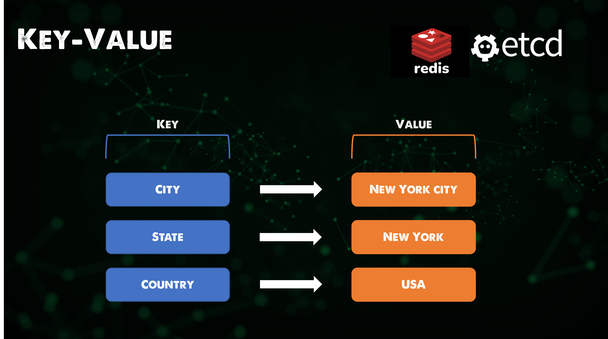
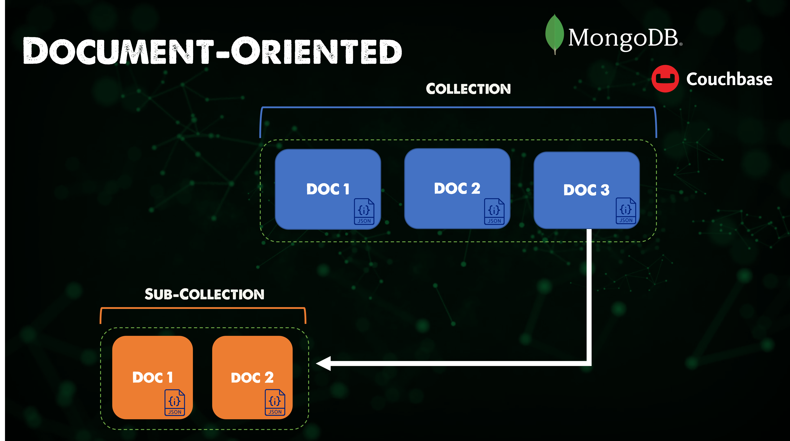
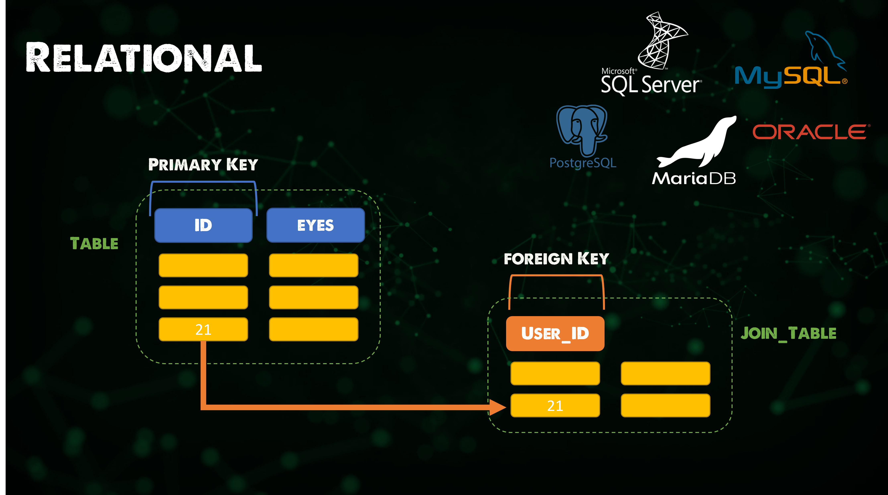

## Data Services

Databases are going to be the most common data service that we come across in our environments. I wanted to take this session to explore some of those different types of Databases and some of the use cases they each have. Some we have used and seen throughout the course of the challenge. 

From an application development point of view choosing the right data service or database is going to be a huge decision when it comes to the performance and scalability of your application. 

https://www.youtube.com/watch?v=W2Z7fbCLSTw

### Key-value

A key-value database is a type of nonrelational database that uses a simple key-value method to store data. A key-value database stores data as a collection of key-value pairs in which a key serves as a unique identifier. Both keys and values can be anything, ranging from simple objects to complex compound objects. Key-value databases are highly partitionable and allow horizontal scaling at scales that other types of databases cannot achieve.

An example of a Key-Value database is Redis. 

*Redis is an in-memory data structure store, used as a distributed, in-memory key–value database, cache and message broker, with optional durability. Redis supports different kinds of abstract data structures, such as strings, lists, maps, sets, sorted sets, HyperLogLogs, bitmaps, streams, and spatial indices.*

As you can see from the description of Redis this means that our database is fast but we are limited on space as a trade off. Also no queries or joins which means data modelling options are very limited. 

Best for: 
- Caching 
- Pub/Sub
- Leaderboards 
- Shopping carts

Generally used as a cache above another persistent data layer. 

### Wide Column

A wide-column database is a NoSQL database that organises data storage into flexible columns that can be spread across multiple servers or database nodes, using multi-dimensional mapping to reference data by column, row, and timestamp.

*Cassandra is a free and open-source, distributed, wide-column store, NoSQL database management system designed to handle large amounts of data across many commodity servers, providing high availability with no single point of failure.*

No schema which means can handle unstructured data however this can be seen as a benefit to some workloads. 

Best for: 
- Time-Series 
- Historical Records 
- High-Write, Low-Read 

### Document

A document database (also known as a document-oriented database or a document store) is a database that stores information in documents. 

*MongoDB is a source-available cross-platform document-oriented database program. Classified as a NoSQL database program, MongoDB uses JSON-like documents with optional schemas. MongoDB is developed by MongoDB Inc. and licensed under the Server Side Public License.*

NoSQL document databases allow businesses to store simple data without using complex SQL codes. Quickly store with no compromise to reliability. 

Best for: 

- Most Applications 
- Games 
- Internet of Things 

### Relational

If you are new to databases but you know of them my guess is that you have absolutely come across a relational database. 

A relational database is a digital database based on the relational model of data, as proposed by E. F. Codd in 1970. A system used to maintain relational databases is a relational database management system. Many relational database systems have an option of using the SQL for querying and maintaining the database.

*MySQL is an open-source relational database management system. Its name is a combination of "My", the name of co-founder Michael Widenius's daughter, and "SQL", the abbreviation for Structured Query Language.*

MySQL is one example of a relational database there are lots of other options. 

Whilst researching relational databases the term or abbreviation **ACID** has been mentioned a lot, (atomicity, consistency, isolation, durability) is a set of properties of database transactions intended to guarantee data validity despite errors, power failures, and other mishaps. In the context of databases, a sequence of database operations that satisfies the ACID properties (which can be perceived as a single logical operation on the data) is called a transaction. For example, a transfer of funds from one bank account to another, even involving multiple changes such as debiting one account and crediting another, is a single transaction. 

Best for: 
- Most Applications (It has been around for years, doesn't mean it is the best)

It is not ideal for unstructured data or the ability to scale is where some of the other NoSQL mentions give a better ability to scale for certain workloads. 

### Graph

A graph database stores nodes and relationships instead of tables, or documents. Data is stored just like you might sketch ideas on a whiteboard. Your data is stored without restricting it to a pre-defined model, allowing a very flexible way of thinking about and using it.

*Neo4j is a graph database management system developed by Neo4j, Inc. Described by its developers as an ACID-compliant transactional database with native graph storage and processing*

Best for: 

- Graphs
- Knowledge Graphs
- Recommendation Engines

### Search Engine

In the last section we actually used a Search Engine database in the way of Elasticsearch. 

A search-engine database is a type of non-relational database that is dedicated to the search of data content. Search-engine databases use indexes to categorise the similar characteristics among data and facilitate search capability.

*Elasticsearch is a search engine based on the Lucene library. It provides a distributed, multitenant-capable full-text search engine with an HTTP web interface and schema-free JSON documents.*

Best for: 

- Search Engines 
- Typeahead 
- Log search

### Multi-model

A multi-model database is a database management system designed to support multiple data models against a single, integrated backend. In contrast, most database management systems are organized around a single data model that determines how data can be organized, stored, and manipulated.Document, graph, relational, and key–value models are examples of data models that may be supported by a multi-model database. 

*Fauna is a flexible, developer-friendly, transactional database delivered as a secure and scalable cloud API with native GraphQL.*

Best for: 

- You are not stuck to having to choose a data model
- ACID Compliant
- Fast 
- No provisioning overhead
- How do you want to consume your data and let the cloud do the heavy lifting

That is going to wrap up this database overview session, no matter what industry you are in you are going to come across one area of databases. We are then going to take some of these examples and look at the data management and in particular the protection and storing of these data services later on in the section. 

There are a ton of resources I have linked below, you could honestly spend 90 years probably deep diving into all database types and everything that comes with this. 

## Resources 

- [Redis Crash Course - the What, Why and How to use Redis as your primary database](https://www.youtube.com/watch?v=OqCK95AS-YE)
- [Redis: How to setup a cluster - for beginners](https://www.youtube.com/watch?v=GEg7s3i6Jak)
- [Redis on Kubernetes for beginners](https://www.youtube.com/watch?v=JmCn7k0PlV4)
- [Intro to Cassandra - Cassandra Fundamentals](https://www.youtube.com/watch?v=YjYWsN1vek8)
- [MongoDB Crash Course](https://www.youtube.com/watch?v=ofme2o29ngU)
- [MongoDB in 100 Seconds](https://www.youtube.com/watch?v=-bt_y4Loofg)
- [What is a Relational Database?](https://www.youtube.com/watch?v=OqjJjpjDRLc)
- [Learn PostgreSQL Tutorial - Full Course for Beginners](https://www.youtube.com/watch?v=qw--VYLpxG4)
- [MySQL Tutorial for Beginners [Full Course]](https://www.youtube.com/watch?v=7S_tz1z_5bA)
- [What is a graph database? (in 10 minutes)](https://www.youtube.com/watch?v=REVkXVxvMQE)
- [What is Elasticsearch?](https://www.youtube.com/watch?v=ZP0NmfyfsoM)
- [FaunaDB Basics - The Database of your Dreams](https://www.youtube.com/watch?v=2CipVwISumA)
- [Fauna Crash Course - Covering the Basics](https://www.youtube.com/watch?v=ihaB7CqJju0)

See you on [Day 86](day86.md)
