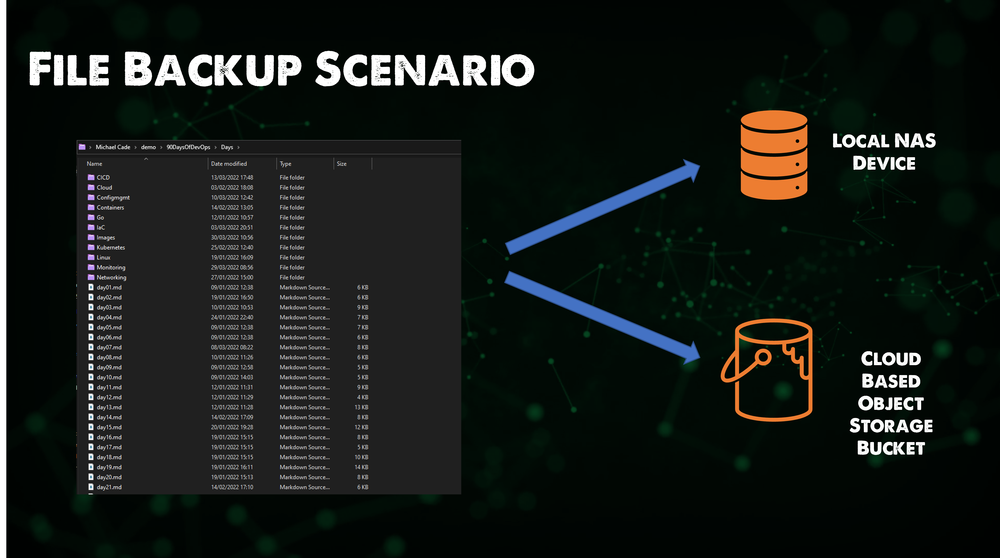

## Backup all the platforms

During this whole challenge, we discussed many different platforms and environments. One thing all of those have in common is the fact they all need some level of data protection!

Data Protection has been around for many many years but the wealth of data that we have today and the value that this data brings means we have to make sure we are not only resilient to infrastructure failure by having multiple nodes and high availability across applications but we must also consider that we need a copy of that data, that important data in a safe and secure location if a failure scenario was to occur.

We hear a lot these days it seems about cybercrime and ransomware, and don't get me wrong this is a massive threat and I stand by the fact that you will be attacked by ransomware. It is not a matter of if it is a matter of when. So even more reason to make sure you have your data secure for when that time arises. However, the most common cause for data loss is not ransomware or cybercrime it is simply accidental deletion!

We have all done it, deleted something we shouldn't have and had that instant regret.

With all of the technology and automation we have discussed during the challenge, the requirement to protect any stateful data or even complex stateless configuration is still there, regardless of the platform.

But we should be able to perform that protection of the data with automation in mind and be able to integrate it into our workflows.

If we look at what backup is:

_In information technology, a backup, or data backup is a copy of computer data taken and stored elsewhere so that it may be used to restore the original after a data loss event. The verb form, referring to the process of doing so, is "back up", whereas the noun and adjective form is "backup"._

If we break this down to the simplest form, a backup is a copy and paste of data to a new location. Simply put I could take a backup right now by copying a file from my C: drive to my D: drive and I would then have a copy in case something happened to the C: drive or something was edited wrongly within the files. I could revert to the copy I have on the D: drive. Now if my computer dies where both the C & D drives live then I am not protected so I have to consider a solution or a copy of data outside of my system maybe onto a NAS drive in my house? But then what happens if something happens to my house, maybe I need to consider storing it on another system in another location, maybe the cloud is an option. Maybe I could store a copy of my important files in several locations to mitigate the risk of failure?

### 3-2-1 Backup Methodolgy

Now seems a good time to talk about the 3-2-1 rule or backup methodology. I did a [lightning talk](https://www.youtube.com/watch?v=5wRt1bJfKBw) covering this topic.

We have already mentioned before some of the extreme ends of why we need to protect our data but a few more are listed below:

Which then allows me to talk about the 3-2-1 methodology. My first copy or backup of my data should be as close to my production system as possible, the reason for this is based on speed to recovery and again going back to that original point about accidental deletion this is going to be the most common reason for recovery. But I want to be storing that on a suitable second media outside of the original or production system.

We then want to make sure we also send a copy of our data external or offsite this is where a second location comes in be it another house, building, data centre or the public cloud.

### Backup Responsibility

We have most likely heard all of the myths when it comes to not having to backup, things like "Everything is stateless" I mean if everything is stateless then what is the business? no databases? word documents? There is a level of responsibility on every individual within the business to ensure they are protected but it is going to come down most likely to the operations teams to provide the backup process for the mission-critical applications and data.

Another good one is that "High availability is my backup, we have built in multiple nodes into our cluster there is no way this is going down!" apart from when you make a mistake to the database and this is replicated over all the nodes in the cluster, or there is fire, flood or blood scenario that means the cluster is no longer available and with it the important data. It's not about being stubborn it is about being aware of the data and the services, absolutely everyone should factor in high availability and fault tolerance into their architecture but that does not substitute the need for backup!

Replication can also seem to give us the offsite copy of the data and maybe that cluster mentioned above does live across multiple locations, however, the first accidental mistake would still be replicated there. But again a Backup requirement should stand alongside application replication or system replication within the environment.

Now with all this said you can go to the extreme on the other end as well and send copies of data to too many locations which is going to not only cost but also increase the risk of being attacked as your surface area is now massively expanded.

Anyway, who looks after backup? It will be different within each business but someone should be taking it upon themselves to understand the backup requirements. But also understand the recovery plan!

### Nobody cares till everybody cares

Backup is a prime example, nobody cares about backup until you need to restore something. Alongside the requirement to back our data up we also need to consider how we restore!

With our text document example, we are talking about very small files so the ability to copy back and forth is easy and fast. But if we are talking about 100GB plus files then this is going to take time. Also, we have to consider the level at which we need to recover if we take a virtual machine for example.

We have the whole Virtual Machine, we have the Operating System, Application installation and then if this is a database server we will have some database files as well. If we have made a mistake and inserted the wrong line of code into our database I probably don't need to restore the whole virtual machine, I want to be granular on what I recover back.

### Backup Scenario

I want to now start building on a scenario to protect some data, specifically, I want to protect some files on my local machine (in this case Windows but the tool I am going to use is not only free and open-source but also cross-platform) I would like to make sure they are protected to a NAS device I have locally in my home but also into an Object Storage bucket in the cloud.

I want to back up this important data, it just so happens to be the repository for the 90DaysOfDevOps, which yes is also being sent to GitHub which is probably where you are reading this now but what if my machine was to die and GitHub was down? How would anyone be able to read the content but also how would I potentially be able to restore that data to another service?

There are lots of tools that can help us achieve this but I am going to be using a tool called [Kopia](https://kopia.io/) an Open-Source backup tool which will enable us to encrypt, dedupe and compress our backups whilst being able to send them to many locations.

You will find the releases to download [here](https://github.com/kopia/kopia/releases) at the time of writing I will be using v0.10.6.

### Installing Kopia

There is a Kopia CLI and GUI, we will be using the GUI but know that you can have a CLI version of this as well for those Linux servers that do not give you a GUI.

I will be using `KopiaUI-Setup-0.10.6.exe`

Really quick next next installation and then when you open the application you are greeted with the choice of selecting the storage type that you wish to use as your backup repository.

### Setting up a Repository

Firstly we would like to set up a repository using our local NAS device and we are going to do this using SMB, but we could also use NFS I believe.

On the next screen, we are going to define a password, this password is used to encrypt the repository contents.

Now that we have the repository configured we can trigger an ad-hoc snapshot to start writing data to it.

First up we need to enter a path to what we want to snapshot and in our case we want to take a copy of our `90DaysOfDevOps` folder. We will get back to the scheduling aspect shortly.

We can define our snapshot retention.

Maybe there are files or file types that we wish to exclude.

If we wanted to define a schedule we could do this on this next screen, when you first create this snapshot this is the opening page to define.

And you will see several other settings that can be handled here.

Select snapshot now and the data will be written to your repository.

### Offsite backup to S3

With Kopia we can through the UI it seems only to have one repository configured at a time. But through the UI we can be creative and have multiple repository configuration files to choose from to achieve our goal of having a copy local and offsite in Object Storage.

The Object Storage I am choosing to send my data to is going to Google Cloud Storage. I firstly logged into my Google Cloud Platform account and created a storage bucket. I already had the Google Cloud SDK installed on my system but running the `gcloud auth application-default login` authenticated me with my account.

I then used the CLI of Kopia to show me the current status of my repository after we added our SMB repository in the previous steps. I did this using the `"C:\Program Files\KopiaUI\resources\server\kopia.exe" --config-file=C:\Users\micha\AppData\Roaming\kopia\repository.config repository status` command.

We are now ready to replace for the demo the configuration for the repository, what we would probably do if we wanted a long-term solution to hit both of these repositories is we would create an `smb.config` file and a `object.config` file and be able to run both of these commands to send our copies of data to each location. To add our repository we ran `"C:\Program Files\KopiaUI\resources\server\kopia.exe" --config-file=C:\Users\micha\AppData\Roaming\kopia\repository.config repository create gcs --bucket 90daysofdevops`

The above command is taking into account that the Google Cloud Storage bucket we created is called `90daysofdevops`

Now that we have created our new repository we can then run the `"C:\Program Files\KopiaUI\resources\server\kopia.exe" --config-file=C:\Users\micha\AppData\Roaming\kopia\repository.config repository status` command again and will now show the GCS repository configuration.

The next thing we need to do is create a snapshot and send that to our newly created repository. Using the `"C:\Program Files\KopiaUI\resources\server\kopia.exe" --config-file=C:\Users\micha\AppData\Roaming\kopia\repository.config kopia snapshot create "C:\Users\micha\demo\90DaysOfDevOps"` command we can kick off this process. You can see in the below browser that our Google Cloud Storage bucket now has kopia files based on our backup in place.

With the above process we can settle our requirement of sending our important data to 2 different locations, 1 of which is offsite in Google Cloud Storage and of course we still have our production copy of our data on a different media type.

### Restore

Restore is another consideration and is very important, Kopia gives us the capability to not only restore to the existing location but also a new location.

If we run the command `"C:\Program Files\KopiaUI\resources\server\kopia.exe" --config-file=C:\Users\micha\AppData\Roaming\kopia\repository.config snapshot list` this will list the snapshots that we have currently in our configured repository (GCS)

We can then mount those snapshots directly from GCS using the `"C:\Program Files\KopiaUI\resources\server\kopia.exe" --config-file=C:\Users\micha\AppData\Roaming\kopia\repository.config mount all Z:` command.

We could also restore the snapshot contents using `kopia snapshot restore kdbd9dff738996cfe7bcf99b45314e193`

The commands above are very long and this is because I was using the KopiaUI version of the kopia.exe as explained at the top of the walkthrough you can download the kopia.exe and put it into a path so you can just use the `kopia` command.

In the next session, we will be focusing on protecting workloads within Kubernetes.

## Resources

- [Kubernetes Backup and Restore made easy!](https://www.youtube.com/watch?v=01qcYSck1c4&t=217s)
- [Kubernetes Backups, Upgrades, Migrations - with Velero](https://www.youtube.com/watch?v=zybLTQER0yY)
- [7 Database Paradigms](https://www.youtube.com/watch?v=W2Z7fbCLSTw&t=520s)
- [Disaster Recovery vs. Backup: What's the difference?](https://www.youtube.com/watch?v=07EHsPuKXc0)
- [Veeam Portability & Cloud Mobility](https://www.youtube.com/watch?v=hDBlTdzE6Us&t=3s)

See you on [Day 87](day87.md)
