## Disaster Recovery

We have mentioned already how different failure scenarios will warrant different recovery requirements. When it comes to Fire, Flood and Blood scenarios we can consider these mostly disaster situations where we might need our worklods up and running in a completely different location as fast as possible or at least with near-zero recovery time objectives (RTO) 

This can only be achieved at scale when you automate the replication of the complete application stack to a standby environment. 

This allows for fast failovers across cloud regions, cloud providers or between on-premises and cloud infrastructure. 

Keeping with the theme so far we are going to concentrate on how this can be achieved using Kasten K10 using our minikube cluster that we deployed and configured a few sessions ago. 

We will then create another minikube cluster with Kasten K10 also installed to act as our standby cluster which in theory could be any location. 

Kasten K10 also has built in functionality to ensure if something was to happen to the Kubernetes cluster it is running on that the catalog data is replicated and available in a new one [K10 Disaster Recovery](https://docs.kasten.io/latest/operating/dr.html)

### Add object storage to K10 

The first thing we need to do is add an object storage bucket as a target location for our backups to land. Not only does this act as an offsite location but we can also leverage this as our disaster recovery source data to recover from. 

I have cleaned out the S3 bucket that we created for the Kanister demo in the last session. 

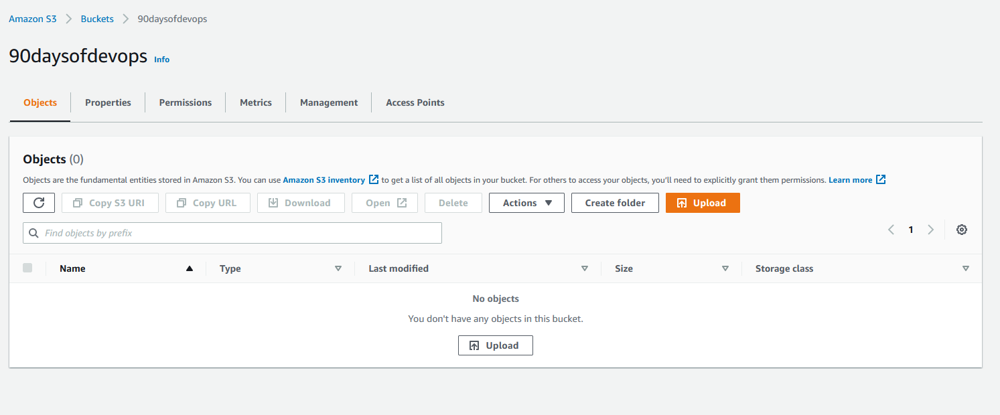

Port forward to access the K10 dashboard, open a new terminal to run the below command

`kubectl --namespace kasten-io port-forward service/gateway 8080:8000`

The Kasten dashboard will be available at: `http://127.0.0.1:8080/k10/#/`

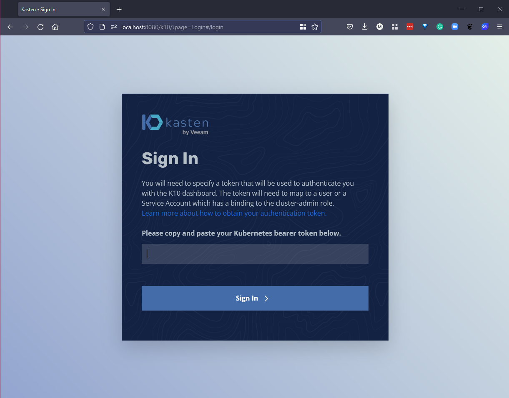

To authenticate with the dashboard we now need the token which we can get with the following commands. 

```
TOKEN_NAME=$(kubectl get secret --namespace kasten-io|grep k10-k10-token | cut -d " " -f 1)
TOKEN=$(kubectl get secret --namespace kasten-io $TOKEN_NAME -o jsonpath="{.data.token}" | base64 --decode)

echo "Token value: "
echo $TOKEN
```

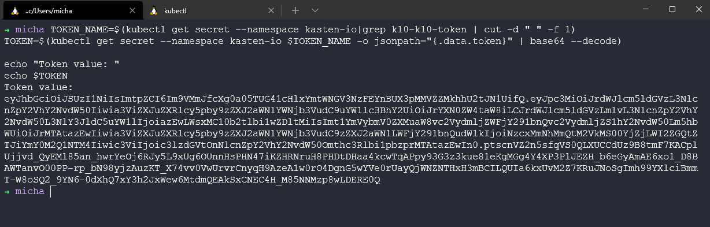

Now we take this token and we input that into our browser, you will then be prompted for an email and company name. 

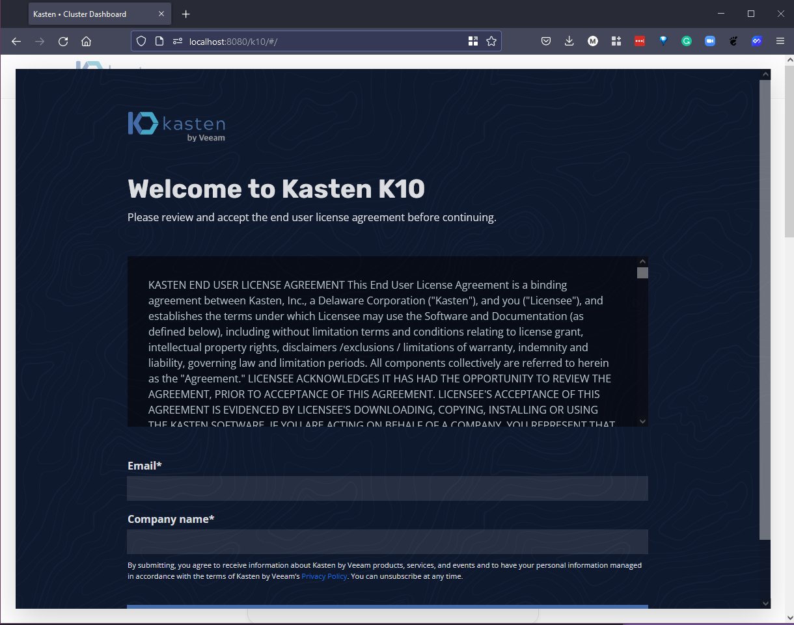

Then we get access to the Kasten K10 dashboard. 


Now that we are back in the Kasten K10 dashboard we can add our location profile, select "Settings" at the top of the page and "New Profile"

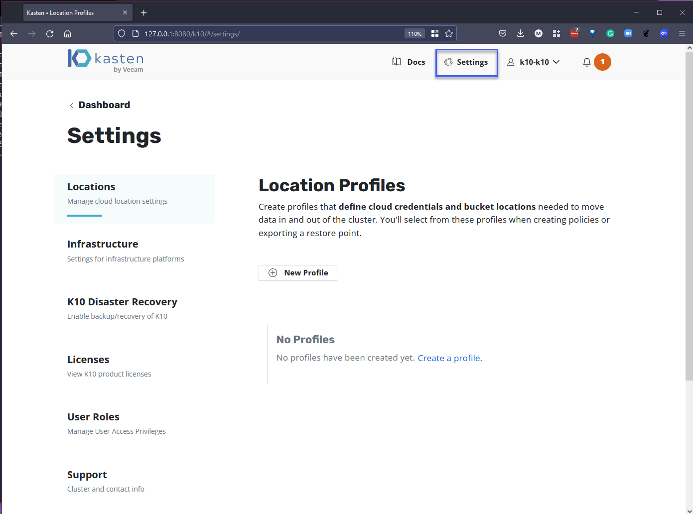

You can see from the image below that we have choice when it comes to where this location profile is, we are going to select Amazon S3 and we are going to add our sensitive access credentials, region and bucket name. 

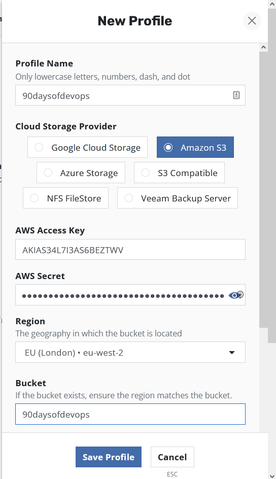

If we scroll down on the New Profile creation window you will see we also have the ability to enable immutable backups which leverages the S3 Object Lock API. For this demo we won't be using that. 


Hit "Save Profile" and you can now see our newly created or added location profile as per below. 

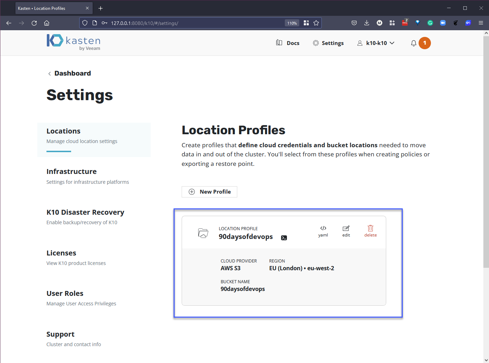

### Create a policy to protect pacman app to object storage

In the previous session we created only an adhoc snapshot of our pacman application, therefore we need to create a backup policy that will send our application backups to our newly created object storage location. 

If you head back to the dashboard and select the Policy card you will see a screen as per below. Select "Create New Policy" 


First of all we can give our policy a useful name and description. We can also define our backup frequency for demo purposes I am using on-demand. 


Next we want to enable backups via Snapshot exports meaning that we want to send our data out to our location profile. If you have multiple you can select which one you would like to send your backups to.


Next, we select the application by either name or labels, I am going to choose by name and all resources. 


Under Advanced settings we are not going to be using any of these but based on our walkthrough of Kanister yesterday we can leverage Kanister as part of Kasten K10 as well to take those application consistent copies of our data. 


Finally select "Create Policy" and you will now see the policy in our Policy window. 

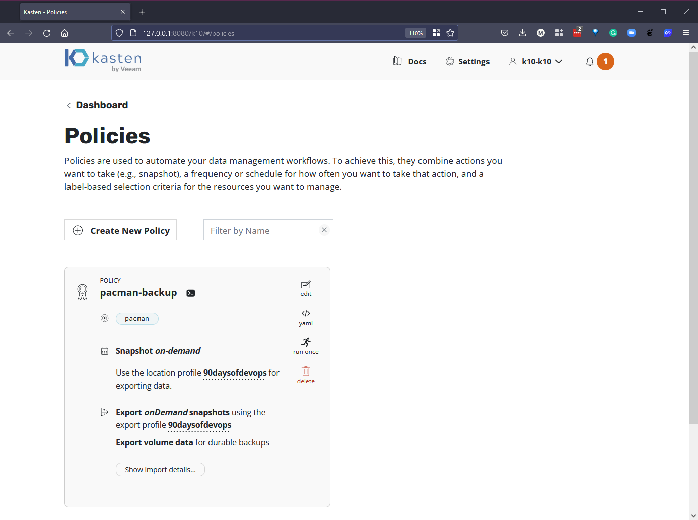

At the bottom of the created policy you will have "Show import details" we need this string to be able to import into our standby cluster. Copy this somewhere safe for now. 

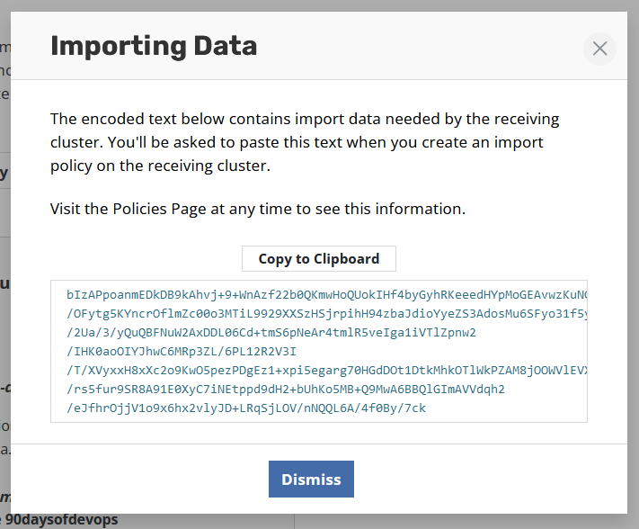

Before we move on we just need to select "run once" to get a backup sent our object storage bucket. 

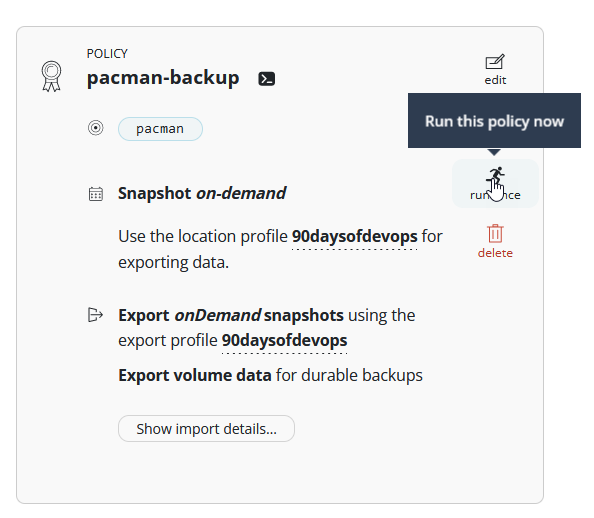

Just to show the successful backup and export of our data. 

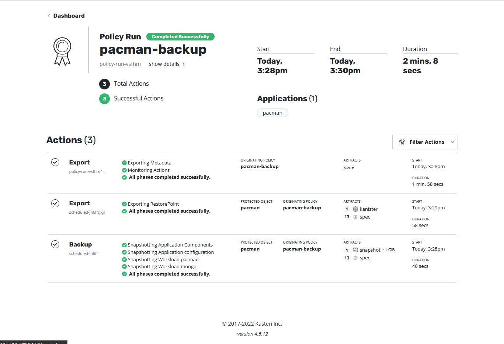


### Create a new minikube cluster & deploy K10

We then need to deploy a second Kubernetes cluster and where this could be any supported version of Kubernetes including OpenShift for the purpose of education we will use the very free version of minikube with a different name. 

Using `minikube start --addons volumesnapshots,csi-hostpath-driver --apiserver-port=6443 --container-runtime=containerd -p standby --kubernetes-version=1.21.2` we can create our new cluster. 


We then can deploy Kasten K10 in this cluster using 

`helm install k10 kasten/k10 --namespace=kasten-io --set auth.tokenAuth.enabled=true --set injectKanisterSidecar.enabled=true --set-string injectKanisterSidecar.namespaceSelector.matchLabels.k10/injectKanisterSidecar=true --create-namespace`

This will take a while but in the meantime we can use `kubectl get pods -n kasten-io -w` to watch the progress of our pods getting to the running status. 

It is worth noting that because we are using minikube our application will just run when we run our import policy, our storageclass is the same on this standby cluster. However something we will cover in the final session is about mobility and transformation. 

When the pods are up and running we can follow the steps we went through on the previous steps in the other cluster. 

Port forward to access the K10 dashboard, open a new terminal to run the below command

`kubectl --namespace kasten-io port-forward service/gateway 8080:8000`

The Kasten dashboard will be available at: `http://127.0.0.1:8080/k10/#/`


To authenticate with the dashboard we now need the token which we can get with the following commands. 

```
TOKEN_NAME=$(kubectl get secret --namespace kasten-io|grep k10-k10-token | cut -d " " -f 1)
TOKEN=$(kubectl get secret --namespace kasten-io $TOKEN_NAME -o jsonpath="{.data.token}" | base64 --decode)

echo "Token value: "
echo $TOKEN
```


Now we take this token and we input that into our browser, you will then be prompted for an email and company name. 


Then we get access to the Kasten K10 dashboard. 


### Import Pacman into new minikube cluster

At this point we are now able to create an import policy in that standby cluster and connect to the object storage backups and determine what and how we want this to look. 

First we add in our Location Profile that we walked through earlier on the other cluster, showing off dark mode here to show the difference between our production system and our DR standby location. 

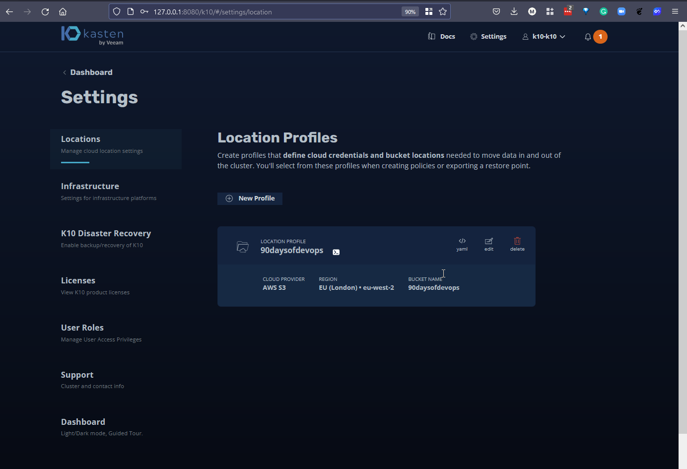

Now we go back to the dashboard and into the policies tab to create a new policy. 

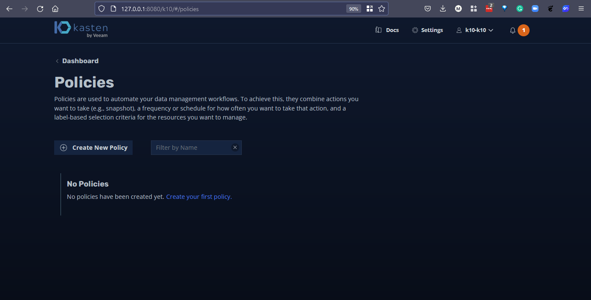

Create the import policy as per the below image. When complete, we can create policy. There are options here to restore after import and some people might want this option, this will go and restore into our standby cluster on completion. We also have the ability to change what that looks like and the plan will be show this in [Day 90](day90.md). 


I selected to import on demand, but you can obviously set a schedule on when you want this import to happen. Because of this I am going to run once. 

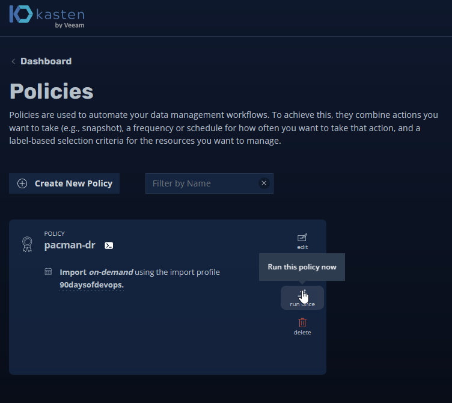

You can see below the successful import policy job. 


If we now head back to the dashboard and into the Applications card, we can then select the drop down where you see below "Removed" you will see our application here. Select Restore 

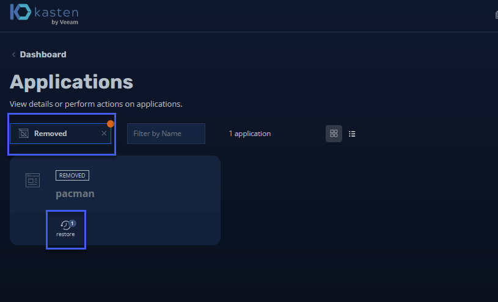

Here we can see the restore points we have available to us, this was the backup job that we ran on the primary cluster against our PacMan application. 

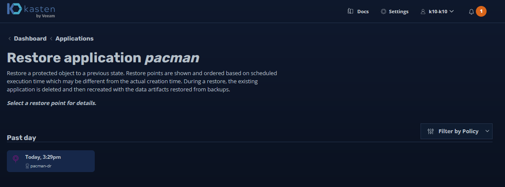

I am not going to change any of the defaults as I want to cover this in more detail in the next session. 


When you hit "Restore" it will prompt you with a confirmation. 


We can see below that we are in the standby cluster and if we check on our pods we can see that we have our running application. 

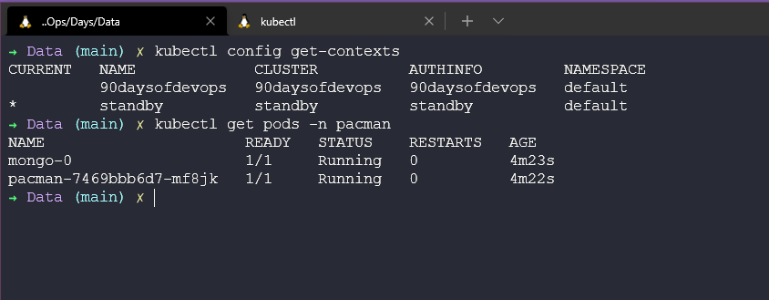

We can then port forward (in reality and real life you would not need this step to access the application, you would be using ingress)


Next we will take a look at Application mobility and transformation. 

## Resources 

- [Kubernetes Backup and Restore made easy!](https://www.youtube.com/watch?v=01qcYSck1c4&t=217s)
- [Kubernetes Backups, Upgrades, Migrations - with Velero](https://www.youtube.com/watch?v=zybLTQER0yY)
- [7 Database Paradigms](https://www.youtube.com/watch?v=W2Z7fbCLSTw&t=520s)
- [Disaster Recovery vs. Backup: What's the difference?](https://www.youtube.com/watch?v=07EHsPuKXc0)
- [Veeam Portability & Cloud Mobility](https://www.youtube.com/watch?v=hDBlTdzE6Us&t=3s)

See you on [Day 90](day90.md)
